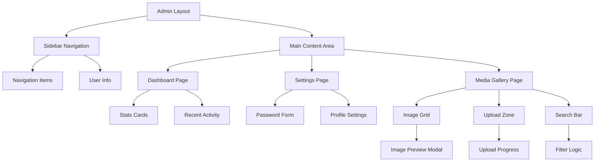

# Design Document

## Overview

The Admin UI Design feature implements a professional, minimalist admin dashboard for the TrendAnkara radio station CMS. The design emphasizes simplicity while delivering powerful management capabilities through an intuitive interface. Built on Next.js App Router with React Server Components, the system leverages existing authentication, storage, and UI components to create a cohesive admin experience.

## Steering Document Alignment

### Technical Standards (tech.md)
- **Next.js 15.5.3 App Router**: Server Components for optimal performance
- **Tailwind CSS v4**: Utility-first styling with dark theme preset
- **NextAuth.js**: Leveraging existing authentication system
- **MinIO Client**: Using established storage client for media operations
- **React 19.1.0**: Latest features including Suspense boundaries
- **TypeScript**: Type-safe component interfaces and API contracts

### Project Structure (structure.md)
- **Admin Routes**: `/src/app/admin/*` following App Router conventions
- **Component Organization**: Reusable components in `/src/components/admin/`
- **API Routes**: `/src/app/api/admin/*` for server actions
- **Shared UI Components**: Extending `/src/components/ui/*` primitives
- **Storage Integration**: Utilizing `/src/lib/storage/` utilities
- **Authentication**: Building on `/src/lib/auth/` patterns

## Code Reuse Analysis

### Existing Components to Leverage
- **Button Component** (`/src/components/ui/Button.tsx`): Dark theme variants already configured
- **Input Component** (`/src/components/ui/Input.tsx`): Form inputs with validation states
- **Card Component** (`/src/components/ui/Card.tsx`): Content containers with dark styling
- **Modal Component** (`/src/components/ui/Modal.tsx`): Dialogs for confirmations and previews
- **LoadingSpinner** (`/src/components/ui/LoadingSpinner.tsx`): Loading states

### Integration Points
- **Authentication System**: `requireAuth()` and `getServerSession()` from `/src/lib/auth/utils.ts`
- **MinIO Storage Client**: Complete storage operations from `/src/lib/storage/client.ts`
- **Tailwind Config**: Dark theme colors and brand palette already defined
- **Utils Library**: `cn()` utility for conditional class names from `/src/lib/utils.ts`
- **Database Layer**: Existing MySQL connection patterns

## Architecture

The admin UI follows a component-based architecture with server-side rendering for optimal performance and SEO. The design separates presentation, business logic, and data access layers.



## Components and Interfaces

### AdminLayout Component
- **Purpose:** Root layout wrapper providing consistent structure across admin pages
- **Interfaces:** Children prop for page content, session data from auth
- **Dependencies:** Sidebar, Header, authentication utils
- **Reuses:** Existing layout patterns, requireAuth utility

### AdminSidebar Component
- **Purpose:** Fixed navigation sidebar with collapsible mobile version
- **Interfaces:** Navigation items array, active route highlighting
- **Dependencies:** Next.js Link, usePathname hook
- **Reuses:** Button component, dark theme colors

### DashboardPage Component
- **Purpose:** Admin landing page with overview statistics and quick actions
- **Interfaces:** Server-side data fetching for stats
- **Dependencies:** Card components, data fetching utilities
- **Reuses:** Card, LoadingSpinner components

### SettingsPage Component
- **Purpose:** User settings management including password changes
- **Interfaces:** Form submission handlers, validation logic
- **Dependencies:** Form components, password validation
- **Reuses:** Input, Button, Card components

### MediaGallery Component
- **Purpose:** Grid display of uploaded images with search and preview
- **Interfaces:** Image list from MinIO, search/filter props
- **Dependencies:** MinIO client, image optimization
- **Reuses:** Card, Modal, LoadingSpinner components

### ImageUpload Component
- **Purpose:** Drag-and-drop file upload with progress tracking
- **Interfaces:** onUpload callback, file validation rules
- **Dependencies:** MinIO upload client, progress tracking
- **Reuses:** Button component, progress indicators

### PasswordChangeForm Component
- **Purpose:** Secure password update form with validation
- **Interfaces:** Form state, validation errors, success callback
- **Dependencies:** Password validation utilities, auth API
- **Reuses:** Input, Button components, form patterns

## Data Models

### AdminUser (extends existing User model)
```typescript
interface AdminUser {
  id: string
  email: string
  name: string | null
  role: 'admin' | 'super_admin' | 'editor'
  lastLogin: Date
  createdAt: Date
  updatedAt: Date
}
```

### MediaFile
```typescript
interface MediaFile {
  id: string
  filename: string
  url: string
  thumbnailUrl: string
  size: number
  mimeType: string
  uploadedBy: string
  uploadedAt: Date
  tags: string[]
  inUse: boolean
  usageReferences: string[]
}
```

### DashboardStats
```typescript
interface DashboardStats {
  totalNews: number
  totalPolls: number
  activePolls: number
  totalMedia: number
  recentActivity: ActivityItem[]
  storageUsed: number
  lastBackup: Date | null
}
```

### PasswordChangeRequest
```typescript
interface PasswordChangeRequest {
  currentPassword: string
  newPassword: string
  confirmPassword: string
}
```

## Error Handling

### Error Scenarios

1. **Authentication Failure**
   - **Handling:** Redirect to login with return URL
   - **User Impact:** Seamless re-authentication flow

2. **Upload Size Exceeded**
   - **Handling:** Client-side validation before upload attempt
   - **User Impact:** Clear message about size limits with suggestions

3. **Network Timeout**
   - **Handling:** Retry with exponential backoff (MinIO client handles)
   - **User Impact:** Loading state with retry option

4. **Invalid File Type**
   - **Handling:** Prevent upload, show accepted formats
   - **User Impact:** Immediate feedback with format guidance

5. **Concurrent Editing**
   - **Handling:** Optimistic locking with conflict resolution
   - **User Impact:** Warning dialog with merge options

6. **Storage Quota Exceeded**
   - **Handling:** Block upload, show storage stats
   - **User Impact:** Clear storage usage display with cleanup suggestions

## Testing Strategy

### Unit Testing
- Component rendering tests with React Testing Library
- Form validation logic testing
- Authentication utility function tests
- MinIO client mock testing

### Integration Testing
- Admin workflow end-to-end tests
- Password change flow testing
- Media upload and deletion flows
- Navigation and routing tests

### End-to-End Testing
- Complete admin journey from login to logout
- Media management workflow
- Settings update scenarios
- Mobile responsive behavior testing

## UI/UX Design Patterns

### Visual Design
- **Color Palette:** RED (#dc2626) accents, BLACK (#000000) backgrounds, WHITE (#ffffff) text
- **Typography:** Inter font family with clear hierarchy
- **Spacing:** Consistent 8px grid system
- **Shadows:** Subtle elevation for cards and modals
- **Animations:** Smooth transitions (200ms) for interactions

### Responsive Breakpoints
- **Mobile:** < 768px (collapsible sidebar, stacked layout)
- **Tablet:** 768px - 1024px (compact sidebar, flexible grid)
- **Desktop:** > 1024px (full sidebar, multi-column layout)

### Interaction Patterns
- **Hover States:** Subtle background color changes
- **Focus States:** Red outline for accessibility
- **Loading States:** Skeleton screens maintaining layout
- **Error States:** Red border with inline error messages
- **Success States:** Green checkmarks with auto-dismiss

### Accessibility Features
- **Keyboard Navigation:** Tab order, arrow keys for galleries
- **Screen Reader Support:** ARIA labels and roles
- **Color Contrast:** WCAG AA compliance
- **Focus Indicators:** Visible focus rings
- **Skip Links:** Quick navigation to main content