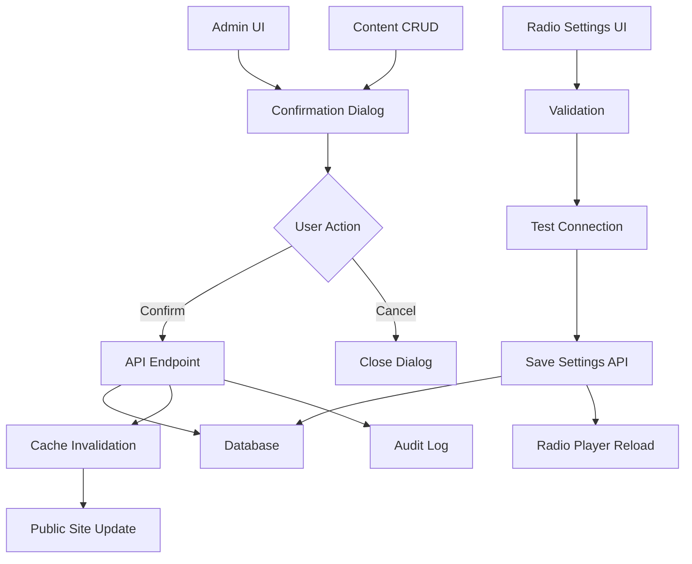

# Design Document - CMS Integration

## Overview

The CMS Integration feature completes the connection between the admin panel and public-facing components of the Turkish radio station platform. This design introduces confirmation dialogs for critical actions, dynamic radio stream configuration via database, and seamless admin-to-public content flow. The implementation focuses on maintaining simplicity per the core motto while ensuring data safety and admin efficiency.

## Steering Document Alignment

### Technical Standards (tech.md)
- **Next.js 15 App Router**: Leveraging server components for admin panels and client components for interactive modals
- **NextAuth.js Integration**: Using existing session management for authorization checks
- **MySQL Database**: Extending current schema with radio_settings table
- **React 19 Features**: Utilizing suspense boundaries and transitions for smooth UI updates
- **TypeScript**: Type-safe interfaces for all new components and API endpoints

### Project Structure (structure.md)
- **Components**: New confirmation dialogs in `/src/components/ui/ConfirmDialog.tsx`
- **Admin Features**: Radio settings in `/src/app/admin/settings/radio/`
- **API Routes**: New endpoints in `/src/app/api/admin/settings/radio/`
- **Hooks**: Custom hooks in `/src/hooks/useConfirmation.ts`
- **Database Queries**: SQL functions in `/src/lib/db/queries/settings.ts`

## Code Reuse Analysis

### Existing Components to Leverage
- **Modal.tsx**: Base modal component for building confirmation dialogs
- **Button.tsx**: Existing button styles for action buttons
- **Card.tsx**: Container for radio settings interface
- **LoadingSpinner.tsx**: Loading states during async operations
- **Toast notifications**: Existing notification system for success/error feedback

### Integration Points
- **NextAuth Middleware**: Authorization checks for admin routes
- **MySQL Client**: Database connection for settings persistence
- **RadioPlayerContext**: Global state management for radio player updates
- **API Response Utils**: Standardized response formatting
- **Cache Invalidation**: Existing cache management utilities

## Architecture



## Components and Interfaces

### ConfirmDialog Component
- **Purpose:** Universal confirmation dialog for critical actions
- **Interfaces:**
  ```typescript
  interface ConfirmDialogProps {
    isOpen: boolean
    onClose: () => void
    onConfirm: () => Promise<void>
    title: string
    message: string
    confirmText?: string
    cancelText?: string
    variant?: 'danger' | 'warning' | 'info'
    showPreview?: boolean
    previewContent?: React.ReactNode
  }
  ```
- **Dependencies:** Modal, Button, LoadingSpinner components
- **Reuses:** Existing Modal component as foundation

### useConfirmation Hook
- **Purpose:** Manage confirmation dialog state and async operations
- **Interfaces:**
  ```typescript
  interface UseConfirmationReturn {
    isOpen: boolean
    confirm: (options: ConfirmOptions) => Promise<boolean>
    handleConfirm: () => Promise<void>
    handleCancel: () => void
    isLoading: boolean
  }
  ```
- **Dependencies:** React state management hooks
- **Reuses:** Existing error handling patterns

### RadioSettingsForm Component
- **Purpose:** Form for managing radio stream configuration
- **Interfaces:**
  ```typescript
  interface RadioSettings {
    id: number
    stream_url: string
    metadata_url?: string
    station_name: string
    station_description?: string
    is_active: boolean
    fallback_url?: string
    test_status?: 'idle' | 'testing' | 'success' | 'failed'
  }
  ```
- **Dependencies:** Form validation, API client
- **Reuses:** Input, Button, Card components

### ContentSyncService
- **Purpose:** Synchronize admin changes with public site
- **Interfaces:**
  ```typescript
  interface SyncOperation {
    type: 'create' | 'update' | 'delete' | 'publish' | 'unpublish'
    entity: 'news' | 'poll' | 'media' | 'settings'
    id: number | string
    data?: any
    timestamp: Date
  }
  ```
- **Dependencies:** Cache service, WebSocket or polling
- **Reuses:** Existing cache invalidation logic

## Data Models

### RadioSettings Table
```sql
CREATE TABLE `radio_settings` (
  `id` INT NOT NULL AUTO_INCREMENT,
  `stream_url` VARCHAR(500) NOT NULL,
  `metadata_url` VARCHAR(500),
  `station_name` VARCHAR(255) NOT NULL,
  `station_description` TEXT,
  `is_active` BOOLEAN DEFAULT true,
  `fallback_url` VARCHAR(500),
  `last_tested_at` TIMESTAMP,
  `test_result` JSON,
  `updated_at` TIMESTAMP DEFAULT CURRENT_TIMESTAMP ON UPDATE CURRENT_TIMESTAMP,
  `updated_by` INT,
  PRIMARY KEY (`id`),
  FOREIGN KEY (`updated_by`) REFERENCES `users`(`id`)
);
```

### AuditLog Table Extension
```sql
ALTER TABLE `audit_logs` ADD COLUMN `confirmation_required` BOOLEAN DEFAULT false;
ALTER TABLE `audit_logs` ADD COLUMN `confirmation_timestamp` TIMESTAMP NULL;
```

### ConfirmationSettings
```typescript
interface ConfirmationSettings {
  delete_news: boolean
  delete_poll: boolean
  delete_media: boolean
  publish_content: boolean
  unpublish_content: boolean
  batch_operations: boolean
  radio_settings: boolean
}
```

## API Endpoints

### Radio Settings Management
- **GET /api/admin/settings/radio**: Fetch current settings
- **PUT /api/admin/settings/radio**: Update settings with validation
- **POST /api/admin/settings/radio/test**: Test stream connection
- **GET /api/radio/config**: Public endpoint for player configuration

### Confirmation Status
- **GET /api/admin/settings/confirmations**: Get confirmation preferences
- **PUT /api/admin/settings/confirmations**: Update confirmation preferences

## Error Handling

### Error Scenarios

1. **Stream URL Invalid**
   - **Handling:** Validate URL format, attempt connection test
   - **User Impact:** Error message with specific issue (format, unreachable, etc.)
   - **Recovery:** Retain previous working configuration

2. **Database Connection Failure**
   - **Handling:** Retry with exponential backoff
   - **User Impact:** Loading state with timeout warning
   - **Recovery:** Fallback to cached settings if available

3. **Concurrent Edit Conflict**
   - **Handling:** Optimistic locking with version check
   - **User Impact:** Conflict resolution dialog
   - **Recovery:** Show diff and allow merge or override

4. **Authentication Expiry During Operation**
   - **Handling:** Queue operation, redirect to login
   - **User Impact:** Session expired notification
   - **Recovery:** Resume operation after re-authentication

5. **Stream Test Timeout**
   - **Handling:** 10-second timeout with progress indicator
   - **User Impact:** Timeout message with retry option
   - **Recovery:** Allow manual override with warning

## Security Considerations

### Input Validation
- URL sanitization for stream URLs
- SQL injection prevention via parameterized queries
- XSS protection for all text inputs
- CSRF token validation for state changes

### Authorization
- Admin role required for settings modification
- Super admin required for confirmation preference changes
- Rate limiting on test operations (max 10/minute)

## Performance Optimizations

### Caching Strategy
- Cache radio settings with 5-minute TTL
- Invalidate on update via Redis pub/sub or database triggers
- Client-side caching with SWR or React Query

### Database Optimization
- Index on `is_active` for quick lookup
- Single row constraint for active settings
- Batch updates wrapped in transactions

### UI Responsiveness
- Optimistic updates with rollback on failure
- Debounced form validation
- Virtual scrolling for large content lists

## Testing Strategy

### Unit Testing
- **ConfirmDialog**: Test all user interaction paths
- **RadioSettingsForm**: Validation rules and error states
- **useConfirmation**: Hook state management
- **API Handlers**: Request/response validation

### Integration Testing
- **Admin to Public Flow**: Content changes reflect immediately
- **Stream URL Update**: Player reconnects with new URL
- **Confirmation Flow**: End-to-end action confirmation
- **Authentication**: Protected route access control

### End-to-End Testing
- **Critical User Journeys:**
  1. Admin deletes news with confirmation
  2. Radio settings update and player restart
  3. Batch delete with confirmation
  4. Session expiry during critical operation
  5. Concurrent edit resolution

## Migration Plan

### Database Migration
```sql
-- Add radio_settings table if not exists
CREATE TABLE IF NOT EXISTS `radio_settings` (...);

-- Migrate existing config to database
INSERT INTO `radio_settings` (stream_url, metadata_url, station_name, is_active)
VALUES ('https://radyo.yayin.com.tr:5132/stream',
        'https://cros9.yayin.com.tr/radyo/stream/nowplaying',
        'Trend Ankara',
        true);

-- Add audit columns to existing tables
ALTER TABLE `news` ADD COLUMN `deleted_with_confirmation` BOOLEAN DEFAULT false;
ALTER TABLE `polls` ADD COLUMN `deleted_with_confirmation` BOOLEAN DEFAULT false;
```

### Configuration Migration
- Move hardcoded stream URLs to database
- Update environment variables documentation
- Provide fallback for missing database settings

## Rollback Strategy

### Feature Flags
```typescript
const features = {
  confirmationDialogs: process.env.ENABLE_CONFIRMATIONS === 'true',
  dynamicRadioSettings: process.env.ENABLE_DYNAMIC_RADIO === 'true',
  realtimeSync: process.env.ENABLE_REALTIME_SYNC === 'true'
}
```

### Database Rollback
- Keep backup of original settings table
- Prepared rollback scripts in migrations folder
- Test rollback procedure in staging

## Documentation Updates

### Admin User Guide
- How to update radio settings
- Understanding confirmation dialogs
- Troubleshooting stream issues

### Developer Documentation
- API endpoint specifications
- Component usage examples
- Testing procedures

### Operational Runbook
- Monitoring radio stream health
- Database backup procedures
- Emergency fallback procedures