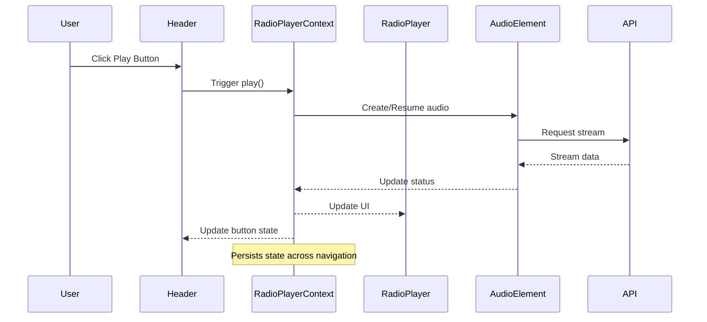
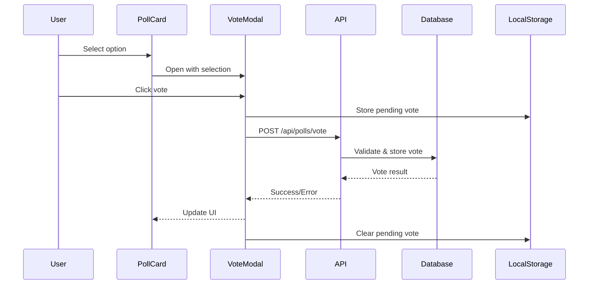
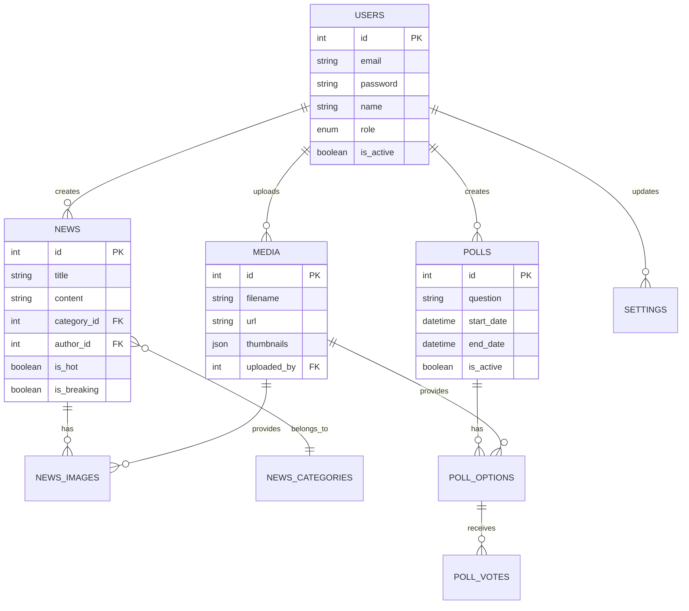

# Design Document - Frontend Design Implementation

## Overview

This design document outlines the technical architecture and implementation approach for the Trend Ankara Radio CMS frontend. The design emphasizes component reusability, performance optimization, and adherence to the "Monkey-Proof Design" philosophy. Building upon the existing Next.js 15.5.3 infrastructure with Tailwind CSS v4, this implementation will create a professional, dark-mode-only radio station interface that serves Turkish audiences with ultra-simple, accessible interactions.

## Steering Document Alignment

### Technical Standards (tech.md)
- **Next.js 15.5.3 App Router**: Utilizing server components for optimal performance
- **React 19.1.0**: Leveraging latest React features and concurrent rendering
- **Tailwind CSS v4**: Extending existing configuration for dark theme
- **TypeScript Support**: Adding type definitions for component props and API responses
- **Performance Targets**: Meeting Core Web Vitals (LCP < 2.5s, FID < 100ms, CLS < 0.1)
- **Mobile API Ready**: Component designs support JSON serialization for mobile app

### Project Structure (structure.md)
Following the established directory organization:
- **Components**: `/src/components/` with subdirectories for domain-specific components
- **UI Primitives**: `/src/components/ui/` for reusable base components
- **Hooks**: `/src/hooks/` for custom React hooks
- **Types**: `/src/types/` for TypeScript definitions
- **Utilities**: `/src/lib/utils/` for shared functions
- **Styles**: Component-scoped styles with Tailwind utilities

## Code Reuse Analysis

### Existing Components to Leverage
- **Tailwind Configuration** (`tailwind.config.ts`): Already configured with brand colors, dark mode surfaces, and animations
- **Database Schema** (`src/lib/db/schema.ts`): Established tables for users, media, and settings
- **Storage Client** (`src/lib/storage/client.ts`): MinIO integration for media management
- **Validation Utilities** (`src/lib/utils/validation.ts`): Input validation functions
- **iOS Detection** (`src/lib/utils/iosDetection.ts`): Device-specific handling utilities
- **Logger** (`src/lib/utils/logger.ts`): Consistent error and info logging

### Integration Points
- **API Routes**: Existing `/api/` endpoints for polls, news, media, and mobile
- **Database Queries** (`src/lib/db/queries/`): Prepared query functions for data access
- **Authentication**: NextAuth.js integration planned for admin areas
- **Media Upload** (`src/lib/storage/upload.ts`): Existing upload handling with thumbnail generation

## Architecture

The frontend architecture follows a component-driven design with clear separation between presentation, business logic, and data layers. Components are organized hierarchically with atomic design principles.

```mermaid
graph TD
    A[App Router Layout] --> B[Page Components]
    B --> C[Feature Components]
    C --> D[UI Components]
    D --> E[Primitive Components]

    F[RadioPlayerContext] --> C
    G[Custom Hooks] --> C
    H[API Routes] --> I[Database]
    H --> J[MinIO Storage]

    K[Global State] --> F
    L[Local Storage] --> F

    C --> H

    style A fill:#DC2626
    style F fill:#DC2626
    style D fill:#1A1A1A
    style E fill:#2E2E2E
```



## Components and Interfaces

### Component 1: Button Component
- **Purpose:** Primary interactive element with multiple variants and sizes
- **Interfaces:**
  ```typescript
  interface ButtonProps {
    variant: 'primary' | 'secondary' | 'danger' | 'ghost';
    size: 'small' | 'medium' | 'large' | 'giant';
    fullWidth?: boolean;
    loading?: boolean;
    disabled?: boolean;
    icon?: React.ReactNode;
    onClick?: () => void;
    children: React.ReactNode;
  }
  ```
- **Dependencies:** Tailwind CSS, React
- **Reuses:** Extends HTML button element, uses Tailwind's existing animation utilities

### Component 2: RadioPlayer Component
- **Purpose:** Persistent audio streaming with iOS-specific optimizations
- **Interfaces:**
  ```typescript
  interface RadioPlayerProps {
    streamUrl: string;
    metadataUrl: string;
    autoPlay?: boolean;
    persistent?: boolean;
  }

  interface RadioPlayerState {
    isPlaying: boolean;
    isLoading: boolean;
    currentSong: string;
    volume: number;
    error: string | null;
    connectionStatus: 'connected' | 'connecting' | 'disconnected';
  }
  ```
- **Dependencies:** RadioPlayerContext, useRadioPlayer hook, iOS detection utility
- **Reuses:** `iosDetection.ts` for device handling, logger for error tracking

### Component 3: NewsCard Component
- **Purpose:** Display news articles with responsive layout and lazy loading
- **Interfaces:**
  ```typescript
  interface NewsCardProps {
    id: number;
    title: string;
    summary: string;
    thumbnail: string;
    category: NewsCategory;
    isHot?: boolean;
    isBreaking?: boolean;
    publishedAt: Date;
    onClick?: (id: number) => void;
  }

  type NewsCategory = 'MAGAZINE' | 'ARTIST' | 'ALBUM' | 'CONCERT' | string;
  ```
- **Dependencies:** Next/Image for optimization, Modal component for article display
- **Reuses:** Media storage URLs from MinIO, formatting utilities

### Component 4: PollCard Component
- **Purpose:** Interactive voting interface with results visualization
- **Interfaces:**
  ```typescript
  interface PollCardProps {
    id: number;
    question: string;
    options: PollOption[];
    endDate: Date;
    totalVotes: number;
    hasVoted: boolean;
    onVote?: (pollId: number, optionId: number) => Promise<void>;
  }

  interface PollOption {
    id: number;
    title: string;
    imageUrl?: string;
    voteCount: number;
  }
  ```
- **Dependencies:** API client for vote submission, animation libraries for results
- **Reuses:** Database poll schema, existing `/api/polls/vote` endpoint

### Component 5: Modal Component
- **Purpose:** Overlay container for news articles and poll popups
- **Interfaces:**
  ```typescript
  interface ModalProps {
    isOpen: boolean;
    onClose: () => void;
    title?: string;
    size?: 'small' | 'medium' | 'large' | 'fullscreen';
    children: React.ReactNode;
  }
  ```
- **Dependencies:** Portal for rendering, focus trap for accessibility
- **Reuses:** Dark theme colors from Tailwind config

### Component 6: Header Component
- **Purpose:** Site navigation with logo and persistent radio player on desktop
- **Interfaces:**
  ```typescript
  interface HeaderProps {
    currentPath: string;
    user?: User | null;
  }
  ```
- **Dependencies:** RadioPlayer component, Navigation component
- **Reuses:** Existing layout patterns, brand colors

### Component 7: NewsCarousel Component
- **Purpose:** Featured news slider for homepage
- **Interfaces:**
  ```typescript
  interface NewsCarouselProps {
    items: NewsItem[];
    autoPlay?: boolean;
    interval?: number;
  }
  ```
- **Dependencies:** Touch gesture handling, NewsCard component
- **Reuses:** NewsCard for individual items, animation utilities

### Component 8: AdminDataTable Component
- **Purpose:** Sortable, paginated data display for admin panel
- **Interfaces:**
  ```typescript
  interface DataTableProps<T> {
    columns: ColumnDef<T>[];
    data: T[];
    pagination?: PaginationState;
    sorting?: SortingState;
    onPaginationChange?: (pagination: PaginationState) => void;
    onSortingChange?: (sorting: SortingState) => void;
  }
  ```
- **Dependencies:** usePagination hook, sorting utilities
- **Reuses:** Existing pagination hook, database query patterns

## Data Models

### RadioPlayerContext State
```typescript
interface RadioPlayerContextValue {
  // Player state
  isPlaying: boolean;
  isLoading: boolean;
  volume: number;
  currentSong: string;
  streamHealth: number;

  // Connection state
  connectionStatus: ConnectionStatus;
  reconnectAttempts: number;
  lastError: Error | null;

  // Actions
  play: () => Promise<void>;
  pause: () => void;
  setVolume: (volume: number) => void;
  resetPlayer: () => void;  // Nuclear reset for iOS

  // iOS specific
  isIOS: boolean;
  audioContext?: AudioContext;
}
```

### News Article Model
```typescript
interface NewsArticle {
  id: number;
  title: string;
  slug: string;
  summary: string;
  content: string;
  thumbnail: MediaFile;
  images?: MediaFile[];
  category: NewsCategory;
  tags?: string[];
  isHot: boolean;
  isBreaking: boolean;
  publishedAt: Date;
  author?: User;
  viewCount: number;
}
```

### Poll Model
```typescript
interface Poll {
  id: number;
  title: string;
  question: string;
  description?: string;
  options: PollOption[];
  startDate: Date;
  endDate: Date;
  isActive: boolean;
  totalVotes: number;
  allowMultiple: boolean;
  showResults: boolean;
}
```

### Theme Configuration
```typescript
interface ThemeConfig {
  colors: {
    brand: {
      red: string;      // #DC2626
      black: string;    // #000000
      white: string;    // #FFFFFF
    };
    dark: {
      bg: {
        primary: string;    // #000000
        secondary: string;  // #0A0A0A
        tertiary: string;   // #141414
      };
      surface: {
        primary: string;    // #1A1A1A
        secondary: string;  // #242424
        tertiary: string;   // #2E2E2E
      };
      border: {
        primary: string;    // #333333
        secondary: string;  // #404040
      };
    };
  };
  breakpoints: {
    mobile: number;    // 768px
    tablet: number;    // 1024px
    desktop: number;   // 1280px
  };
}
```

## Error Handling

### Error Scenarios

1. **Radio Stream Connection Failure**
   - **Handling:** Automatic reconnection with exponential backoff (1s, 2s, 4s, 8s, max 30s)
   - **User Impact:** "Bağlantı koptu, yeniden deneniyor..." message with spinner

2. **Image Loading Failure**
   - **Handling:** Show placeholder image with retry button
   - **User Impact:** Gray placeholder with refresh icon

3. **API Request Timeout**
   - **Handling:** Retry with timeout extension, show cached data if available
   - **User Impact:** "Yükleniyor..." then cached content with "Güncelleniyor" badge

4. **Poll Vote Submission Failure**
   - **Handling:** Store vote locally, retry on next interaction
   - **User Impact:** "Oyunuz kaydediliyor..." with retry option

5. **iOS Audio Context Blocked**
   - **Handling:** Nuclear reset strategy - destroy and recreate audio context
   - **User Impact:** Brief pause, then automatic resume

6. **Form Validation Error**
   - **Handling:** Inline error messages with field highlighting
   - **User Impact:** Red border on field with Turkish error message below

## Testing Strategy

### Unit Testing
- **Component Testing:** Jest + React Testing Library for all UI components
- **Hook Testing:** Isolated testing of custom hooks with mock providers
- **Utility Testing:** Pure function testing for formatting, validation
- **Coverage Target:** 80% for critical components (RadioPlayer, PollCard, NewsCard)

### Integration Testing
- **API Integration:** Mock API responses, test error scenarios
- **Context Integration:** Test RadioPlayerContext with multiple consumers
- **Database Integration:** Test query builders with mock database

### End-to-End Testing
- **User Flows:**
  - Radio play/pause across navigation
  - Poll voting workflow
  - News browsing and reading
  - Admin content management
- **Device Testing:** iOS Safari, Android Chrome, Desktop browsers
- **Performance Testing:** Lighthouse CI for Core Web Vitals

## Performance Optimization Strategy

### Code Splitting
```typescript
// Lazy load admin components
const AdminPanel = lazy(() => import('@/components/admin/AdminPanel'));
const MediaManager = lazy(() => import('@/components/media/MediaManager'));
const ContentBuilder = lazy(() => import('@/components/content/ContentBuilder'));
```

### Image Optimization
```typescript
// Next.js Image with responsive sizing
<Image
  src={thumbnail}
  alt={title}
  width={640}
  height={360}
  sizes="(max-width: 768px) 100vw, (max-width: 1024px) 50vw, 33vw"
  loading="lazy"
  placeholder="blur"
  blurDataURL={blurPlaceholder}
/>
```

### State Management
- **Global State:** RadioPlayerContext for audio state only
- **Local State:** Component-level state for UI interactions
- **Server State:** React Query or SWR for API data caching
- **Persistence:** LocalStorage for user preferences, volume settings

### Bundle Optimization
- **Tree Shaking:** Remove unused Tailwind classes
- **Minification:** Terser for production builds
- **Compression:** Gzip/Brotli for static assets
- **CDN Ready:** Hashed filenames for cache busting

## Accessibility Implementation

### ARIA Labels
```typescript
// Turkish ARIA labels for screen readers
const ariaLabels = {
  playButton: "Radyoyu başlat",
  pauseButton: "Radyoyu duraklat",
  volumeSlider: "Ses seviyesi",
  newsCard: "Haber kartı",
  pollOption: "Anket seçeneği",
  navigation: "Ana menü"
};
```

### Keyboard Navigation
```typescript
// Focus management for modal
useEffect(() => {
  if (isOpen) {
    previousFocus.current = document.activeElement;
    modalRef.current?.focus();
  }
  return () => {
    previousFocus.current?.focus();
  };
}, [isOpen]);
```

### Reduced Motion
```css
@media (prefers-reduced-motion: reduce) {
  * {
    animation-duration: 0.01ms !important;
    animation-iteration-count: 1 !important;
    transition-duration: 0.01ms !important;
  }
}
```

## Mobile Responsiveness Strategy

### Breakpoint System
```typescript
const breakpoints = {
  mobile: 'max-width: 767px',
  tablet: '768px to 1023px',
  desktop: 'min-width: 1024px'
};
```

### Component Adaptation
- **Mobile:** Single column, bottom navigation, fixed radio player
- **Tablet:** 2-column grid, side navigation drawer
- **Desktop:** 3-column grid, top navigation, inline radio player

### Touch Optimizations
- Minimum 48px touch targets
- Swipe gestures for carousels
- Pull-to-refresh for news feed
- Long-press for context menus

## Security Considerations

### XSS Prevention
```typescript
// Sanitize user input
import DOMPurify from 'isomorphic-dompurify';
const sanitizedContent = DOMPurify.sanitize(userInput);
```

### CSRF Protection
- Use Next.js built-in CSRF tokens
- Validate origin headers
- SameSite cookie attributes

### Content Security Policy
```typescript
// next.config.js CSP headers
const cspHeader = `
  default-src 'self';
  script-src 'self' 'unsafe-eval' 'unsafe-inline';
  style-src 'self' 'unsafe-inline';
  img-src 'self' blob: data: https:;
  media-src 'self' https://radyo.yayin.com.tr;
  connect-src 'self' https://radyo.yayin.com.tr;
`;
```

## Component Interaction Diagrams

### RadioPlayerContext Flow


### Poll Voting Workflow


## Data Flow Architecture

```mermaid
graph TB
    subgraph "Client Layer"
        UI[UI Components]
        Context[RadioPlayerContext]
        LocalStore[LocalStorage]
    end

    subgraph "API Layer"
        NewsAPI[/api/news]
        PollsAPI[/api/polls]
        MediaAPI[/api/media]
        RadioAPI[/api/radio]
        MobileAPI[/api/mobile/v1/*]
    end

    subgraph "Data Layer"
        MySQL[(MySQL Database)]
        MinIO[(MinIO Storage)]
        RadioStream[Radio Stream Server]
    end

    UI <--> Context
    UI <--> LocalStore
    UI --> NewsAPI
    UI --> PollsAPI
    UI --> MediaAPI
    Context --> RadioAPI

    NewsAPI --> MySQL
    PollsAPI --> MySQL
    MediaAPI --> MinIO
    RadioAPI --> RadioStream

    MobileAPI --> MySQL
    MobileAPI --> MinIO

    style Context fill:#DC2626
    style UI fill:#1A1A1A
    style MySQL fill:#2E2E2E
```

## Admin Interface Design

### Admin Layout Component
```typescript
interface AdminLayoutProps {
  children: React.ReactNode;
  user: AuthenticatedUser;
}

// Admin navigation structure
const adminNavigation = [
  { label: 'Dashboard', path: '/admin', icon: 'Dashboard' },
  { label: 'Haberler', path: '/admin/news', icon: 'News' },
  { label: 'Anketler', path: '/admin/polls', icon: 'Poll' },
  { label: 'Medya', path: '/admin/media', icon: 'Media' },
  { label: 'İçerik', path: '/admin/content', icon: 'Content' },
  { label: 'Ayarlar', path: '/admin/settings', icon: 'Settings' }
];
```

### Authentication Flow

```mermaid
flowchart TD
    A[User visits /admin] --> B{Authenticated?}
    B -->|No| C[Redirect to /api/auth/signin]
    B -->|Yes| D[Load AdminLayout]
    C --> E[NextAuth Provider]
    E --> F{Valid credentials?}
    F -->|No| G[Show error]
    F -->|Yes| H[Create session]
    H --> D
    D --> I[Render admin content]

    style A fill:#DC2626
    style D fill:#1A1A1A
    style E fill:#2E2E2E
```


## State Management Strategy

```mermaid
graph LR
    subgraph "Global State"
        RadioContext[RadioPlayerContext<br/>- Playing state<br/>- Volume<br/>- Current song]
    end

    subgraph "Server State"
        ReactQuery[React Query/SWR<br/>- News data<br/>- Poll data<br/>- User preferences]
    end

    subgraph "Local State"
        Component[Component State<br/>- UI interactions<br/>- Form inputs<br/>- Modal visibility]
    end

    subgraph "Persistent State"
        LocalStorage[LocalStorage<br/>- Volume setting<br/>- User preferences<br/>- Pending votes]
    end

    RadioContext --> LocalStorage
    ReactQuery --> Component
    Component --> LocalStorage

    style RadioContext fill:#DC2626
    style Component fill:#1A1A1A
```



## API Integration Mapping

### Component to API Endpoint Mapping
| Component | API Endpoint | Method | Purpose |
|-----------|-------------|---------|---------|
| RadioPlayer | `/api/radio` | GET | Stream URL & metadata |
| NewsCard | `/api/news/{id}` | GET | Article details |
| NewsCarousel | `/api/news?featured=true` | GET | Featured articles |
| PollCard | `/api/polls/active` | GET | Active polls |
| PollCard | `/api/polls/vote` | POST | Submit vote |
| MediaManager | `/api/media/upload` | POST | Upload files |
| MediaPicker | `/api/media` | GET | List media files |
| AdminDataTable | Various | GET/POST/PUT/DELETE | CRUD operations |

## Enhanced Testing Strategy

### E2E Test Scenarios
```typescript
// Radio Player Persistence Test
describe('Radio Player Persistence', () => {
  it('should maintain playback across page navigation', async () => {
    // 1. Start playing radio on homepage
    await page.goto('/');
    await page.click('[data-testid="radio-play"]');
    await expect(page.locator('[data-testid="radio-status"]')).toContainText('Playing');

    // 2. Navigate to news page
    await page.click('[href="/news"]');
    await expect(page.locator('[data-testid="radio-status"]')).toContainText('Playing');

    // 3. Navigate to polls page
    await page.click('[href="/polls"]');
    await expect(page.locator('[data-testid="radio-status"]')).toContainText('Playing');
  });
});

// Poll Voting Test
describe('Poll Voting Workflow', () => {
  it('should complete voting process', async () => {
    // 1. Open poll
    await page.goto('/polls');
    await page.click('[data-testid="active-poll"]');

    // 2. Select option
    await page.click('[data-testid="poll-option-1"]');

    // 3. Submit vote
    await page.click('[data-testid="submit-vote"]');

    // 4. Verify results display
    await expect(page.locator('[data-testid="poll-results"]')).toBeVisible();
    await expect(page.locator('[data-testid="vote-percentage"]')).toBeVisible();
  });
});
```

### Performance Test Criteria
```typescript
// Core Web Vitals Testing
const performanceMetrics = {
  LCP: {
    target: 2500, // ms
    test: () => measureLCP('/'),
    critical: true
  },
  FID: {
    target: 100, // ms
    test: () => measureFID('/'),
    critical: true
  },
  CLS: {
    target: 0.1,
    test: () => measureCLS('/'),
    critical: true
  },
  TTFB: {
    target: 600, // ms
    test: () => measureTTFB('/api/news'),
    critical: false
  }
};
```

## iOS Audio Implementation Details

### Nuclear Reset Strategy
```typescript
class IOSAudioManager {
  private audioContext: AudioContext | null = null;
  private audioElement: HTMLAudioElement | null = null;
  private resetCount = 0;
  private maxResets = 3;

  async nuclearReset(): Promise<void> {
    // 1. Destroy everything
    if (this.audioElement) {
      this.audioElement.pause();
      this.audioElement.src = '';
      this.audioElement.load();
      this.audioElement.remove();
      this.audioElement = null;
    }

    if (this.audioContext) {
      await this.audioContext.close();
      this.audioContext = null;
    }

    // 2. Wait for cleanup
    await new Promise(resolve => setTimeout(resolve, 100));

    // 3. Recreate with cache-busted URL
    const timestamp = Date.now();
    const streamUrl = `${STREAM_URL}?t=${timestamp}`;

    this.audioElement = new Audio();
    this.audioElement.crossOrigin = 'anonymous';
    this.audioElement.preload = 'none';
    this.audioElement.src = streamUrl;

    // 4. Create new audio context
    this.audioContext = new (window.AudioContext ||
                            (window as any).webkitAudioContext)();

    // 5. Connect and play
    const source = this.audioContext.createMediaElementSource(this.audioElement);
    source.connect(this.audioContext.destination);

    await this.audioElement.play();
  }

  async handlePlaybackError(error: Error): Promise<void> {
    if (this.resetCount < this.maxResets) {
      this.resetCount++;
      await this.nuclearReset();
    } else {
      throw new Error('Max reset attempts reached');
    }
  }
}
```

## Database Entity Relationships

