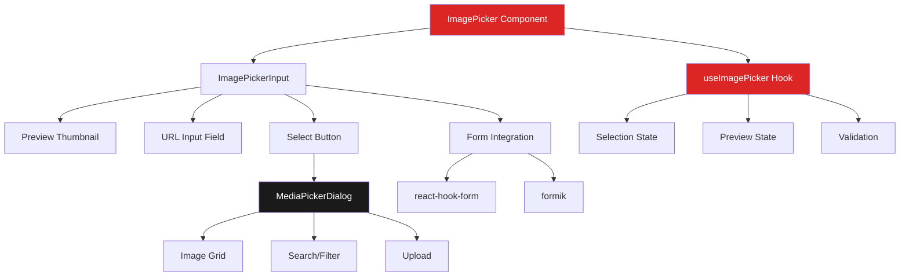

# Design Document: Image Picker Dialog

## Overview

The Image Picker Dialog is a specialized wrapper component around the existing MediaPickerDialog that provides a streamlined, image-focused selection experience. It simplifies the media selection process by offering immediate URL population, visual preview capabilities, and seamless form integration. The component acts as a higher-level abstraction that maintains all the power of the MediaPickerDialog while exposing a simpler interface optimized for image selection use cases.

## Steering Document Alignment

### Technical Standards (tech.md)
- **React 19 & Next.js 15**: Component uses modern React patterns with TypeScript
- **Tailwind CSS v4**: Utilizes existing utility classes and dark theme
- **Form Integration**: Compatible with react-hook-form and formik
- **Performance**: Implements lazy loading and virtual scrolling for large libraries
- **Turkish UI**: All user-facing text in Turkish while code remains in English

### Project Structure (structure.md)
- **Component Location**: `/src/components/ui/ImagePicker.tsx` (UI primitive)
- **Hook Location**: `/src/hooks/useImagePicker.ts` (state management)
- **Type Definitions**: Extends existing MediaItem interface from MediaPickerDialog
- **Integration Points**: NewsForm, PollItemsManager, and other admin forms

## Code Reuse Analysis

### Existing Components to Leverage
- **MediaPickerDialog**: Full media management capabilities (search, filter, upload, pagination)
- **Modal**: Existing modal infrastructure for dialog display
- **Button**: Consistent button styling for actions
- **Input**: Form input component for URL display
- **LoadingSpinner**: Existing loading states

### Integration Points
- **Media API**: `/api/admin/media` endpoint for fetching images
- **Upload API**: `/api/admin/media/upload` for new image uploads
- **Form Libraries**: Existing react-hook-form implementations in NewsForm and PollItemsManager
- **Type System**: MediaItem interface already defined in MediaPickerDialog

## Architecture

The Image Picker follows a composition pattern, wrapping the MediaPickerDialog with additional functionality while maintaining separation of concerns:



## Components and Interfaces

### 1. ImagePicker Component
- **Purpose:** High-level component that combines input field with media picker functionality
- **Location:** `/src/components/ui/ImagePicker.tsx`
- **Interfaces:**
  ```typescript
  interface ImagePickerProps {
    value?: string;
    onChange: (url: string) => void;
    onBlur?: () => void;
    name?: string;
    label?: string;
    placeholder?: string;
    required?: boolean;
    error?: string;
    multiple?: boolean;
    maxSelection?: number;
    sizePreference?: 'thumbnail' | 'medium' | 'large' | 'original';
    showPreview?: boolean;
    disabled?: boolean;
    category?: string;
    className?: string;
  }
  ```
- **Dependencies:** MediaPickerDialog, ImagePickerInput, useImagePicker hook
- **Reuses:** Existing form validation patterns, dark theme styles

### 2. ImagePickerInput Sub-component
- **Purpose:** Input field with preview thumbnail and picker trigger button
- **Location:** Part of ImagePicker component file
- **Interfaces:**
  ```typescript
  interface ImagePickerInputProps {
    value: string;
    onOpenPicker: () => void;
    onClear: () => void;
    placeholder?: string;
    error?: string;
    disabled?: boolean;
    preview?: PreviewState;
  }
  ```
- **Dependencies:** Input component, Button component
- **Reuses:** Existing Input component styles and validation display

### 3. useImagePicker Hook
- **Purpose:** Manages picker state, preview loading, and validation
- **Location:** `/src/hooks/useImagePicker.ts`
- **Interfaces:**
  ```typescript
  interface UseImagePickerOptions {
    value?: string;
    onChange: (url: string) => void;
    sizePreference?: ImageSize;
    validateOnSelect?: boolean;
  }

  interface UseImagePickerReturn {
    isPickerOpen: boolean;
    openPicker: () => void;
    closePicker: () => void;
    handleSelect: (media: MediaItem | MediaItem[]) => void;
    preview: PreviewState;
    clearSelection: () => void;
  }
  ```
- **Dependencies:** useState, useEffect, useCallback from React
- **Reuses:** MediaItem type from MediaPickerDialog

### 4. Preview State Management
- **Purpose:** Handles thumbnail loading and error states for preview
- **Interfaces:**
  ```typescript
  interface PreviewState {
    url: string | null;
    loading: boolean;
    error: boolean;
    width?: number;
    height?: number;
  }
  ```
- **Dependencies:** Image loading via browser API
- **Reuses:** Error handling patterns from existing components

## Data Models

### MediaItem (Existing)
```typescript
interface MediaItem {
  id: number;
  url: string;
  thumbnails?: {
    small?: string;    // 150x150px
    medium?: string;   // 400x400px
    large?: string;    // 800x800px
  };
  filename: string;
  title?: string;
  alt_text?: string;
  mime_type: string;
  size: number;
  width?: number;
  height?: number;
  created_at: string;
  category?: string;
}
```

### Image Size Selection
```typescript
type ImageSize = 'thumbnail' | 'medium' | 'large' | 'original';

interface SizeMap {
  thumbnail: 'small';   // Maps to thumbnails.small
  medium: 'medium';     // Maps to thumbnails.medium
  large: 'large';       // Maps to thumbnails.large
  original: 'url';      // Maps to main url field
}
```

### Selection Result
```typescript
interface SelectionResult {
  url: string;
  metadata?: {
    width: number;
    height: number;
    size: number;
    filename: string;
  };
}
```

## Error Handling

### Error Scenarios

1. **Image Load Failure**
   - **Handling:** Show placeholder icon with "Resim yüklenemedi" message
   - **User Impact:** Clear visual indication that image is unavailable
   - **Recovery:** Allow re-selection or manual URL entry

2. **Network Error During Selection**
   - **Handling:** Display "Bağlantı hatası, tekrar deneyin" toast notification
   - **User Impact:** Temporary interruption, can retry
   - **Recovery:** Automatic retry with exponential backoff

3. **Invalid URL Format**
   - **Handling:** Validation error "Geçersiz resim URL'i" below input
   - **User Impact:** Cannot submit form until corrected
   - **Recovery:** Clear field and select new image

4. **Upload Size Exceeded**
   - **Handling:** Show "Dosya çok büyük (max 10MB)" error
   - **User Impact:** Must choose smaller image or compress
   - **Recovery:** Suggest image compression or different file

5. **Permission Denied**
   - **Handling:** Show "Bu medyaya erişim izniniz yok" message
   - **User Impact:** Cannot select restricted images
   - **Recovery:** Contact admin for permissions

## Implementation Strategy

### Phase 1: Core Component Structure
1. Create ImagePicker component with basic props interface
2. Implement ImagePickerInput sub-component with preview
3. Set up useImagePicker hook for state management
4. Connect to MediaPickerDialog for selection

### Phase 2: Preview and Validation
1. Implement image preview loading with error handling
2. Add hover preview tooltip
3. Integrate form validation
4. Add loading and error states

### Phase 3: Advanced Features
1. Implement multiple selection mode
2. Add size preference selection
3. Create keyboard navigation support
4. Add drag-and-drop support (optional enhancement)

### Phase 4: Form Integration
1. Create react-hook-form wrapper
2. Add formik adapter
3. Integrate with NewsForm
4. Integrate with PollItemsManager

## Testing Strategy

### Unit Testing
- Test useImagePicker hook state transitions
- Test URL validation logic
- Test preview state management
- Test size preference URL selection

### Integration Testing
- Test with MediaPickerDialog integration
- Test form library integration
- Test error handling flows
- Test keyboard navigation

### End-to-End Testing
- Test complete selection flow in NewsForm
- Test multiple selection in gallery creation
- Test upload and immediate selection
- Test mobile responsiveness

## Performance Considerations

1. **Lazy Loading**
   - Preview images load only when visible
   - Use Intersection Observer for grid images
   - Implement virtual scrolling for large libraries

2. **Debouncing**
   - 300ms debounce on search input
   - Prevent rapid API calls during typing

3. **Caching**
   - Cache preview images in browser
   - Store recent selections in sessionStorage
   - Reuse MediaPickerDialog instance when possible

4. **Bundle Size**
   - Lazy load MediaPickerDialog only when needed
   - Tree-shake unused media type filters
   - Minimize custom CSS by using Tailwind utilities

## Accessibility Features

1. **Keyboard Navigation**
   - Tab through all interactive elements
   - Arrow keys for grid navigation
   - Enter to select, Escape to close

2. **Screen Reader Support**
   - ARIA labels on all buttons
   - Alt text for all images
   - Announce selection changes

3. **Focus Management**
   - Return focus to trigger button on close
   - Trap focus within modal when open
   - Visual focus indicators on all elements

4. **High Contrast Mode**
   - Ensure sufficient contrast ratios
   - Visible borders in high contrast mode
   - Clear selection indicators