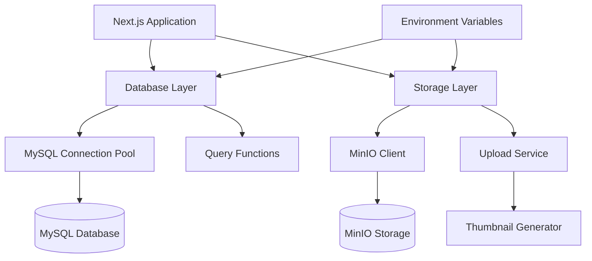

# Design Document

## Overview

This design establishes the MySQL database and MinIO object storage connectivity for the local development environment. The implementation follows a modular architecture with singleton patterns for connection management, connection pooling for database efficiency, and a service layer abstraction for storage operations. The design prioritizes simplicity, performance, and developer experience while maintaining production parity.

## Steering Document Alignment

### Technical Standards (tech.md)
- **MySQL 8.0**: Using mysql2 driver with promise support for async/await patterns
- **MinIO S3-compatible API**: Using official MinIO JavaScript SDK
- **Connection Pooling**: Implementing pool with 5-20 connections as specified
- **Performance Targets**: Design ensures <100ms query execution through indexing and pooling
- **Environment Variables**: All configuration via process.env following security best practices
- **Error Handling**: Standardized error responses with detailed logging in development

### Project Structure (structure.md)
- **Database Client**: `src/lib/db/client.ts` - MySQL connection management
- **Storage Client**: `src/lib/storage/client.ts` - MinIO client initialization
- **Upload Utilities**: `src/lib/storage/upload.ts` - File upload and thumbnail generation
- **Query Functions**: `src/lib/db/queries/` - Database query utilities
- **API Routes**: Following existing pattern in `src/app/api/`
- **Type Definitions**: `src/types/database.ts` and `src/types/storage.ts`

## Code Reuse Analysis

### Existing Components to Leverage
- **Empty Placeholder Files**: `src/lib/db/client.ts` and `src/lib/storage/client.ts` ready for implementation
- **Docker Configuration**: `docker/docker-compose.yml` with MySQL and MinIO services configured
- **Environment Setup**: `.env.local` with all necessary connection variables
- **API Route Pattern**: Existing routes in `src/app/api/` to follow for consistency
- **Type System**: TypeScript configuration ready for type-safe implementations

### Integration Points
- **Next.js App Router**: Server-side database queries in Server Components
- **API Routes**: Database and storage operations in API endpoints
- **Docker Network**: Services communicate via `radio_network` bridge
- **Environment Variables**: Using Next.js built-in env support

## Architecture

The architecture uses a layered approach with clear separation of concerns:



## Components and Interfaces

### Component 1: Database Client (`src/lib/db/client.ts`)
- **Purpose:** Manage MySQL connection pool and provide query interface with automatic environment detection
- **Interfaces:**
  - `getConnection()`: Returns pooled connection with health check
  - `query<T>(sql: string, params?: any[])`: Execute parameterized queries with type safety
  - `transaction<T>(callback: (conn: Connection) => Promise<T>)`: Handle transactional operations with auto-rollback
  - `isDockerEnvironment()`: Detect Docker vs local environment based on hostname resolution
- **Dependencies:** mysql2/promise, environment variables, dns module for Docker detection
- **Reuses:** N/A (new implementation)
- **Performance:** Connection pool (5-20), prepared statements cache, query timeout 5s

### Component 2: Storage Client (`src/lib/storage/client.ts`)
- **Purpose:** Initialize and manage MinIO client instance
- **Interfaces:**
  - `getClient()`: Returns configured MinIO client
  - `ensureBucket()`: Create bucket if not exists
  - `getPublicUrl()`: Generate public access URLs
- **Dependencies:** @aws-sdk/client-s3 or minio, environment variables
- **Reuses:** N/A (new implementation)

### Component 3: Upload Service (`src/lib/storage/upload.ts`)
- **Purpose:** Handle file uploads with validation and thumbnail generation
- **Interfaces:**
  - `uploadImage()`: Process and store image with thumbnails
  - `deleteFile()`: Remove file from storage
  - `generateThumbnails()`: Create multiple image sizes
- **Dependencies:** sharp, MinIO client, multer for multipart handling
- **Reuses:** Storage client from Component 2

### Component 4: Database Schema Manager (`src/lib/db/schema.ts`)
- **Purpose:** Initialize and validate database schema
- **Interfaces:**
  - `initializeSchema()`: Create tables if not exist
  - `checkSchema()`: Validate existing schema
  - `runMigration()`: Execute schema updates
- **Dependencies:** Database client, SQL schema definitions
- **Reuses:** Database client from Component 1

### Component 5: Environment Validator (`src/lib/config/validator.ts`)
- **Purpose:** Validate required environment variables on startup
- **Interfaces:**
  - `validateEnv()`: Check all required variables
  - `getConfig()`: Return typed configuration object
- **Dependencies:** process.env, zod for validation
- **Reuses:** N/A (new implementation)

## Data Models

### Database Schema
```sql
-- Users table (admin users)
CREATE TABLE IF NOT EXISTS users (
  id INT AUTO_INCREMENT PRIMARY KEY,
  email VARCHAR(255) UNIQUE NOT NULL,
  password VARCHAR(255) NOT NULL,
  name VARCHAR(255) NOT NULL,
  role ENUM('admin', 'editor') DEFAULT 'editor',
  is_active BOOLEAN DEFAULT true,
  created_at TIMESTAMP DEFAULT CURRENT_TIMESTAMP,
  updated_at TIMESTAMP DEFAULT CURRENT_TIMESTAMP ON UPDATE CURRENT_TIMESTAMP,
  INDEX idx_email (email),
  INDEX idx_active (is_active)
);

-- Media table (for uploaded files)
CREATE TABLE IF NOT EXISTS media (
  id INT AUTO_INCREMENT PRIMARY KEY,
  filename VARCHAR(500) NOT NULL,
  original_name VARCHAR(500) NOT NULL,
  mime_type VARCHAR(100) NOT NULL,
  size BIGINT NOT NULL,
  url VARCHAR(1000) NOT NULL,
  thumbnails JSON,
  width INT,
  height INT,
  uploaded_by INT,
  created_at TIMESTAMP DEFAULT CURRENT_TIMESTAMP,
  updated_at TIMESTAMP DEFAULT CURRENT_TIMESTAMP ON UPDATE CURRENT_TIMESTAMP,
  deleted_at TIMESTAMP NULL,
  FOREIGN KEY (uploaded_by) REFERENCES users(id),
  INDEX idx_created (created_at),
  INDEX idx_deleted (deleted_at)
);

-- Settings table (application settings)
CREATE TABLE IF NOT EXISTS settings (
  id INT AUTO_INCREMENT PRIMARY KEY,
  setting_key VARCHAR(100) UNIQUE NOT NULL,
  setting_value TEXT,
  setting_type ENUM('string', 'number', 'boolean', 'json') DEFAULT 'string',
  updated_by INT,
  created_at TIMESTAMP DEFAULT CURRENT_TIMESTAMP,
  updated_at TIMESTAMP DEFAULT CURRENT_TIMESTAMP ON UPDATE CURRENT_TIMESTAMP,
  FOREIGN KEY (updated_by) REFERENCES users(id),
  INDEX idx_key (setting_key)
);
```

### Database Connection Configuration
```typescript
interface DatabaseConfig {
  host: string;              // Docker: 'radiodb' | Local: 'localhost'
  port: number;              // 3306
  user: string;              // from DATABASE_URL
  password: string;          // from DATABASE_URL
  database: string;          // 'radio_db'
  connectionLimit: number;   // Min: 5, Max: 20
  waitForConnections: boolean; // true
  queueLimit: number;        // 0 (unlimited)
  enableKeepAlive: boolean;  // true
  keepAliveInitialDelay: number; // 0
}

### Storage Configuration
```typescript
interface StorageConfig {
  endpoint: string;
  port: number;
  accessKey: string;
  secretKey: string;
  bucket: string;
  useSSL: boolean;
}
```

### Media Upload Result
```typescript
interface UploadResult {
  originalUrl: string;
  thumbnails: {
    thumb: string;    // 150x150 - for lists and grids
    medium: string;   // 600x600 - for cards and previews
    full: string;     // 1200x1200 - for full view
  };
  metadata: {
    size: number;
    mimeType: string;
    dimensions: { width: number; height: number; };
  };
}
```

### Database Query Result
```typescript
interface QueryResult<T = any> {
  rows: T[];
  fields: FieldInfo[];
  affectedRows?: number;
  insertId?: number;
}
```

## Error Handling

### Error Scenarios

1. **Database Connection Failure**
   - **Handling:** Retry with exponential backoff, max 3 attempts
   - **User Impact:** "Database temporarily unavailable" message in development console
   - **Logging:** Detailed connection error with host/port information

2. **MinIO Connection Failure**
   - **Handling:** Graceful degradation, queue uploads for retry
   - **User Impact:** "Media upload temporarily unavailable" with retry option
   - **Logging:** Endpoint and credential validation errors

3. **Invalid Environment Variables**
   - **Handling:** Fail fast on startup with clear instructions
   - **User Impact:** Application won't start, shows missing variable names
   - **Logging:** List of missing/invalid variables with setup guide

4. **Upload Size Exceeded**
   - **Handling:** Reject before upload, return size limit
   - **User Impact:** "File too large. Maximum size: 5MB"
   - **Logging:** File size and limit information

5. **Thumbnail Generation Failure**
   - **Handling:** Store original, mark thumbnails as pending
   - **User Impact:** Original image available, thumbnails generated async
   - **Logging:** Image processing error details

## Testing Strategy

### Unit Testing
- **Database Client**: Mock mysql2 connection, test query building
- **Storage Client**: Mock MinIO client, test URL generation
- **Upload Service**: Mock file processing, test validation logic
- **Environment Validator**: Test with various env configurations

### Integration Testing
- **Database Operations**: Test with Docker MySQL container
- **Storage Operations**: Test with Docker MinIO container
- **Full Upload Flow**: End-to-end image upload with thumbnails
- **Schema Initialization**: Test table creation and indexing

### End-to-End Testing
- **Developer Setup**: Clone repo, run docker-compose, verify connections
- **Media Upload**: Upload image via UI, verify storage and thumbnails
- **Database Queries**: Create, read, update, delete operations
- **Error Recovery**: Test connection loss and recovery

## Implementation Considerations

### Connection Management
- Use singleton pattern for database pool and MinIO client
- Lazy initialization on first use
- Graceful shutdown handling for connection cleanup
- Environment detection: Check if 'radiodb' hostname resolves for Docker, fallback to localhost

### Performance Optimizations
- Connection pool configuration: min 5, max 20, idle timeout 60s
- Prepared statements for frequent queries (cache size: 100)
- Query optimization: Use indexes on foreign keys and frequent WHERE columns
- Image processing: Queue with 2 workers, max 5MB per image
- CDN-ready URL generation: Pre-signed URLs with 7-day expiry

### Security Measures
- No credentials in code or error messages
- SQL injection prevention via mysql2 parameterized queries
- File type validation: Accept only image/jpeg, image/png, image/webp
- Size limits: 5MB per file, validated at multer middleware

### Developer Experience
- Clear console output: "✅ MySQL connected (Docker)" or "✅ MySQL connected (Local)"
- Helpful error messages: "❌ MySQL connection failed. Check if Docker is running: docker-compose up -d"
- Docker health checks: Wait for MySQL/MinIO ready state before app start
- Auto-creation: Database tables and MinIO bucket created on first run

### Environment Detection Logic
```typescript
// Detect Docker environment
async function isDockerEnvironment(): Promise<boolean> {
  try {
    await dns.promises.lookup('radiodb');
    return true; // Docker network resolved
  } catch {
    return false; // Use localhost
  }
}

// Connection string builder
function getConnectionConfig(): DatabaseConfig {
  const isDocker = await isDockerEnvironment();
  return {
    host: isDocker ? 'radiodb' : 'localhost',
    port: 3306,
    // ... other config
  };
}
```

### Error Recovery Strategy
- **Database Reconnection**: Exponential backoff (1s, 2s, 4s, 8s) with max 3 retries
- **MinIO Retry**: 3 attempts with 500ms, 1s, 2s delays
- **Upload Failure**: Store failed uploads in queue table for retry
- **Graceful Degradation**: If MinIO unavailable, allow app to run without media features