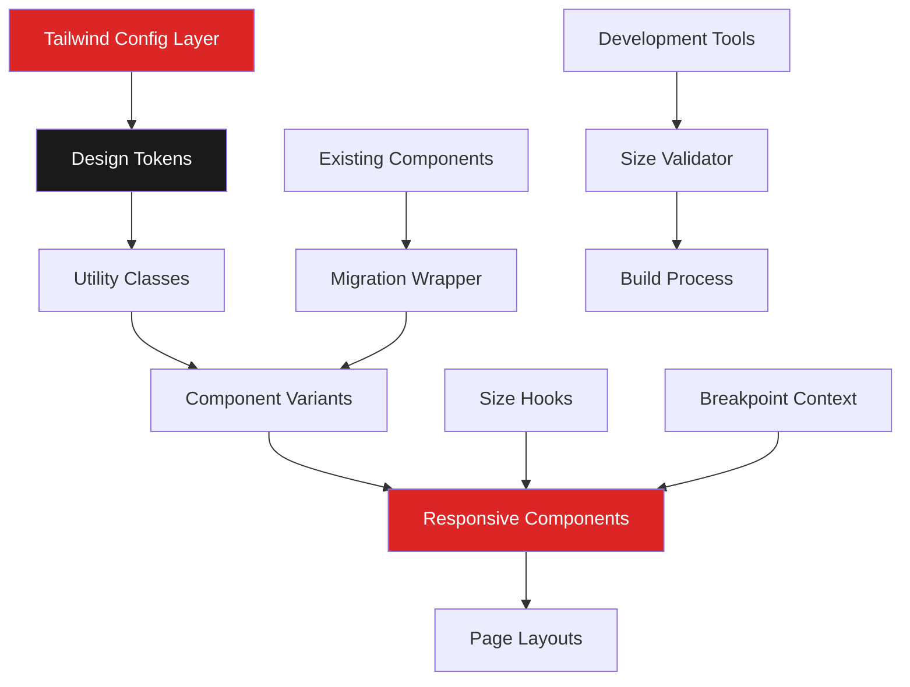

# Design Document: Responsive Design System

## Overview

The Responsive Design System establishes a comprehensive, mobile-first approach to component sizing and spacing throughout the radio station CMS platform. This system will transform the current large-by-default UI elements into a carefully crafted responsive hierarchy that prioritizes mobile usability while maintaining professional aesthetics on larger screens. The design leverages Tailwind CSS v4's utility-first approach and integrates seamlessly with our existing Next.js 15 and React 19 architecture.

## Steering Document Alignment

### Technical Standards (tech.md)
- **Tailwind CSS v4**: Utilizes Tailwind's responsive modifiers and custom configuration
- **Next.js 15 Compatibility**: Ensures server components and client components handle responsive classes correctly
- **Mobile API Architecture**: Aligns with mobile-first JSON responses for dynamic content
- **Performance Requirements**: Maintains < 3 seconds page load on 3G connections
- **Browser Support**: Compatible with iOS Safari 14+, Chrome 90+, Firefox 88+, Edge 90+

### Project Structure (structure.md)
- **Component Organization**: Updates will follow existing `/components/ui/` structure
- **Utility Functions**: Responsive helpers will be added to `/lib/utils/`
- **Type Definitions**: New size types will extend existing `/types/` structure
- **Consistent Naming**: Maintains PascalCase for components, camelCase for utilities

## Code Reuse Analysis

### Existing Components to Leverage
- **Button.tsx**: Already uses size variants (small, medium, large, giant) - will enhance with responsive modifiers
- **Modal.tsx**: Has sizeClasses object - will extend with mobile-first breakpoints
- **Badge.tsx**: Contains size system - will adapt for touch targets
- **Card.tsx**: Base component ready for responsive padding adjustments
- **Input.tsx**: Form elements will inherit new touch-optimized sizes
- **cn() utility**: Existing className merger from `/lib/utils` will handle responsive classes

### Integration Points
- **RadioPlayer**: Will maintain audio functionality while adapting visual size
- **AdminSidebar**: Already has mobile toggle - will enhance with new spacing system
- **StatsCard**: Number display logic exists - will amplify with responsive text sizes
- **NewsCarousel**: Swipe functionality present - will optimize for single-item mobile view
- **Tailwind Config**: Extend existing color system with new spacing/sizing tokens

## Architecture

The responsive design system follows a layered architecture that extends our existing component system:



## Components and Interfaces

### 1. Design Token System
- **Purpose:** Centralized size and spacing definitions
- **Location:** `/tailwind.config.ts` extensions
- **Interfaces:**
  ```typescript
  interface SizeScale {
    xs: string;   // Mobile minimum (14px base text)
    sm: string;   // Mobile comfortable (16px)
    md: string;   // Tablet default (16px)
    lg: string;   // Desktop standard (16px)
    xl: string;   // Desktop expanded (18px)
  }

  interface TypographyScale {
    base: { fontSize: '14px', lineHeight: '1.5' };      // Mobile minimum
    sm: { fontSize: '16px', lineHeight: '1.5' };
    md: { fontSize: '16px', lineHeight: '1.6' };
    lg: { fontSize: '16px', lineHeight: '1.6' };
    // Statistics sizes
    stat: {
      primary: 'text-2xl md:text-4xl',    // 32-48px
      secondary: 'text-xl md:text-2xl',   // 24-32px
      label: 'text-xs uppercase'          // 12px
    };
  }

  interface TouchTargets {
    standard: '44px';     // Primary touch target
    compact: '40px';      // Constrained space with gap-2 (8px)
    spacing: '8px';       // Minimum gap between targets
  }
  ```
- **Dependencies:** Tailwind CSS core
- **Reuses:** Existing color tokens, font families

### 2. Responsive Size Utilities
- **Purpose:** Helper functions for responsive sizing
- **Location:** `/src/lib/utils/responsive.ts`
- **Interfaces:**
  ```typescript
  function getResponsiveSize(base: Size, breakpoint?: Breakpoint): string;
  function calculateTouchTarget(element: HTMLElement): { width: number; height: number };
  ```
- **Dependencies:** None
- **Reuses:** cn() utility for class merging

### 3. Enhanced UI Components
- **Purpose:** Updated primitive components with responsive sizing
- **Interfaces:** Extended props with responsive size options
  ```typescript
  interface ResponsiveButtonProps extends ButtonProps {
    responsiveSize?: {
      base: Size;
      sm?: Size;
      md?: Size;
      lg?: Size;
    };
    touchOptimized?: boolean;  // Ensures min 44x44px touch target
  }

  interface ResponsiveTableProps {
    stickyFirstColumn?: boolean;  // For mobile horizontal scroll
    mobileScroll?: boolean;       // Enable overflow-x-auto on mobile
  }
  ```
- **Dependencies:** Design tokens, responsive utilities
- **Reuses:** All existing component logic and styling
- **Specific Implementations:**
  - **Buttons**: Min height 44px on mobile, 40px on desktop
  - **Inputs**: Min height 44px for all touch devices
  - **Navigation**: Max 56px height mobile, 72px desktop
  - **Admin Sidebar**: Max 240px width on desktop

### 4. Layout Components
- **Purpose:** Responsive containers and grids
- **Location:** `/src/components/layout/`
- **Interfaces:**
  ```typescript
  interface ResponsiveGridProps {
    cols: {
      base: 1;           // Mobile: single column
      sm?: 1 | 2;        // Tablet: 2-column for admin dashboard
      md?: 2 | 3;
      lg?: 3 | 4;
    };
    gap: ResponsiveSpacing;
  }

  interface AdminDashboardGridProps {
    mobileStack: true;           // Force single column on mobile
    tabletColumns: 2;            // Exactly 2 columns on tablet (640-1024px)
    desktopColumns: 3 | 4;       // 3-4 columns on desktop
  }
  ```
- **Dependencies:** Tailwind grid utilities
- **Reuses:** Existing layout patterns

### 5. Migration Compatibility Layer
- **Purpose:** Backward compatibility for existing components
- **Location:** `/src/lib/utils/migration.ts`
- **Interfaces:**
  ```typescript
  function mapLegacySize(oldSize: string): ResponsiveSize;
  function warnDeprecatedSizing(component: string, prop: string): void;
  ```
- **Dependencies:** Console API for warnings
- **Reuses:** Existing component prop types

## Data Models

### Size Token Model
```typescript
interface SizeToken {
  name: string;           // 'text-sm', 'p-4', etc.
  mobile: string;        // '14px', '16px'
  tablet?: string;       // '16px', '20px'
  desktop: string;       // '16px', '24px'
  category: 'text' | 'spacing' | 'component';
  deprecated?: boolean;
}
```

### Breakpoint Model
```typescript
interface Breakpoint {
  name: 'xs' | 'sm' | 'md' | 'lg' | 'xl' | '2xl';
  minWidth: number;     // in pixels
  maxWidth?: number;    // in pixels
  isActive: boolean;    // runtime state
}
```

### Component Size Model
```typescript
interface ComponentSize {
  height: ResponsiveValue<string>;
  padding: ResponsiveValue<string>;
  fontSize: ResponsiveValue<string>;
  minTouchTarget: number;  // in pixels, typically 44
}
```

### Responsive Value Model
```typescript
type ResponsiveValue<T> = T | {
  base: T;
  sm?: T;
  md?: T;
  lg?: T;
  xl?: T;
};
```

## Implementation Strategy

### Phase 1: Foundation (Design Tokens)
1. Extend Tailwind configuration with size scales
2. Define spacing multipliers for mobile/desktop
3. Create responsive text size utilities
4. Establish touch target minimums

### Phase 2: Core Components
1. Update Button component with responsive sizes
2. Enhance Input/Form components for touch
3. Adapt Card padding for mobile
4. Optimize Modal for fullscreen mobile

### Phase 3: Complex Components
1. Transform StatsCard with prominent numbers
2. Refactor AdminSidebar responsive behavior
3. Update NewsCarousel for single-item mobile
4. Enhance PollCard touch interactions

### Phase 4: Layout Systems
1. Implement responsive grid system
2. Create mobile-first container components
3. Add responsive spacing utilities
4. Build adaptive navigation patterns

### Phase 5: Migration & Polish
1. Add backward compatibility layer
2. Create migration warnings
3. Update documentation
4. Add development tools

## Error Handling

### Error Scenarios

1. **Invalid Size Token**
   - **Handling:** Fall back to nearest valid size with console warning
   - **User Impact:** Component renders with closest appropriate size
   - **Developer Feedback:** Warning in development mode with suggested fix

2. **Touch Target Too Small**
   - **Handling:** Automatically expand clickable area with transparent padding
   - **User Impact:** Element remains visually same but has larger touch area
   - **Developer Feedback:** Development warning with WCAG compliance note

3. **Breakpoint Detection Failure**
   - **Handling:** Use base (mobile) size as fallback
   - **User Impact:** Interface remains usable with mobile-optimized sizing
   - **Developer Feedback:** Error logged with browser information

4. **Legacy Component Conflict**
   - **Handling:** Apply compatibility wrapper automatically
   - **User Impact:** No visual change, component works as before
   - **Developer Feedback:** Migration suggestion in console

5. **Performance Degradation**
   - **Handling:** Throttle resize observers, use CSS-only where possible
   - **User Impact:** Smooth transitions without lag
   - **Developer Feedback:** Performance metrics in development tools

## Testing Strategy

### Unit Testing
- Test size token calculations across breakpoints
- Verify touch target size validation
- Test migration compatibility functions
- Validate responsive utility outputs

### Integration Testing
- Test component size changes across breakpoints
- Verify backward compatibility with existing components
- Test RadioPlayer functionality with new sizes
- Validate form submission with new input sizes

### End-to-End Testing
- Mobile device testing:
  - iPhone SE (375px width)
  - iPhone 14 (390px width)
  - Samsung Galaxy S21 (384px width)
- Tablet testing:
  - iPad (768px width)
  - iPad Pro (1024px width)
- Desktop browser testing:
  - 1280px (HD)
  - 1920px (Full HD)
  - 2560px (2K)
- Specific breakpoint validation:
  - 320px (minimum mobile)
  - 640px (sm breakpoint)
  - 768px (md breakpoint)
  - 1024px (lg breakpoint)
  - 1280px (xl breakpoint)
- Admin panel workflow on mobile devices
- News browsing and poll voting on small screens

### Visual Regression Testing
- Capture screenshots at each breakpoint
- Compare before/after migration
- Validate spacing consistency
- Check text readability at all sizes

## Performance Considerations

1. **CSS Bundle Optimization**
   - Use Tailwind's purge to remove unused utilities
   - Group responsive utilities to reduce repetition
   - Leverage CSS custom properties for runtime values:
     ```css
     :root {
       --touch-target: 44px;
       --mobile-header: 56px;
       --desktop-header: 72px;
       --min-text: 14px;
     }
     ```

2. **Runtime Performance**
   - Avoid JavaScript-based responsive calculations where possible
   - Use CSS-only responsive solutions
   - Implement resize observer with throttling:
     ```typescript
     const throttledResize = throttle((entries) => {
       // Handle resize
     }, 100); // 100ms throttle
     ```

3. **Development Performance**
   - Provide TypeScript autocomplete for size props
   - Cache size calculations during build
   - Use static analysis for size validation

## Migration Path

1. **Compatibility Mode** (Week 1)
   - Both old and new size systems work simultaneously
   - Console warnings guide developers
   - No breaking changes

2. **Soft Migration** (Week 2-3)
   - Update high-traffic components first
   - Provide codemods for automatic conversion
   - Document migration patterns

3. **Deprecation** (Week 4)
   - Mark old sizes as deprecated
   - Increase warning visibility
   - Provide migration deadline

4. **Cleanup** (Week 5+)
   - Remove compatibility layer
   - Clean up old size utilities
   - Finalize documentation