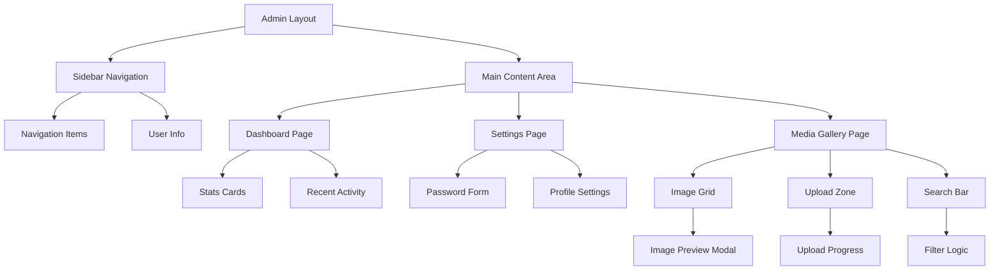

# admin-ui-design - Task 4

Execute task 4 for the admin-ui-design specification.

## Task Description
Create StatsCard component for dashboard metrics

## Code Reuse
**Leverage existing code**: src/components/ui/Card.tsx, src/components/ui/LoadingSpinner.tsx

## Requirements Reference
**Requirements**: 1.1

## Usage
```
/Task:4-admin-ui-design
```

## Instructions

Execute with @spec-task-executor agent the following task: "Create StatsCard component for dashboard metrics"

```
Use the @spec-task-executor agent to implement task 4: "Create StatsCard component for dashboard metrics" for the admin-ui-design specification and include all the below context.

# Steering Context
## Steering Documents Context

No steering documents found or all are empty.

# Specification Context
## Specification Context (Pre-loaded): admin-ui-design

### Requirements
# Requirements Document

## Introduction

This feature delivers a professional, slick, and simple admin dashboard for the TrendAnkara radio station CMS platform. The admin interface provides intuitive management tools for content editors and administrators, featuring streamlined workflows for password management and media operations through MinIO integration. The design follows a "keep it simple" philosophy while maintaining professional aesthetics.

## Alignment with Product Vision

This feature strongly supports the product vision outlined in product.md by:
- **Simplifying Content Management**: Provides administrators with a clean, intuitive interface that reduces complexity
- **Professional Web Presence**: Delivers a polished admin experience matching the quality expectations of kralmuzik.com.tr
- **Core Motto Adherence**: Embodies "Keep it basic, don't overcomplicate anything" through minimalist design
- **Dark Theme Consistency**: Maintains RED/BLACK/WHITE color scheme across all admin interfaces
- **Efficient Media Management**: Centralizes image/media operations with MinIO integration for streamlined workflows

## Requirements

### Requirement 1: Admin Dashboard UI

**User Story:** As an administrator, I want a professional and simple dashboard interface, so that I can efficiently navigate and manage all aspects of the radio station platform.

#### Acceptance Criteria

1. WHEN an administrator logs into the admin panel THEN the system SHALL display a clean dashboard with navigation sidebar and main content area
2. IF the administrator is authenticated THEN the system SHALL show personalized welcome message with their name/email
3. WHEN navigating between admin pages THEN the system SHALL maintain consistent layout structure with smooth transitions
4. IF the screen size changes THEN the system SHALL adapt responsively while maintaining usability
5. WHEN viewing any admin page THEN the system SHALL use dark theme with RED/BLACK/WHITE color scheme consistently

### Requirement 2: Sidebar Navigation Component

**User Story:** As an administrator, I want a persistent sidebar navigation, so that I can quickly access different management sections without confusion.

#### Acceptance Criteria

1. WHEN viewing the admin panel THEN the system SHALL display a fixed sidebar with clearly labeled navigation items
2. IF the current page matches a navigation item THEN the system SHALL highlight the active menu item visually
3. WHEN clicking a navigation item THEN the system SHALL navigate to the corresponding page without full reload
4. IF on mobile devices THEN the system SHALL provide a collapsible sidebar with hamburger menu toggle
5. WHEN the sidebar contains many items THEN the system SHALL group related items with clear section headers

### Requirement 3: Settings Page with Password Management

**User Story:** As an administrator, I want to change my password through a secure settings interface, so that I can maintain account security.

#### Acceptance Criteria

1. WHEN navigating to settings page THEN the system SHALL display a clean form for password change
2. IF entering a new password THEN the system SHALL validate password strength and show requirements
3. WHEN submitting password change THEN the system SHALL require current password confirmation
4. IF password change succeeds THEN the system SHALL show success notification and maintain session
5. WHEN password validation fails THEN the system SHALL display clear error messages with guidance

### Requirement 4: MinIO Media Gallery Interface

**User Story:** As a content editor, I want to browse, search, and preview images in a gallery view, so that I can efficiently manage media assets.

#### Acceptance Criteria

1. WHEN accessing the media page THEN the system SHALL display images in a responsive grid gallery layout
2. IF clicking on an image THEN the system SHALL show a full preview with metadata information
3. WHEN searching for images THEN the system SHALL filter results in real-time based on filename or tags
4. IF images are loading THEN the system SHALL show loading placeholders maintaining layout stability
5. WHEN scrolling through many images THEN the system SHALL implement pagination or infinite scroll

### Requirement 5: Image Upload Interface

**User Story:** As a content editor, I want to upload images with drag-and-drop functionality, so that I can quickly add new media assets.

#### Acceptance Criteria

1. WHEN on the media upload section THEN the system SHALL provide a drag-and-drop zone with clear instructions
2. IF dragging files over the zone THEN the system SHALL show visual feedback indicating drop readiness
3. WHEN uploading files THEN the system SHALL display progress bars for each file
4. IF upload completes THEN the system SHALL automatically add images to the gallery view
5. WHEN upload fails THEN the system SHALL show error messages with retry options

### Requirement 6: Image Management Actions

**User Story:** As an administrator, I want to delete and organize images, so that I can maintain a clean media library.

#### Acceptance Criteria

1. WHEN viewing an image in the gallery THEN the system SHALL provide delete action with confirmation dialog
2. IF deleting an image THEN the system SHALL remove it from MinIO storage and update gallery immediately
3. WHEN selecting multiple images THEN the system SHALL enable bulk delete operations
4. IF an image is in use THEN the system SHALL warn before deletion and show usage references
5. WHEN deletion fails THEN the system SHALL show error message and maintain image in gallery

## Non-Functional Requirements

### Performance
- Page load time under 2 seconds for admin dashboard
- Image gallery renders within 1 second for first 20 images
- Upload progress updates in real-time without lag
- Smooth animations and transitions (60 FPS)
- Responsive to user input within 100ms

### Security
- Password changes require current password verification
- Secure session management with proper timeouts
- CSRF protection on all form submissions
- File upload validation for type and size
- Sanitized user inputs to prevent XSS attacks

### Reliability
- Graceful error handling with user-friendly messages
- Automatic retry for failed MinIO operations
- Maintains state during network interruptions
- Prevents data loss with confirmation dialogs
- Browser back/forward button compatibility

### Usability
- Intuitive navigation without documentation needed
- Clear visual hierarchy with consistent spacing
- Accessible with keyboard navigation support
- Mobile-responsive design for tablet/phone access
- Consistent visual feedback for all interactions
- Turkish language interface with English codebase
- Maximum 3 clicks to reach any function

---

### Design
# Design Document

## Overview

The Admin UI Design feature implements a professional, minimalist admin dashboard for the TrendAnkara radio station CMS. The design emphasizes simplicity while delivering powerful management capabilities through an intuitive interface. Built on Next.js App Router with React Server Components, the system leverages existing authentication, storage, and UI components to create a cohesive admin experience.

## Steering Document Alignment

### Technical Standards (tech.md)
- **Next.js 15.5.3 App Router**: Server Components for optimal performance
- **Tailwind CSS v4**: Utility-first styling with dark theme preset
- **NextAuth.js**: Leveraging existing authentication system
- **MinIO Client**: Using established storage client for media operations
- **React 19.1.0**: Latest features including Suspense boundaries
- **TypeScript**: Type-safe component interfaces and API contracts

### Project Structure (structure.md)
- **Admin Routes**: `/src/app/admin/*` following App Router conventions
- **Component Organization**: Reusable components in `/src/components/admin/`
- **API Routes**: `/src/app/api/admin/*` for server actions
- **Shared UI Components**: Extending `/src/components/ui/*` primitives
- **Storage Integration**: Utilizing `/src/lib/storage/` utilities
- **Authentication**: Building on `/src/lib/auth/` patterns

## Code Reuse Analysis

### Existing Components to Leverage
- **Button Component** (`/src/components/ui/Button.tsx`): Dark theme variants already configured
- **Input Component** (`/src/components/ui/Input.tsx`): Form inputs with validation states
- **Card Component** (`/src/components/ui/Card.tsx`): Content containers with dark styling
- **Modal Component** (`/src/components/ui/Modal.tsx`): Dialogs for confirmations and previews
- **LoadingSpinner** (`/src/components/ui/LoadingSpinner.tsx`): Loading states

### Integration Points
- **Authentication System**: `requireAuth()` and `getServerSession()` from `/src/lib/auth/utils.ts`
- **MinIO Storage Client**: Complete storage operations from `/src/lib/storage/client.ts`
- **Tailwind Config**: Dark theme colors and brand palette already defined
- **Utils Library**: `cn()` utility for conditional class names from `/src/lib/utils.ts`
- **Database Layer**: Existing MySQL connection patterns

## Architecture

The admin UI follows a component-based architecture with server-side rendering for optimal performance and SEO. The design separates presentation, business logic, and data access layers.



## Components and Interfaces

### AdminLayout Component
- **Purpose:** Root layout wrapper providing consistent structure across admin pages
- **Interfaces:** Children prop for page content, session data from auth
- **Dependencies:** Sidebar, Header, authentication utils
- **Reuses:** Existing layout patterns, requireAuth utility

### AdminSidebar Component
- **Purpose:** Fixed navigation sidebar with collapsible mobile version
- **Interfaces:** Navigation items array, active route highlighting
- **Dependencies:** Next.js Link, usePathname hook
- **Reuses:** Button component, dark theme colors

### DashboardPage Component
- **Purpose:** Admin landing page with overview statistics and quick actions
- **Interfaces:** Server-side data fetching for stats
- **Dependencies:** Card components, data fetching utilities
- **Reuses:** Card, LoadingSpinner components

### SettingsPage Component
- **Purpose:** User settings management including password changes
- **Interfaces:** Form submission handlers, validation logic
- **Dependencies:** Form components, password validation
- **Reuses:** Input, Button, Card components

### MediaGallery Component
- **Purpose:** Grid display of uploaded images with search and preview
- **Interfaces:** Image list from MinIO, search/filter props
- **Dependencies:** MinIO client, image optimization
- **Reuses:** Card, Modal, LoadingSpinner components

### ImageUpload Component
- **Purpose:** Drag-and-drop file upload with progress tracking
- **Interfaces:** onUpload callback, file validation rules
- **Dependencies:** MinIO upload client, progress tracking
- **Reuses:** Button component, progress indicators

### PasswordChangeForm Component
- **Purpose:** Secure password update form with validation
- **Interfaces:** Form state, validation errors, success callback
- **Dependencies:** Password validation utilities, auth API
- **Reuses:** Input, Button components, form patterns

## Data Models

### AdminUser (extends existing User model)
```typescript
interface AdminUser {
  id: string
  email: string
  name: string | null
  role: 'admin' | 'super_admin' | 'editor'
  lastLogin: Date
  createdAt: Date
  updatedAt: Date
}
```

### MediaFile
```typescript
interface MediaFile {
  id: string
  filename: string
  url: string
  thumbnailUrl: string
  size: number
  mimeType: string
  uploadedBy: string
  uploadedAt: Date
  tags: string[]
  inUse: boolean
  usageReferences: string[]
}
```

### DashboardStats
```typescript
interface DashboardStats {
  totalNews: number
  totalPolls: number
  activePolls: number
  totalMedia: number
  recentActivity: ActivityItem[]
  storageUsed: number
  lastBackup: Date | null
}
```

### PasswordChangeRequest
```typescript
interface PasswordChangeRequest {
  currentPassword: string
  newPassword: string
  confirmPassword: string
}
```

## Error Handling

### Error Scenarios

1. **Authentication Failure**
   - **Handling:** Redirect to login with return URL
   - **User Impact:** Seamless re-authentication flow

2. **Upload Size Exceeded**
   - **Handling:** Client-side validation before upload attempt
   - **User Impact:** Clear message about size limits with suggestions

3. **Network Timeout**
   - **Handling:** Retry with exponential backoff (MinIO client handles)
   - **User Impact:** Loading state with retry option

4. **Invalid File Type**
   - **Handling:** Prevent upload, show accepted formats
   - **User Impact:** Immediate feedback with format guidance

5. **Concurrent Editing**
   - **Handling:** Optimistic locking with conflict resolution
   - **User Impact:** Warning dialog with merge options

6. **Storage Quota Exceeded**
   - **Handling:** Block upload, show storage stats
   - **User Impact:** Clear storage usage display with cleanup suggestions

## Testing Strategy

### Unit Testing
- Component rendering tests with React Testing Library
- Form validation logic testing
- Authentication utility function tests
- MinIO client mock testing

### Integration Testing
- Admin workflow end-to-end tests
- Password change flow testing
- Media upload and deletion flows
- Navigation and routing tests

### End-to-End Testing
- Complete admin journey from login to logout
- Media management workflow
- Settings update scenarios
- Mobile responsive behavior testing

## UI/UX Design Patterns

### Visual Design
- **Color Palette:** RED (#dc2626) accents, BLACK (#000000) backgrounds, WHITE (#ffffff) text
- **Typography:** Inter font family with clear hierarchy
- **Spacing:** Consistent 8px grid system
- **Shadows:** Subtle elevation for cards and modals
- **Animations:** Smooth transitions (200ms) for interactions

### Responsive Breakpoints
- **Mobile:** < 768px (collapsible sidebar, stacked layout)
- **Tablet:** 768px - 1024px (compact sidebar, flexible grid)
- **Desktop:** > 1024px (full sidebar, multi-column layout)

### Interaction Patterns
- **Hover States:** Subtle background color changes
- **Focus States:** Red outline for accessibility
- **Loading States:** Skeleton screens maintaining layout
- **Error States:** Red border with inline error messages
- **Success States:** Green checkmarks with auto-dismiss

### Accessibility Features
- **Keyboard Navigation:** Tab order, arrow keys for galleries
- **Screen Reader Support:** ARIA labels and roles
- **Color Contrast:** WCAG AA compliance
- **Focus Indicators:** Visible focus rings
- **Skip Links:** Quick navigation to main content

**Note**: Specification documents have been pre-loaded. Do not use get-content to fetch them again.

## Task Details
- Task ID: 4
- Description: Create StatsCard component for dashboard metrics
- Leverage: src/components/ui/Card.tsx, src/components/ui/LoadingSpinner.tsx
- Requirements: 1.1

## Instructions
- Implement ONLY task 4: "Create StatsCard component for dashboard metrics"
- Follow all project conventions and leverage existing code
- Mark the task as complete using: claude-code-spec-workflow get-tasks admin-ui-design 4 --mode complete
- Provide a completion summary
```

## Task Completion
When the task is complete, mark it as done:
```bash
claude-code-spec-workflow get-tasks admin-ui-design 4 --mode complete
```

## Next Steps
After task completion, you can:
- Execute the next task using /admin-ui-design-task-[next-id]
- Check overall progress with /spec-status admin-ui-design
