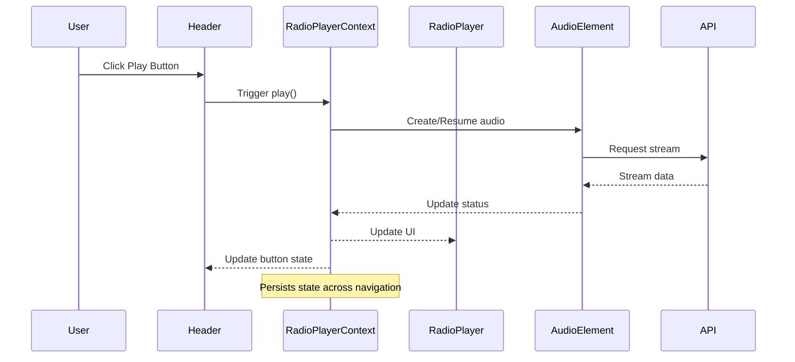
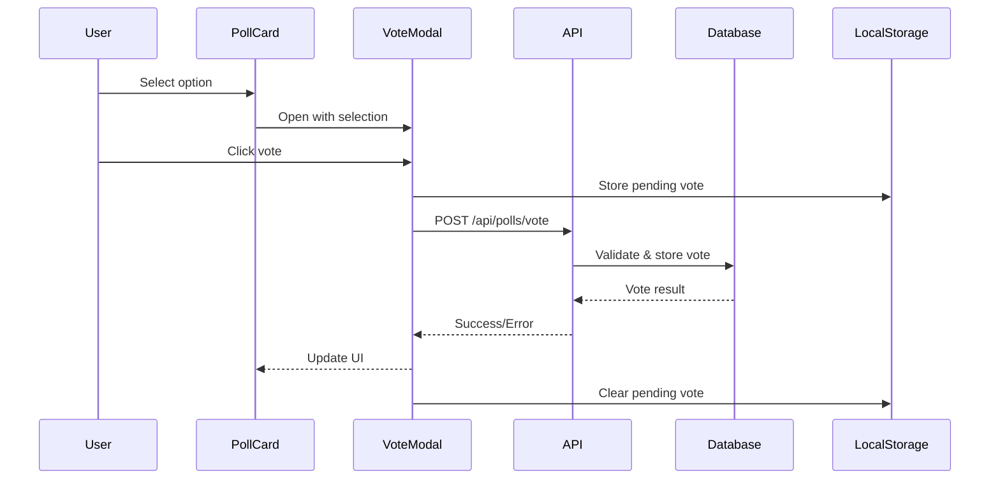
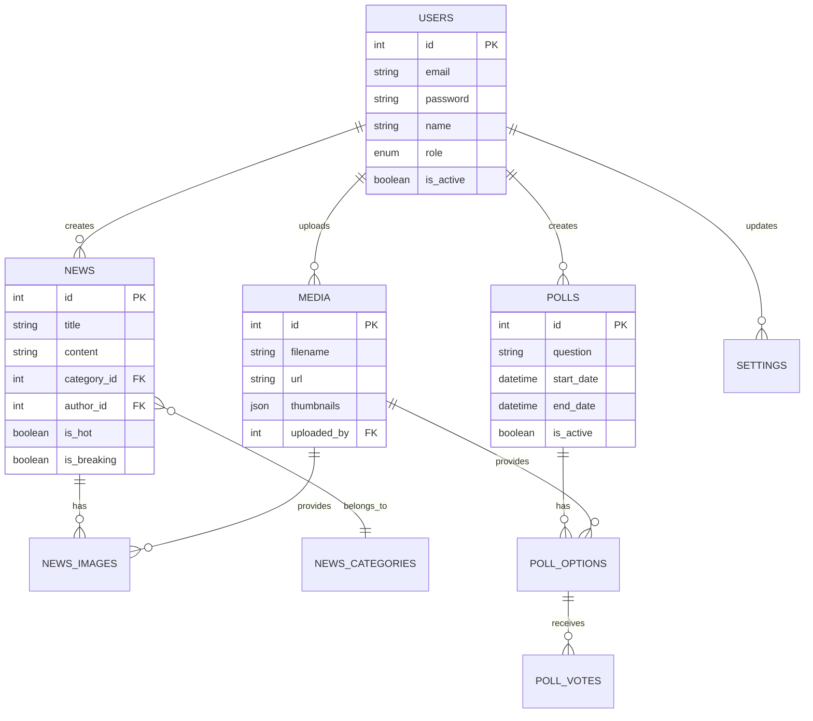

# frontend-design - Task 34

Execute task 34 for the frontend-design specification.

## Task Description
Implement PollCard voting logic in src/components/polls/PollCard.tsx

## Code Reuse
**Leverage existing code**: localStorage API

## Requirements Reference
**Requirements**: 4.2, 4.3

## Usage
```
/Task:34-frontend-design
```

## Instructions

Execute with @spec-task-executor agent the following task: "Implement PollCard voting logic in src/components/polls/PollCard.tsx"

```
Use the @spec-task-executor agent to implement task 34: "Implement PollCard voting logic in src/components/polls/PollCard.tsx" for the frontend-design specification and include all the below context.

# Steering Context
## Steering Documents Context

No steering documents found or all are empty.

# Specification Context
## Specification Context (Pre-loaded): frontend-design

### Requirements
# Requirements Document - Frontend Design Implementation

## Introduction

This specification defines the requirements for implementing a professional, modern frontend design system for the Trend Ankara Radio CMS. The design follows the "Monkey-Proof Design" philosophy, ensuring extreme simplicity and usability for all users regardless of technical expertise. The implementation will create a dark-mode-only interface with RED/BLACK/WHITE color scheme that provides seamless radio streaming, content management, and audience engagement.

## Alignment with Product Vision

This frontend design directly supports the core product motto: "Keep it basic, don't overcomplicate anything." The implementation aligns with the product vision by:

- **Simplifying User Experience**: Ultra-simple interfaces with always-visible critical functions
- **Supporting Core Features**: Radio player persistence, news display, and polling system
- **Professional Aesthetic**: Modern radio station design matching kralmuzik.com.tr quality
- **Mobile-Ready**: Responsive design that supports the planned mobile app through consistent visual language
- **Turkish Audience Focus**: All UI text in Turkish, culturally appropriate design patterns

## Requirements

### Requirement 1: Core Component System

**User Story:** As a developer, I want a comprehensive component library, so that I can build consistent and maintainable user interfaces quickly.

#### Acceptance Criteria

1. WHEN a developer needs a UI element THEN the component library SHALL provide pre-built, tested components
2. IF a component is used anywhere in the application THEN it SHALL follow the design system specifications exactly
3. WHEN a component is rendered THEN it SHALL have minimum touch target of 48x48px for interactive elements
4. IF a user interacts with any component THEN the component SHALL provide immediate visual feedback
5. WHEN a component has multiple variants THEN each variant SHALL be clearly documented with usage examples
6. IF a component has an error state THEN it SHALL display clear, Turkish-language error messages

### Requirement 2: Radio Player Component

**User Story:** As a radio listener, I want an always-available radio player, so that I can listen to the stream without interruption while browsing the site.

#### Acceptance Criteria

1. WHEN the user loads any page THEN the radio player SHALL be visible and accessible
2. IF the user navigates between pages THEN the radio stream SHALL continue playing without interruption
3. WHEN the play button is clicked THEN the stream SHALL start within 2 seconds
4. IF the stream connection is lost THEN the player SHALL automatically attempt reconnection with visual feedback
5. WHEN on iOS devices THEN the player SHALL use special nuclear reset strategy for stability
6. IF on mobile devices THEN the player SHALL appear as a fixed bottom bar with 80px height
7. WHEN metadata is available THEN the player SHALL display current song information

### Requirement 3: News Display System

**User Story:** As a visitor, I want to browse and read news articles easily, so that I can stay updated with music and radio content.

#### Acceptance Criteria

1. WHEN the homepage loads THEN a news carousel SHALL display featured articles
2. IF a news card is clicked THEN a modal SHALL open with the full article content
3. WHEN viewing news on mobile THEN cards SHALL display in a single column layout
4. IF an article has a category THEN it SHALL display a colored badge (MAGAZINE/ARTIST/ALBUM/CONCERT)
5. WHEN scrolling through news THEN images SHALL lazy load with blur placeholders
6. IF an article is marked as HOT or BREAKING THEN it SHALL have a distinctive visual indicator
7. WHEN the news page loads THEN it SHALL display a 3-column grid on desktop, 2-column on tablet, 1-column on mobile

### Requirement 4: Polling Interface

**User Story:** As a listener, I want to participate in station polls, so that I can vote for my favorite songs and artists.

#### Acceptance Criteria

1. WHEN an active poll exists THEN it SHALL appear as a popup on the homepage
2. IF a user selects a poll option THEN the vote button SHALL become enabled
3. WHEN a vote is submitted THEN the results SHALL display with animated percentage bars
4. IF a user has already voted THEN they SHALL see results instead of voting options
5. WHEN poll items have images THEN they SHALL display as 60px thumbnails next to options
6. IF a poll has ended THEN it SHALL show in the past polls section with final results
7. WHEN viewing on mobile THEN poll options SHALL stack vertically with full-width touch targets

### Requirement 5: Navigation System

**User Story:** As a site visitor, I want simple and clear navigation, so that I can find content without confusion.

#### Acceptance Criteria

1. WHEN on desktop THEN the header SHALL display logo and maximum 3 navigation items
2. IF on mobile THEN a hamburger menu SHALL provide access to navigation
3. WHEN a navigation item is active THEN it SHALL have a red underline indicator
4. IF hovering over a navigation item on desktop THEN it SHALL show underline animation
5. WHEN the mobile menu is open THEN clicking outside SHALL close it
6. IF on mobile THEN critical navigation SHALL also appear in a bottom navigation bar
7. WHEN navigating THEN page transitions SHALL use fade animations for smooth experience

### Requirement 6: Dark Mode Theme

**User Story:** As a user, I want a consistent dark theme, so that I have a comfortable viewing experience, especially at night.

#### Acceptance Criteria

1. WHEN the application loads THEN it SHALL always display in dark mode
2. IF any component is rendered THEN it SHALL use the RED (#DC2626)/BLACK (#000000)/WHITE (#FFFFFF) color scheme
3. WHEN text appears on dark backgrounds THEN it SHALL meet WCAG AA contrast ratios (7:1 for normal text)
4. IF an element needs emphasis THEN it SHALL use the brand red color
5. WHEN displaying surfaces THEN they SHALL use graduated dark grays (#1A1A1A, #242424, #2E2E2E)
6. IF borders are needed THEN they SHALL use subtle gray colors (#333333, #404040)

### Requirement 7: Responsive Design

**User Story:** As a mobile user, I want the site to work perfectly on my device, so that I can access all features on the go.

#### Acceptance Criteria

1. WHEN viewport is less than 768px THEN layout SHALL switch to mobile single-column
2. IF on tablet (768px-1024px) THEN content SHALL display in 2-column grids where applicable
3. WHEN on desktop (>1024px) THEN content SHALL use 3-column grids for optimal space usage
4. IF touch is detected THEN all interactive elements SHALL have minimum 48px touch targets
5. WHEN orientation changes THEN layout SHALL adapt smoothly without content jumping
6. IF on mobile THEN the radio player SHALL move to a fixed bottom position

### Requirement 8: Performance Optimization

**User Story:** As a user with limited bandwidth, I want fast page loads, so that I can access content quickly even on slower connections.

#### Acceptance Criteria

1. WHEN a page loads THEN Largest Contentful Paint SHALL occur within 2.5 seconds
2. IF images are present THEN they SHALL use lazy loading with progressive enhancement
3. WHEN JavaScript loads THEN initial bundle SHALL be less than 100KB
4. IF a user interacts THEN First Input Delay SHALL be less than 100ms
5. WHEN content loads THEN Cumulative Layout Shift SHALL be less than 0.1
6. IF components are non-critical THEN they SHALL be code-split and lazy loaded

### Requirement 9: Accessibility Standards

**User Story:** As a user with disabilities, I want to access all site features, so that I can enjoy the radio station's content equally.

#### Acceptance Criteria

1. WHEN using keyboard navigation THEN all interactive elements SHALL be reachable via Tab key
2. IF an element has focus THEN it SHALL show a clear visual indicator with 3:1 contrast ratio
3. WHEN screen readers are used THEN all content SHALL have proper ARIA labels in Turkish
4. IF an error occurs THEN error messages SHALL be announced to screen readers
5. WHEN animations play THEN users SHALL have option to reduce motion
6. IF form validation fails THEN errors SHALL appear inline with clear descriptions

### Requirement 10: Admin Interface

**User Story:** As a station administrator, I want a clear admin panel, so that I can manage content efficiently.

#### Acceptance Criteria

1. WHEN accessing /admin THEN authentication SHALL be required
2. IF authenticated THEN admin layout SHALL show sidebar navigation on desktop
3. WHEN managing content THEN data tables SHALL support sorting and pagination
4. IF uploading media THEN a media manager dialog SHALL provide upload and selection features
5. WHEN editing content THEN forms SHALL have real-time validation with Turkish error messages
6. IF on mobile admin THEN interface SHALL adapt to single-column with collapsible navigation

## Non-Functional Requirements

### Performance
- Page Load Time: < 3 seconds on 3G connection
- Time to Interactive: < 5 seconds
- Lighthouse Performance Score: > 90
- Bundle Size: < 300KB total
- API Response Time: < 200ms average
- Image Optimization: WebP format with multiple resolutions

### Security
- Content Security Policy headers configured
- XSS protection through input sanitization
- HTTPS-only in production
- Secure session management for admin areas
- Rate limiting on form submissions

### Reliability
- 99.9% uptime for frontend application
- Graceful error handling with user-friendly messages
- Automatic reconnection for radio stream
- Offline fallbacks for critical features
- Error boundary implementation for React components

### Usability
- Zero learning curve for basic functions
- Maximum 3 clicks to any content
- All actions reversible where applicable
- Clear visual hierarchy
- Consistent interaction patterns
- Turkish language throughout UI
- Mobile-first responsive design

### Compatibility
- Modern browsers: Chrome 90+, Firefox 88+, Safari 14+, Edge 90+
- Mobile browsers: iOS Safari 14+, Chrome Mobile 90+
- Screen sizes: 320px to 4K displays
- Touch, mouse, and keyboard input support
- iOS audio handling compatibility

### Maintainability
- Component-based architecture
- TypeScript for type safety where applicable
- Consistent code formatting with Prettier
- Comprehensive component documentation
- Automated testing for critical paths
- Clear separation of concerns

### Scalability
- Support for 1000+ concurrent users
- Lazy loading for performance
- CDN-ready asset structure
- Efficient state management
- Optimized re-renders

---

### Design
# Design Document - Frontend Design Implementation

## Overview

This design document outlines the technical architecture and implementation approach for the Trend Ankara Radio CMS frontend. The design emphasizes component reusability, performance optimization, and adherence to the "Monkey-Proof Design" philosophy. Building upon the existing Next.js 15.5.3 infrastructure with Tailwind CSS v4, this implementation will create a professional, dark-mode-only radio station interface that serves Turkish audiences with ultra-simple, accessible interactions.

## Steering Document Alignment

### Technical Standards (tech.md)
- **Next.js 15.5.3 App Router**: Utilizing server components for optimal performance
- **React 19.1.0**: Leveraging latest React features and concurrent rendering
- **Tailwind CSS v4**: Extending existing configuration for dark theme
- **TypeScript Support**: Adding type definitions for component props and API responses
- **Performance Targets**: Meeting Core Web Vitals (LCP < 2.5s, FID < 100ms, CLS < 0.1)
- **Mobile API Ready**: Component designs support JSON serialization for mobile app

### Project Structure (structure.md)
Following the established directory organization:
- **Components**: `/src/components/` with subdirectories for domain-specific components
- **UI Primitives**: `/src/components/ui/` for reusable base components
- **Hooks**: `/src/hooks/` for custom React hooks
- **Types**: `/src/types/` for TypeScript definitions
- **Utilities**: `/src/lib/utils/` for shared functions
- **Styles**: Component-scoped styles with Tailwind utilities

## Code Reuse Analysis

### Existing Components to Leverage
- **Tailwind Configuration** (`tailwind.config.ts`): Already configured with brand colors, dark mode surfaces, and animations
- **Database Schema** (`src/lib/db/schema.ts`): Established tables for users, media, and settings
- **Storage Client** (`src/lib/storage/client.ts`): MinIO integration for media management
- **Validation Utilities** (`src/lib/utils/validation.ts`): Input validation functions
- **iOS Detection** (`src/lib/utils/iosDetection.ts`): Device-specific handling utilities
- **Logger** (`src/lib/utils/logger.ts`): Consistent error and info logging

### Integration Points
- **API Routes**: Existing `/api/` endpoints for polls, news, media, and mobile
- **Database Queries** (`src/lib/db/queries/`): Prepared query functions for data access
- **Authentication**: NextAuth.js integration planned for admin areas
- **Media Upload** (`src/lib/storage/upload.ts`): Existing upload handling with thumbnail generation

## Architecture

The frontend architecture follows a component-driven design with clear separation between presentation, business logic, and data layers. Components are organized hierarchically with atomic design principles.

```mermaid
graph TD
    A[App Router Layout] --> B[Page Components]
    B --> C[Feature Components]
    C --> D[UI Components]
    D --> E[Primitive Components]

    F[RadioPlayerContext] --> C
    G[Custom Hooks] --> C
    H[API Routes] --> I[Database]
    H --> J[MinIO Storage]

    K[Global State] --> F
    L[Local Storage] --> F

    C --> H

    style A fill:#DC2626
    style F fill:#DC2626
    style D fill:#1A1A1A
    style E fill:#2E2E2E
```



## Components and Interfaces

### Component 1: Button Component
- **Purpose:** Primary interactive element with multiple variants and sizes
- **Interfaces:**
  ```typescript
  interface ButtonProps {
    variant: 'primary' | 'secondary' | 'danger' | 'ghost';
    size: 'small' | 'medium' | 'large' | 'giant';
    fullWidth?: boolean;
    loading?: boolean;
    disabled?: boolean;
    icon?: React.ReactNode;
    onClick?: () => void;
    children: React.ReactNode;
  }
  ```
- **Dependencies:** Tailwind CSS, React
- **Reuses:** Extends HTML button element, uses Tailwind's existing animation utilities

### Component 2: RadioPlayer Component
- **Purpose:** Persistent audio streaming with iOS-specific optimizations
- **Interfaces:**
  ```typescript
  interface RadioPlayerProps {
    streamUrl: string;
    metadataUrl: string;
    autoPlay?: boolean;
    persistent?: boolean;
  }

  interface RadioPlayerState {
    isPlaying: boolean;
    isLoading: boolean;
    currentSong: string;
    volume: number;
    error: string | null;
    connectionStatus: 'connected' | 'connecting' | 'disconnected';
  }
  ```
- **Dependencies:** RadioPlayerContext, useRadioPlayer hook, iOS detection utility
- **Reuses:** `iosDetection.ts` for device handling, logger for error tracking

### Component 3: NewsCard Component
- **Purpose:** Display news articles with responsive layout and lazy loading
- **Interfaces:**
  ```typescript
  interface NewsCardProps {
    id: number;
    title: string;
    summary: string;
    thumbnail: string;
    category: NewsCategory;
    isHot?: boolean;
    isBreaking?: boolean;
    publishedAt: Date;
    onClick?: (id: number) => void;
  }

  type NewsCategory = 'MAGAZINE' | 'ARTIST' | 'ALBUM' | 'CONCERT' | string;
  ```
- **Dependencies:** Next/Image for optimization, Modal component for article display
- **Reuses:** Media storage URLs from MinIO, formatting utilities

### Component 4: PollCard Component
- **Purpose:** Interactive voting interface with results visualization
- **Interfaces:**
  ```typescript
  interface PollCardProps {
    id: number;
    question: string;
    options: PollOption[];
    endDate: Date;
    totalVotes: number;
    hasVoted: boolean;
    onVote?: (pollId: number, optionId: number) => Promise<void>;
  }

  interface PollOption {
    id: number;
    title: string;
    imageUrl?: string;
    voteCount: number;
  }
  ```
- **Dependencies:** API client for vote submission, animation libraries for results
- **Reuses:** Database poll schema, existing `/api/polls/vote` endpoint

### Component 5: Modal Component
- **Purpose:** Overlay container for news articles and poll popups
- **Interfaces:**
  ```typescript
  interface ModalProps {
    isOpen: boolean;
    onClose: () => void;
    title?: string;
    size?: 'small' | 'medium' | 'large' | 'fullscreen';
    children: React.ReactNode;
  }
  ```
- **Dependencies:** Portal for rendering, focus trap for accessibility
- **Reuses:** Dark theme colors from Tailwind config

### Component 6: Header Component
- **Purpose:** Site navigation with logo and persistent radio player on desktop
- **Interfaces:**
  ```typescript
  interface HeaderProps {
    currentPath: string;
    user?: User | null;
  }
  ```
- **Dependencies:** RadioPlayer component, Navigation component
- **Reuses:** Existing layout patterns, brand colors

### Component 7: NewsCarousel Component
- **Purpose:** Featured news slider for homepage
- **Interfaces:**
  ```typescript
  interface NewsCarouselProps {
    items: NewsItem[];
    autoPlay?: boolean;
    interval?: number;
  }
  ```
- **Dependencies:** Touch gesture handling, NewsCard component
- **Reuses:** NewsCard for individual items, animation utilities

### Component 8: AdminDataTable Component
- **Purpose:** Sortable, paginated data display for admin panel
- **Interfaces:**
  ```typescript
  interface DataTableProps<T> {
    columns: ColumnDef<T>[];
    data: T[];
    pagination?: PaginationState;
    sorting?: SortingState;
    onPaginationChange?: (pagination: PaginationState) => void;
    onSortingChange?: (sorting: SortingState) => void;
  }
  ```
- **Dependencies:** usePagination hook, sorting utilities
- **Reuses:** Existing pagination hook, database query patterns

## Data Models

### RadioPlayerContext State
```typescript
interface RadioPlayerContextValue {
  // Player state
  isPlaying: boolean;
  isLoading: boolean;
  volume: number;
  currentSong: string;
  streamHealth: number;

  // Connection state
  connectionStatus: ConnectionStatus;
  reconnectAttempts: number;
  lastError: Error | null;

  // Actions
  play: () => Promise<void>;
  pause: () => void;
  setVolume: (volume: number) => void;
  resetPlayer: () => void;  // Nuclear reset for iOS

  // iOS specific
  isIOS: boolean;
  audioContext?: AudioContext;
}
```

### News Article Model
```typescript
interface NewsArticle {
  id: number;
  title: string;
  slug: string;
  summary: string;
  content: string;
  thumbnail: MediaFile;
  images?: MediaFile[];
  category: NewsCategory;
  tags?: string[];
  isHot: boolean;
  isBreaking: boolean;
  publishedAt: Date;
  author?: User;
  viewCount: number;
}
```

### Poll Model
```typescript
interface Poll {
  id: number;
  title: string;
  question: string;
  description?: string;
  options: PollOption[];
  startDate: Date;
  endDate: Date;
  isActive: boolean;
  totalVotes: number;
  allowMultiple: boolean;
  showResults: boolean;
}
```

### Theme Configuration
```typescript
interface ThemeConfig {
  colors: {
    brand: {
      red: string;      // #DC2626
      black: string;    // #000000
      white: string;    // #FFFFFF
    };
    dark: {
      bg: {
        primary: string;    // #000000
        secondary: string;  // #0A0A0A
        tertiary: string;   // #141414
      };
      surface: {
        primary: string;    // #1A1A1A
        secondary: string;  // #242424
        tertiary: string;   // #2E2E2E
      };
      border: {
        primary: string;    // #333333
        secondary: string;  // #404040
      };
    };
  };
  breakpoints: {
    mobile: number;    // 768px
    tablet: number;    // 1024px
    desktop: number;   // 1280px
  };
}
```

## Error Handling

### Error Scenarios

1. **Radio Stream Connection Failure**
   - **Handling:** Automatic reconnection with exponential backoff (1s, 2s, 4s, 8s, max 30s)
   - **User Impact:** "Bağlantı koptu, yeniden deneniyor..." message with spinner

2. **Image Loading Failure**
   - **Handling:** Show placeholder image with retry button
   - **User Impact:** Gray placeholder with refresh icon

3. **API Request Timeout**
   - **Handling:** Retry with timeout extension, show cached data if available
   - **User Impact:** "Yükleniyor..." then cached content with "Güncelleniyor" badge

4. **Poll Vote Submission Failure**
   - **Handling:** Store vote locally, retry on next interaction
   - **User Impact:** "Oyunuz kaydediliyor..." with retry option

5. **iOS Audio Context Blocked**
   - **Handling:** Nuclear reset strategy - destroy and recreate audio context
   - **User Impact:** Brief pause, then automatic resume

6. **Form Validation Error**
   - **Handling:** Inline error messages with field highlighting
   - **User Impact:** Red border on field with Turkish error message below

## Testing Strategy

### Unit Testing
- **Component Testing:** Jest + React Testing Library for all UI components
- **Hook Testing:** Isolated testing of custom hooks with mock providers
- **Utility Testing:** Pure function testing for formatting, validation
- **Coverage Target:** 80% for critical components (RadioPlayer, PollCard, NewsCard)

### Integration Testing
- **API Integration:** Mock API responses, test error scenarios
- **Context Integration:** Test RadioPlayerContext with multiple consumers
- **Database Integration:** Test query builders with mock database

### End-to-End Testing
- **User Flows:**
  - Radio play/pause across navigation
  - Poll voting workflow
  - News browsing and reading
  - Admin content management
- **Device Testing:** iOS Safari, Android Chrome, Desktop browsers
- **Performance Testing:** Lighthouse CI for Core Web Vitals

## Performance Optimization Strategy

### Code Splitting
```typescript
// Lazy load admin components
const AdminPanel = lazy(() => import('@/components/admin/AdminPanel'));
const MediaManager = lazy(() => import('@/components/media/MediaManager'));
const ContentBuilder = lazy(() => import('@/components/content/ContentBuilder'));
```

### Image Optimization
```typescript
// Next.js Image with responsive sizing
<Image
  src={thumbnail}
  alt={title}
  width={640}
  height={360}
  sizes="(max-width: 768px) 100vw, (max-width: 1024px) 50vw, 33vw"
  loading="lazy"
  placeholder="blur"
  blurDataURL={blurPlaceholder}
/>
```

### State Management
- **Global State:** RadioPlayerContext for audio state only
- **Local State:** Component-level state for UI interactions
- **Server State:** React Query or SWR for API data caching
- **Persistence:** LocalStorage for user preferences, volume settings

### Bundle Optimization
- **Tree Shaking:** Remove unused Tailwind classes
- **Minification:** Terser for production builds
- **Compression:** Gzip/Brotli for static assets
- **CDN Ready:** Hashed filenames for cache busting

## Accessibility Implementation

### ARIA Labels
```typescript
// Turkish ARIA labels for screen readers
const ariaLabels = {
  playButton: "Radyoyu başlat",
  pauseButton: "Radyoyu duraklat",
  volumeSlider: "Ses seviyesi",
  newsCard: "Haber kartı",
  pollOption: "Anket seçeneği",
  navigation: "Ana menü"
};
```

### Keyboard Navigation
```typescript
// Focus management for modal
useEffect(() => {
  if (isOpen) {
    previousFocus.current = document.activeElement;
    modalRef.current?.focus();
  }
  return () => {
    previousFocus.current?.focus();
  };
}, [isOpen]);
```

### Reduced Motion
```css
@media (prefers-reduced-motion: reduce) {
  * {
    animation-duration: 0.01ms !important;
    animation-iteration-count: 1 !important;
    transition-duration: 0.01ms !important;
  }
}
```

## Mobile Responsiveness Strategy

### Breakpoint System
```typescript
const breakpoints = {
  mobile: 'max-width: 767px',
  tablet: '768px to 1023px',
  desktop: 'min-width: 1024px'
};
```

### Component Adaptation
- **Mobile:** Single column, bottom navigation, fixed radio player
- **Tablet:** 2-column grid, side navigation drawer
- **Desktop:** 3-column grid, top navigation, inline radio player

### Touch Optimizations
- Minimum 48px touch targets
- Swipe gestures for carousels
- Pull-to-refresh for news feed
- Long-press for context menus

## Security Considerations

### XSS Prevention
```typescript
// Sanitize user input
import DOMPurify from 'isomorphic-dompurify';
const sanitizedContent = DOMPurify.sanitize(userInput);
```

### CSRF Protection
- Use Next.js built-in CSRF tokens
- Validate origin headers
- SameSite cookie attributes

### Content Security Policy
```typescript
// next.config.js CSP headers
const cspHeader = `
  default-src 'self';
  script-src 'self' 'unsafe-eval' 'unsafe-inline';
  style-src 'self' 'unsafe-inline';
  img-src 'self' blob: data: https:;
  media-src 'self' https://radyo.yayin.com.tr;
  connect-src 'self' https://radyo.yayin.com.tr;
`;
```

## Component Interaction Diagrams

### RadioPlayerContext Flow


### Poll Voting Workflow


## Data Flow Architecture

```mermaid
graph TB
    subgraph "Client Layer"
        UI[UI Components]
        Context[RadioPlayerContext]
        LocalStore[LocalStorage]
    end

    subgraph "API Layer"
        NewsAPI[/api/news]
        PollsAPI[/api/polls]
        MediaAPI[/api/media]
        RadioAPI[/api/radio]
        MobileAPI[/api/mobile/v1/*]
    end

    subgraph "Data Layer"
        MySQL[(MySQL Database)]
        MinIO[(MinIO Storage)]
        RadioStream[Radio Stream Server]
    end

    UI <--> Context
    UI <--> LocalStore
    UI --> NewsAPI
    UI --> PollsAPI
    UI --> MediaAPI
    Context --> RadioAPI

    NewsAPI --> MySQL
    PollsAPI --> MySQL
    MediaAPI --> MinIO
    RadioAPI --> RadioStream

    MobileAPI --> MySQL
    MobileAPI --> MinIO

    style Context fill:#DC2626
    style UI fill:#1A1A1A
    style MySQL fill:#2E2E2E
```

## Admin Interface Design

### Admin Layout Component
```typescript
interface AdminLayoutProps {
  children: React.ReactNode;
  user: AuthenticatedUser;
}

// Admin navigation structure
const adminNavigation = [
  { label: 'Dashboard', path: '/admin', icon: 'Dashboard' },
  { label: 'Haberler', path: '/admin/news', icon: 'News' },
  { label: 'Anketler', path: '/admin/polls', icon: 'Poll' },
  { label: 'Medya', path: '/admin/media', icon: 'Media' },
  { label: 'İçerik', path: '/admin/content', icon: 'Content' },
  { label: 'Ayarlar', path: '/admin/settings', icon: 'Settings' }
];
```

### Authentication Flow

```mermaid
flowchart TD
    A[User visits /admin] --> B{Authenticated?}
    B -->|No| C[Redirect to /api/auth/signin]
    B -->|Yes| D[Load AdminLayout]
    C --> E[NextAuth Provider]
    E --> F{Valid credentials?}
    F -->|No| G[Show error]
    F -->|Yes| H[Create session]
    H --> D
    D --> I[Render admin content]

    style A fill:#DC2626
    style D fill:#1A1A1A
    style E fill:#2E2E2E
```


## State Management Strategy

```mermaid
graph LR
    subgraph "Global State"
        RadioContext[RadioPlayerContext<br/>- Playing state<br/>- Volume<br/>- Current song]
    end

    subgraph "Server State"
        ReactQuery[React Query/SWR<br/>- News data<br/>- Poll data<br/>- User preferences]
    end

    subgraph "Local State"
        Component[Component State<br/>- UI interactions<br/>- Form inputs<br/>- Modal visibility]
    end

    subgraph "Persistent State"
        LocalStorage[LocalStorage<br/>- Volume setting<br/>- User preferences<br/>- Pending votes]
    end

    RadioContext --> LocalStorage
    ReactQuery --> Component
    Component --> LocalStorage

    style RadioContext fill:#DC2626
    style Component fill:#1A1A1A
```



## API Integration Mapping

### Component to API Endpoint Mapping
| Component | API Endpoint | Method | Purpose |
|-----------|-------------|---------|---------|
| RadioPlayer | `/api/radio` | GET | Stream URL & metadata |
| NewsCard | `/api/news/{id}` | GET | Article details |
| NewsCarousel | `/api/news?featured=true` | GET | Featured articles |
| PollCard | `/api/polls/active` | GET | Active polls |
| PollCard | `/api/polls/vote` | POST | Submit vote |
| MediaManager | `/api/media/upload` | POST | Upload files |
| MediaPicker | `/api/media` | GET | List media files |
| AdminDataTable | Various | GET/POST/PUT/DELETE | CRUD operations |

## Enhanced Testing Strategy

### E2E Test Scenarios
```typescript
// Radio Player Persistence Test
describe('Radio Player Persistence', () => {
  it('should maintain playback across page navigation', async () => {
    // 1. Start playing radio on homepage
    await page.goto('/');
    await page.click('[data-testid="radio-play"]');
    await expect(page.locator('[data-testid="radio-status"]')).toContainText('Playing');

    // 2. Navigate to news page
    await page.click('[href="/news"]');
    await expect(page.locator('[data-testid="radio-status"]')).toContainText('Playing');

    // 3. Navigate to polls page
    await page.click('[href="/polls"]');
    await expect(page.locator('[data-testid="radio-status"]')).toContainText('Playing');
  });
});

// Poll Voting Test
describe('Poll Voting Workflow', () => {
  it('should complete voting process', async () => {
    // 1. Open poll
    await page.goto('/polls');
    await page.click('[data-testid="active-poll"]');

    // 2. Select option
    await page.click('[data-testid="poll-option-1"]');

    // 3. Submit vote
    await page.click('[data-testid="submit-vote"]');

    // 4. Verify results display
    await expect(page.locator('[data-testid="poll-results"]')).toBeVisible();
    await expect(page.locator('[data-testid="vote-percentage"]')).toBeVisible();
  });
});
```

### Performance Test Criteria
```typescript
// Core Web Vitals Testing
const performanceMetrics = {
  LCP: {
    target: 2500, // ms
    test: () => measureLCP('/'),
    critical: true
  },
  FID: {
    target: 100, // ms
    test: () => measureFID('/'),
    critical: true
  },
  CLS: {
    target: 0.1,
    test: () => measureCLS('/'),
    critical: true
  },
  TTFB: {
    target: 600, // ms
    test: () => measureTTFB('/api/news'),
    critical: false
  }
};
```

## iOS Audio Implementation Details

### Nuclear Reset Strategy
```typescript
class IOSAudioManager {
  private audioContext: AudioContext | null = null;
  private audioElement: HTMLAudioElement | null = null;
  private resetCount = 0;
  private maxResets = 3;

  async nuclearReset(): Promise<void> {
    // 1. Destroy everything
    if (this.audioElement) {
      this.audioElement.pause();
      this.audioElement.src = '';
      this.audioElement.load();
      this.audioElement.remove();
      this.audioElement = null;
    }

    if (this.audioContext) {
      await this.audioContext.close();
      this.audioContext = null;
    }

    // 2. Wait for cleanup
    await new Promise(resolve => setTimeout(resolve, 100));

    // 3. Recreate with cache-busted URL
    const timestamp = Date.now();
    const streamUrl = `${STREAM_URL}?t=${timestamp}`;

    this.audioElement = new Audio();
    this.audioElement.crossOrigin = 'anonymous';
    this.audioElement.preload = 'none';
    this.audioElement.src = streamUrl;

    // 4. Create new audio context
    this.audioContext = new (window.AudioContext ||
                            (window as any).webkitAudioContext)();

    // 5. Connect and play
    const source = this.audioContext.createMediaElementSource(this.audioElement);
    source.connect(this.audioContext.destination);

    await this.audioElement.play();
  }

  async handlePlaybackError(error: Error): Promise<void> {
    if (this.resetCount < this.maxResets) {
      this.resetCount++;
      await this.nuclearReset();
    } else {
      throw new Error('Max reset attempts reached');
    }
  }
}
```

## Database Entity Relationships



**Note**: Specification documents have been pre-loaded. Do not use get-content to fetch them again.

## Task Details
- Task ID: 34
- Description: Implement PollCard voting logic in src/components/polls/PollCard.tsx
- Leverage: localStorage API
- Requirements: 4.2, 4.3

## Instructions
- Implement ONLY task 34: "Implement PollCard voting logic in src/components/polls/PollCard.tsx"
- Follow all project conventions and leverage existing code
- Mark the task as complete using: claude-code-spec-workflow get-tasks frontend-design 34 --mode complete
- Provide a completion summary
```

## Task Completion
When the task is complete, mark it as done:
```bash
claude-code-spec-workflow get-tasks frontend-design 34 --mode complete
```

## Next Steps
After task completion, you can:
- Execute the next task using /frontend-design-task-[next-id]
- Check overall progress with /spec-status frontend-design
