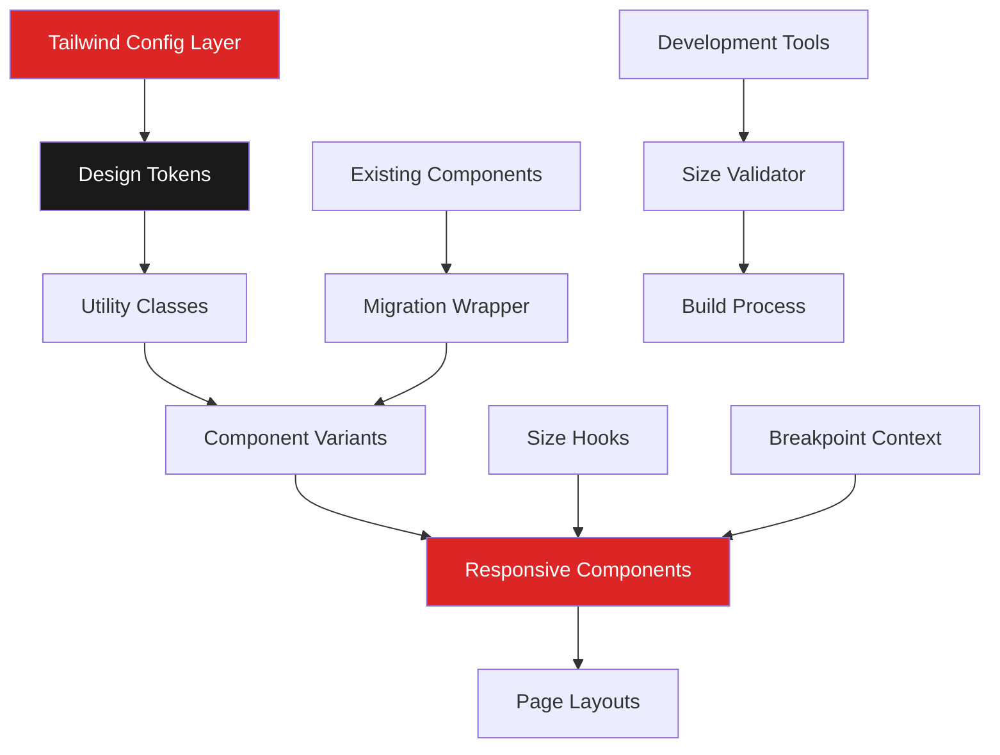

# responsive-design-system - Task 20

Execute task 20 for the responsive-design-system specification.

## Task Description
Update NewsForm with responsive inputs

## Code Reuse
**Leverage existing code**: enhanced Input and Button components

## Requirements Reference
**Requirements**: 8.1, 8.5, 2.1

## Usage
```
/Task:20-responsive-design-system
```

## Instructions

Execute with @spec-task-executor agent the following task: "Update NewsForm with responsive inputs"

```
Use the @spec-task-executor agent to implement task 20: "Update NewsForm with responsive inputs" for the responsive-design-system specification and include all the below context.

# Steering Context
## Steering Documents Context

No steering documents found or all are empty.

# Specification Context
## Specification Context (Pre-loaded): responsive-design-system

### Requirements
# Requirements Document: Responsive Design System

## Introduction

This feature establishes a comprehensive, mobile-first responsive design system for the radio station CMS platform. The system will standardize component sizing across all interfaces (public website, admin panel, and mobile app) to ensure optimal usability on small screens while maintaining professional aesthetics on larger displays. The design system will prioritize content legibility and touch-friendly interactions, with special focus on making statistical numbers prominent while reducing overall UI element sizes.

## Alignment with Product Vision

This feature directly supports the product's core motto "Keep it basic, don't overcomplicate anything" by:
- **Simplifying visual hierarchy** through consistent sizing rules
- **Improving mobile accessibility** for Turkish radio listeners accessing content on phones
- **Enhancing admin efficiency** by optimizing dashboard layouts for various screen sizes
- **Supporting mobile app integration** through consistent design tokens
- **Maintaining professional aesthetics** while improving usability

## Requirements

### Requirement 1: Mobile-First Typography Scale

**User Story:** As a mobile user, I want text to be readable without zooming, so that I can comfortably consume content on my phone.

#### Acceptance Criteria

1. WHEN viewing on mobile devices (< 640px) THEN the system SHALL display base text at minimum 14px
2. IF the element is a statistic number THEN the system SHALL use the largest available size within its container
3. WHEN transitioning between breakpoints THEN text sizes SHALL scale smoothly using responsive classes
4. IF text contains critical information (errors, alerts) THEN the system SHALL maintain minimum 16px size
5. WHEN displaying body text THEN line height SHALL be at least 1.5x font size for readability

### Requirement 2: Touch-Optimized Interactive Elements

**User Story:** As a mobile user, I want buttons and interactive elements to be easily tappable, so that I can navigate without mis-clicks.

#### Acceptance Criteria

1. WHEN displaying on touch devices THEN interactive elements SHALL have minimum 44x44px touch targets
2. IF space is constrained THEN the system SHALL use 40x40px with increased spacing between elements
3. WHEN elements are grouped THEN the system SHALL provide minimum 8px gap between touch targets
4. IF an element has an icon only THEN the system SHALL ensure the clickable area meets minimum size requirements
5. WHEN hover states are shown THEN the system SHALL provide visual feedback without layout shift

### Requirement 3: Responsive Admin Dashboard Components

**User Story:** As an admin user, I want the dashboard to be usable on tablets and phones, so that I can manage content from any device.

#### Acceptance Criteria

1. WHEN viewing dashboard on mobile THEN cards SHALL stack vertically in single column
2. IF viewing on tablet (640-1024px) THEN the system SHALL display 2-column grid layout
3. WHEN statistics are displayed THEN numbers SHALL use maximum available space while labels remain compact
4. IF sidebar is present on mobile THEN it SHALL collapse to hamburger menu with overlay
5. WHEN tables are displayed on mobile THEN they SHALL be horizontally scrollable with sticky first column

### Requirement 4: Consistent Spacing System

**User Story:** As a user, I want consistent spacing throughout the interface, so that the layout feels cohesive and organized.

#### Acceptance Criteria

1. WHEN applying padding to containers THEN the system SHALL use 8px base unit scale (8, 16, 24, 32, 40, 48)
2. IF on mobile devices THEN padding SHALL reduce by one step (e.g., desktop 24px → mobile 16px)
3. WHEN spacing between sections THEN the system SHALL maintain visual hierarchy with proportional gaps
4. IF elements are related THEN spacing SHALL be tighter (8-16px) than between unrelated elements (24-40px)
5. WHEN cards or containers are nested THEN inner padding SHALL be smaller than outer padding

### Requirement 5: Navigation and Header Optimization

**User Story:** As a user, I want the navigation to be accessible without taking too much screen space, so that content remains the focus.

#### Acceptance Criteria

1. WHEN viewing on mobile THEN header height SHALL not exceed 56px
2. IF on desktop THEN navigation height SHALL be maximum 72px with comfortable click targets
3. WHEN logo is displayed THEN it SHALL scale responsively while maintaining aspect ratio
4. IF navigation has many items THEN mobile SHALL use collapsible menu or horizontal scroll
5. WHEN admin sidebar is shown on desktop THEN width SHALL be maximum 240px

### Requirement 6: Responsive Media and Content Cards

**User Story:** As a user, I want media content to display properly on my device, so that I can view images and cards without distortion.

#### Acceptance Criteria

1. WHEN displaying news cards on mobile THEN they SHALL use full width with 16px horizontal padding
2. IF images are shown THEN they SHALL maintain aspect ratio with responsive sizing
3. WHEN poll cards are displayed THEN voting buttons SHALL be prominently sized for easy interaction
4. IF carousel is used THEN mobile SHALL show single item with swipe navigation
5. WHEN modal overlays appear THEN they SHALL leave minimum 16px margin on mobile screens

### Requirement 7: Data Visualization and Statistics

**User Story:** As a user viewing statistics, I want numbers to be prominent and easy to read, so that I can quickly understand the data.

#### Acceptance Criteria

1. WHEN displaying primary statistics THEN numbers SHALL use 2xl-4xl size (32-48px) on mobile
2. IF showing secondary metrics THEN the system SHALL use proportionally smaller but still prominent sizes
3. WHEN labels accompany numbers THEN they SHALL use uppercase text-xs (12px) for contrast
4. IF trends or changes are shown THEN indicators SHALL be clearly visible with color coding
5. WHEN multiple stats are grouped THEN the system SHALL maintain clear visual separation

### Requirement 8: Form and Input Optimization

**User Story:** As a user filling forms, I want inputs to be appropriately sized for my device, so that data entry is comfortable.

#### Acceptance Criteria

1. WHEN displaying form inputs on mobile THEN height SHALL be minimum 44px for comfortable typing
2. IF on desktop THEN inputs SHALL be 40-48px height with appropriate font size
3. WHEN labels are shown THEN they SHALL be clearly associated with inputs using proper spacing
4. IF validation messages appear THEN text SHALL be minimum 14px with clear color indication
5. WHEN forms have multiple fields THEN mobile SHALL use single column layout with adequate spacing

### Requirement 9: Integration with Existing Component System

**User Story:** As a developer, I want the new responsive design system to integrate smoothly with existing components, so that I can migrate gradually without breaking functionality.

#### Acceptance Criteria

1. WHEN updating existing UI components THEN they SHALL maintain backward compatibility
2. IF components use old sizing classes THEN the system SHALL provide migration warnings in development
3. WHEN integrating with RadioPlayer component THEN responsive behavior SHALL not affect audio functionality
4. IF existing components (NewsCarousel, PollCard, MediaManager) are updated THEN they SHALL preserve current functionality
5. WHEN migration is in progress THEN both old and new sizing systems SHALL coexist without conflicts

## Non-Functional Requirements

### Performance
- Component size changes SHALL not cause layout shift during responsive transitions
- CSS bundle size SHALL remain under 100KB gzipped after adding responsive utilities
- Responsive images SHALL use srcset for optimal loading on different screen sizes
- Font loading SHALL be optimized to prevent text size jumps

### Accessibility
- All interactive elements SHALL meet WCAG 2.1 AA minimum size guidelines
- Text contrast ratios SHALL remain compliant across all size variations
- Focus indicators SHALL be clearly visible and appropriately sized
- Zoom up to 200% SHALL not break layouts or cause horizontal scroll

### Compatibility
- Design system SHALL work on iOS Safari 14+, Chrome 90+, Firefox 88+, Edge 90+
- Touch targets SHALL work correctly on devices with different pixel densities
- Responsive breakpoints SHALL align with common device sizes (320px, 640px, 768px, 1024px, 1280px)
- Print styles SHALL maintain readability with appropriate sizing

### Maintainability
- Size tokens SHALL be defined in a central configuration (Tailwind config)
- Component sizes SHALL use semantic naming (small, medium, large) not absolute values
- Responsive utilities SHALL follow consistent naming patterns
- Documentation SHALL include size usage guidelines and examples
- Migration path SHALL be provided for existing components using legacy sizing
- Automated tools SHALL assist in converting hardcoded pixel values to responsive utilities
- Backward compatibility SHALL be maintained for at least one major version
- Component impact analysis SHALL be documented for RadioPlayer, NewsCarousel, PollCard, and MediaManager

### Development Experience
- IDE SHALL provide autocomplete for size utilities
- Build process SHALL warn about hardcoded pixel values in components
- Storybook SHALL display components at different screen sizes
- Design tokens SHALL be exportable for design tools (Figma, Sketch)

---

### Design
# Design Document: Responsive Design System

## Overview

The Responsive Design System establishes a comprehensive, mobile-first approach to component sizing and spacing throughout the radio station CMS platform. This system will transform the current large-by-default UI elements into a carefully crafted responsive hierarchy that prioritizes mobile usability while maintaining professional aesthetics on larger screens. The design leverages Tailwind CSS v4's utility-first approach and integrates seamlessly with our existing Next.js 15 and React 19 architecture.

## Steering Document Alignment

### Technical Standards (tech.md)
- **Tailwind CSS v4**: Utilizes Tailwind's responsive modifiers and custom configuration
- **Next.js 15 Compatibility**: Ensures server components and client components handle responsive classes correctly
- **Mobile API Architecture**: Aligns with mobile-first JSON responses for dynamic content
- **Performance Requirements**: Maintains < 3 seconds page load on 3G connections
- **Browser Support**: Compatible with iOS Safari 14+, Chrome 90+, Firefox 88+, Edge 90+

### Project Structure (structure.md)
- **Component Organization**: Updates will follow existing `/components/ui/` structure
- **Utility Functions**: Responsive helpers will be added to `/lib/utils/`
- **Type Definitions**: New size types will extend existing `/types/` structure
- **Consistent Naming**: Maintains PascalCase for components, camelCase for utilities

## Code Reuse Analysis

### Existing Components to Leverage
- **Button.tsx**: Already uses size variants (small, medium, large, giant) - will enhance with responsive modifiers
- **Modal.tsx**: Has sizeClasses object - will extend with mobile-first breakpoints
- **Badge.tsx**: Contains size system - will adapt for touch targets
- **Card.tsx**: Base component ready for responsive padding adjustments
- **Input.tsx**: Form elements will inherit new touch-optimized sizes
- **cn() utility**: Existing className merger from `/lib/utils` will handle responsive classes

### Integration Points
- **RadioPlayer**: Will maintain audio functionality while adapting visual size
- **AdminSidebar**: Already has mobile toggle - will enhance with new spacing system
- **StatsCard**: Number display logic exists - will amplify with responsive text sizes
- **NewsCarousel**: Swipe functionality present - will optimize for single-item mobile view
- **Tailwind Config**: Extend existing color system with new spacing/sizing tokens

## Architecture

The responsive design system follows a layered architecture that extends our existing component system:



## Components and Interfaces

### 1. Design Token System
- **Purpose:** Centralized size and spacing definitions
- **Location:** `/tailwind.config.ts` extensions
- **Interfaces:**
  ```typescript
  interface SizeScale {
    xs: string;   // Mobile minimum (14px base text)
    sm: string;   // Mobile comfortable (16px)
    md: string;   // Tablet default (16px)
    lg: string;   // Desktop standard (16px)
    xl: string;   // Desktop expanded (18px)
  }

  interface TypographyScale {
    base: { fontSize: '14px', lineHeight: '1.5' };      // Mobile minimum
    sm: { fontSize: '16px', lineHeight: '1.5' };
    md: { fontSize: '16px', lineHeight: '1.6' };
    lg: { fontSize: '16px', lineHeight: '1.6' };
    // Statistics sizes
    stat: {
      primary: 'text-2xl md:text-4xl',    // 32-48px
      secondary: 'text-xl md:text-2xl',   // 24-32px
      label: 'text-xs uppercase'          // 12px
    };
  }

  interface TouchTargets {
    standard: '44px';     // Primary touch target
    compact: '40px';      // Constrained space with gap-2 (8px)
    spacing: '8px';       // Minimum gap between targets
  }
  ```
- **Dependencies:** Tailwind CSS core
- **Reuses:** Existing color tokens, font families

### 2. Responsive Size Utilities
- **Purpose:** Helper functions for responsive sizing
- **Location:** `/src/lib/utils/responsive.ts`
- **Interfaces:**
  ```typescript
  function getResponsiveSize(base: Size, breakpoint?: Breakpoint): string;
  function calculateTouchTarget(element: HTMLElement): { width: number; height: number };
  ```
- **Dependencies:** None
- **Reuses:** cn() utility for class merging

### 3. Enhanced UI Components
- **Purpose:** Updated primitive components with responsive sizing
- **Interfaces:** Extended props with responsive size options
  ```typescript
  interface ResponsiveButtonProps extends ButtonProps {
    responsiveSize?: {
      base: Size;
      sm?: Size;
      md?: Size;
      lg?: Size;
    };
    touchOptimized?: boolean;  // Ensures min 44x44px touch target
  }

  interface ResponsiveTableProps {
    stickyFirstColumn?: boolean;  // For mobile horizontal scroll
    mobileScroll?: boolean;       // Enable overflow-x-auto on mobile
  }
  ```
- **Dependencies:** Design tokens, responsive utilities
- **Reuses:** All existing component logic and styling
- **Specific Implementations:**
  - **Buttons**: Min height 44px on mobile, 40px on desktop
  - **Inputs**: Min height 44px for all touch devices
  - **Navigation**: Max 56px height mobile, 72px desktop
  - **Admin Sidebar**: Max 240px width on desktop

### 4. Layout Components
- **Purpose:** Responsive containers and grids
- **Location:** `/src/components/layout/`
- **Interfaces:**
  ```typescript
  interface ResponsiveGridProps {
    cols: {
      base: 1;           // Mobile: single column
      sm?: 1 | 2;        // Tablet: 2-column for admin dashboard
      md?: 2 | 3;
      lg?: 3 | 4;
    };
    gap: ResponsiveSpacing;
  }

  interface AdminDashboardGridProps {
    mobileStack: true;           // Force single column on mobile
    tabletColumns: 2;            // Exactly 2 columns on tablet (640-1024px)
    desktopColumns: 3 | 4;       // 3-4 columns on desktop
  }
  ```
- **Dependencies:** Tailwind grid utilities
- **Reuses:** Existing layout patterns

### 5. Migration Compatibility Layer
- **Purpose:** Backward compatibility for existing components
- **Location:** `/src/lib/utils/migration.ts`
- **Interfaces:**
  ```typescript
  function mapLegacySize(oldSize: string): ResponsiveSize;
  function warnDeprecatedSizing(component: string, prop: string): void;
  ```
- **Dependencies:** Console API for warnings
- **Reuses:** Existing component prop types

## Data Models

### Size Token Model
```typescript
interface SizeToken {
  name: string;           // 'text-sm', 'p-4', etc.
  mobile: string;        // '14px', '16px'
  tablet?: string;       // '16px', '20px'
  desktop: string;       // '16px', '24px'
  category: 'text' | 'spacing' | 'component';
  deprecated?: boolean;
}
```

### Breakpoint Model
```typescript
interface Breakpoint {
  name: 'xs' | 'sm' | 'md' | 'lg' | 'xl' | '2xl';
  minWidth: number;     // in pixels
  maxWidth?: number;    // in pixels
  isActive: boolean;    // runtime state
}
```

### Component Size Model
```typescript
interface ComponentSize {
  height: ResponsiveValue<string>;
  padding: ResponsiveValue<string>;
  fontSize: ResponsiveValue<string>;
  minTouchTarget: number;  // in pixels, typically 44
}
```

### Responsive Value Model
```typescript
type ResponsiveValue<T> = T | {
  base: T;
  sm?: T;
  md?: T;
  lg?: T;
  xl?: T;
};
```

## Implementation Strategy

### Phase 1: Foundation (Design Tokens)
1. Extend Tailwind configuration with size scales
2. Define spacing multipliers for mobile/desktop
3. Create responsive text size utilities
4. Establish touch target minimums

### Phase 2: Core Components
1. Update Button component with responsive sizes
2. Enhance Input/Form components for touch
3. Adapt Card padding for mobile
4. Optimize Modal for fullscreen mobile

### Phase 3: Complex Components
1. Transform StatsCard with prominent numbers
2. Refactor AdminSidebar responsive behavior
3. Update NewsCarousel for single-item mobile
4. Enhance PollCard touch interactions

### Phase 4: Layout Systems
1. Implement responsive grid system
2. Create mobile-first container components
3. Add responsive spacing utilities
4. Build adaptive navigation patterns

### Phase 5: Migration & Polish
1. Add backward compatibility layer
2. Create migration warnings
3. Update documentation
4. Add development tools

## Error Handling

### Error Scenarios

1. **Invalid Size Token**
   - **Handling:** Fall back to nearest valid size with console warning
   - **User Impact:** Component renders with closest appropriate size
   - **Developer Feedback:** Warning in development mode with suggested fix

2. **Touch Target Too Small**
   - **Handling:** Automatically expand clickable area with transparent padding
   - **User Impact:** Element remains visually same but has larger touch area
   - **Developer Feedback:** Development warning with WCAG compliance note

3. **Breakpoint Detection Failure**
   - **Handling:** Use base (mobile) size as fallback
   - **User Impact:** Interface remains usable with mobile-optimized sizing
   - **Developer Feedback:** Error logged with browser information

4. **Legacy Component Conflict**
   - **Handling:** Apply compatibility wrapper automatically
   - **User Impact:** No visual change, component works as before
   - **Developer Feedback:** Migration suggestion in console

5. **Performance Degradation**
   - **Handling:** Throttle resize observers, use CSS-only where possible
   - **User Impact:** Smooth transitions without lag
   - **Developer Feedback:** Performance metrics in development tools

## Testing Strategy

### Unit Testing
- Test size token calculations across breakpoints
- Verify touch target size validation
- Test migration compatibility functions
- Validate responsive utility outputs

### Integration Testing
- Test component size changes across breakpoints
- Verify backward compatibility with existing components
- Test RadioPlayer functionality with new sizes
- Validate form submission with new input sizes

### End-to-End Testing
- Mobile device testing:
  - iPhone SE (375px width)
  - iPhone 14 (390px width)
  - Samsung Galaxy S21 (384px width)
- Tablet testing:
  - iPad (768px width)
  - iPad Pro (1024px width)
- Desktop browser testing:
  - 1280px (HD)
  - 1920px (Full HD)
  - 2560px (2K)
- Specific breakpoint validation:
  - 320px (minimum mobile)
  - 640px (sm breakpoint)
  - 768px (md breakpoint)
  - 1024px (lg breakpoint)
  - 1280px (xl breakpoint)
- Admin panel workflow on mobile devices
- News browsing and poll voting on small screens

### Visual Regression Testing
- Capture screenshots at each breakpoint
- Compare before/after migration
- Validate spacing consistency
- Check text readability at all sizes

## Performance Considerations

1. **CSS Bundle Optimization**
   - Use Tailwind's purge to remove unused utilities
   - Group responsive utilities to reduce repetition
   - Leverage CSS custom properties for runtime values:
     ```css
     :root {
       --touch-target: 44px;
       --mobile-header: 56px;
       --desktop-header: 72px;
       --min-text: 14px;
     }
     ```

2. **Runtime Performance**
   - Avoid JavaScript-based responsive calculations where possible
   - Use CSS-only responsive solutions
   - Implement resize observer with throttling:
     ```typescript
     const throttledResize = throttle((entries) => {
       // Handle resize
     }, 100); // 100ms throttle
     ```

3. **Development Performance**
   - Provide TypeScript autocomplete for size props
   - Cache size calculations during build
   - Use static analysis for size validation

## Migration Path

1. **Compatibility Mode** (Week 1)
   - Both old and new size systems work simultaneously
   - Console warnings guide developers
   - No breaking changes

2. **Soft Migration** (Week 2-3)
   - Update high-traffic components first
   - Provide codemods for automatic conversion
   - Document migration patterns

3. **Deprecation** (Week 4)
   - Mark old sizes as deprecated
   - Increase warning visibility
   - Provide migration deadline

4. **Cleanup** (Week 5+)
   - Remove compatibility layer
   - Clean up old size utilities
   - Finalize documentation

**Note**: Specification documents have been pre-loaded. Do not use get-content to fetch them again.

## Task Details
- Task ID: 20
- Description: Update NewsForm with responsive inputs
- Leverage: enhanced Input and Button components
- Requirements: 8.1, 8.5, 2.1

## Instructions
- Implement ONLY task 20: "Update NewsForm with responsive inputs"
- Follow all project conventions and leverage existing code
- Mark the task as complete using: claude-code-spec-workflow get-tasks responsive-design-system 20 --mode complete
- Provide a completion summary
```

## Task Completion
When the task is complete, mark it as done:
```bash
claude-code-spec-workflow get-tasks responsive-design-system 20 --mode complete
```

## Next Steps
After task completion, you can:
- Execute the next task using /responsive-design-system-task-[next-id]
- Check overall progress with /spec-status responsive-design-system
