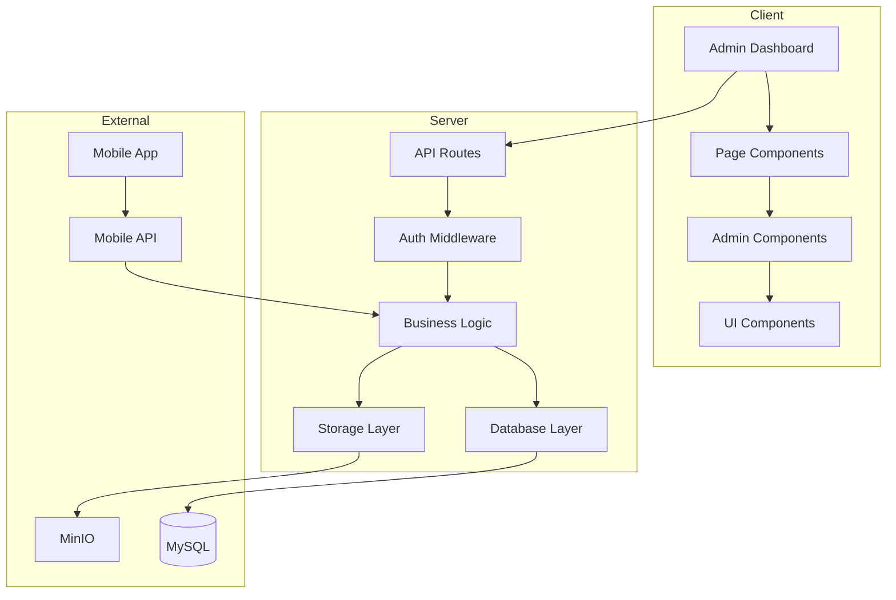
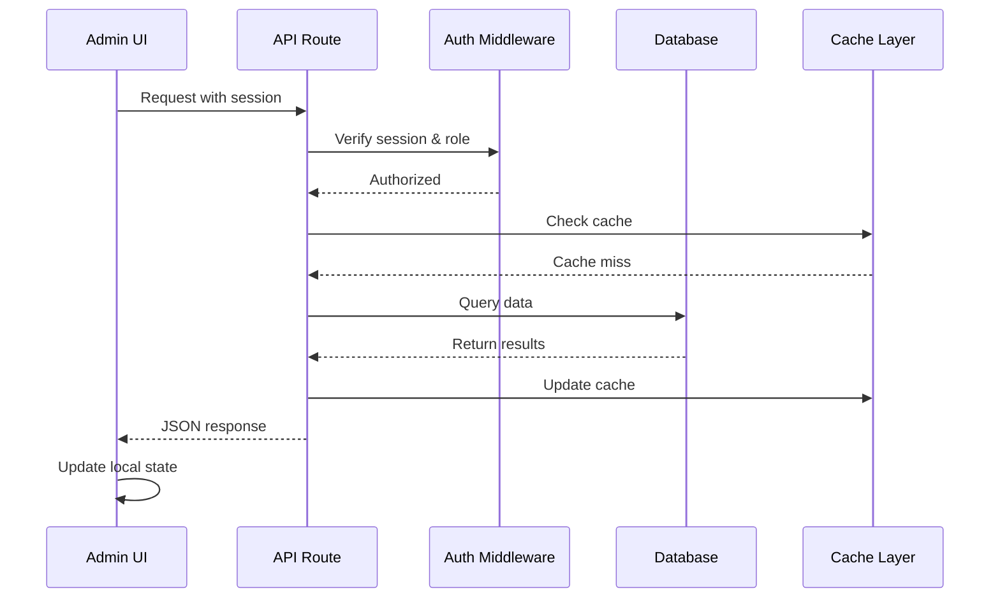

# Design Document

## Feature Name
admin-panel

## Overview
Comprehensive design for the admin panel system that provides full content management capabilities while maintaining simplicity and leveraging existing infrastructure. The design follows Next.js App Router patterns, integrates with MySQL database, and provides real-time updates through server components and client-side state management.

## Steering Document Alignment

### Technical Standards (tech.md)
- Follows Next.js 15.5.3 App Router architecture with server/client components
- Uses existing MySQL 8.0 database with optimized indexes
- Integrates MinIO for S3-compatible media storage
- Implements NextAuth.js for authentication with role-based access
- Maintains Tailwind CSS v4 for styling with dark theme

### Project Structure (structure.md)
- Admin pages under `src/app/admin/` with protected layouts
- API routes in `src/app/api/admin/` for data operations
- Reusable components in `src/components/admin/`
- Database queries in `src/lib/db/` modules
- Type definitions in `src/types/` for type safety

## Code Reuse Analysis

### Existing Components to Leverage
- **StatsCard**: Dashboard statistics display component
- **Button/Badge/Modal**: UI primitives for consistent styling
- **MediaManager**: Existing media upload and management system
- **RadioPlayerContext**: For real-time radio statistics

### Services/Utilities to Extend
- **db/client.ts**: MySQL connection pooling and query execution
- **auth/utils.ts**: Session management and role checking
- **storage/client.ts**: MinIO integration for file operations
- **utils/logger.ts**: Structured logging for audit trails

### Integration Points
- **NextAuth**: Extend existing authentication for admin operations
- **Database Schema**: Extend existing tables (users, media, settings)
- **API Routes**: Follow existing RESTful patterns for consistency
- **Mobile API**: Extend `/api/mobile/v1/` for content delivery

## Architecture



## Components and Interfaces

### Component 1: AdminLayout
- **Purpose:** Protected layout wrapper with navigation and auth check
- **Interfaces:**
  - Props: `{ children: React.ReactNode }`
  - Uses: `getServerSession()` for auth verification
- **Dependencies:** NextAuth, AdminSidebar, AdminHeader
- **Reuses:** Existing Layout component structure

### Component 2: NewsManager
- **Purpose:** CRUD operations for news articles with rich editor
- **Interfaces:**
  - Props: `{ initialData?: News[], categories: Category[] }`
  - Events: `onSave`, `onDelete`, `onPublish`
- **Dependencies:** RichTextEditor, MediaPicker, CategorySelector
- **Reuses:** Existing NewsCard component, media picker dialog

### Component 3: PollBuilder
- **Purpose:** Create and manage polls with drag-drop item ordering
- **Interfaces:**
  - Props: `{ poll?: Poll, onSave: (poll: PollData) => void }`
  - State: Poll configuration, items, validation errors
- **Dependencies:** DatePicker, ImageUpload, SortableList
- **Reuses:** Existing PollCard display component

### Component 4: MediaLibrary
- **Purpose:** Central media management with upload and organization
- **Interfaces:**
  - Props: `{ onSelect?: (media: Media) => void, selectionMode?: boolean }`
  - API: Upload, delete, search, get thumbnails
- **Dependencies:** MinIO client, image processing
- **Reuses:** Existing MediaManager base implementation

### Component 5: ContentBuilder
- **Purpose:** Visual builder for mobile app dynamic pages
- **Interfaces:**
  - Props: `{ page?: ContentPage, components: ComponentType[] }`
  - Output: JSON structure for mobile rendering
- **Dependencies:** DragDropContext, ComponentPalette, MobilePreview
- **Reuses:** Existing MobilePreview component

### Component 6: UserManagement
- **Purpose:** Admin user CRUD with role management
- **Interfaces:**
  - Props: `{ currentUser: User }`
  - Actions: Create, update, deactivate, reset password
- **Dependencies:** bcrypt for password hashing, role checker
- **Reuses:** Existing auth utilities and user type definitions

## Data Models

### Extended Database Tables

```sql
-- Extend existing users table (already exists)
ALTER TABLE users ADD COLUMN IF NOT EXISTS
  last_login TIMESTAMP NULL,
  failed_attempts INT DEFAULT 0,
  locked_until TIMESTAMP NULL;

-- News table
CREATE TABLE IF NOT EXISTS news (
  id INT PRIMARY KEY AUTO_INCREMENT,
  title VARCHAR(255) NOT NULL,
  slug VARCHAR(255) UNIQUE NOT NULL,
  summary TEXT,
  content TEXT NOT NULL,
  featured_image VARCHAR(500),
  category_id INT,
  is_featured BOOLEAN DEFAULT FALSE,
  is_breaking BOOLEAN DEFAULT FALSE,
  is_hot BOOLEAN DEFAULT FALSE,
  is_active BOOLEAN DEFAULT TRUE,
  view_count INT DEFAULT 0,
  published_at TIMESTAMP NULL,
  created_by INT NOT NULL,
  created_at TIMESTAMP DEFAULT CURRENT_TIMESTAMP,
  updated_at TIMESTAMP DEFAULT CURRENT_TIMESTAMP ON UPDATE CURRENT_TIMESTAMP,
  deleted_at TIMESTAMP NULL,
  FOREIGN KEY (created_by) REFERENCES users(id),
  INDEX idx_news_slug (slug),
  INDEX idx_news_published (published_at),
  INDEX idx_news_category (category_id)
);

-- News categories
CREATE TABLE IF NOT EXISTS news_categories (
  id INT PRIMARY KEY AUTO_INCREMENT,
  name VARCHAR(100) NOT NULL,
  slug VARCHAR(100) UNIQUE NOT NULL,
  color VARCHAR(20),
  is_active BOOLEAN DEFAULT TRUE,
  created_at TIMESTAMP DEFAULT CURRENT_TIMESTAMP
);

-- Polls table
CREATE TABLE IF NOT EXISTS polls (
  id INT PRIMARY KEY AUTO_INCREMENT,
  title VARCHAR(255) NOT NULL,
  description TEXT,
  type ENUM('TOP_50', 'TOP_10', 'BEST_OF_MONTH', 'LISTENER_CHOICE', 'SPECIAL'),
  start_date TIMESTAMP NOT NULL,
  end_date TIMESTAMP NOT NULL,
  is_active BOOLEAN DEFAULT TRUE,
  created_by INT NOT NULL,
  created_at TIMESTAMP DEFAULT CURRENT_TIMESTAMP,
  updated_at TIMESTAMP DEFAULT CURRENT_TIMESTAMP ON UPDATE CURRENT_TIMESTAMP,
  deleted_at TIMESTAMP NULL,
  FOREIGN KEY (created_by) REFERENCES users(id),
  INDEX idx_polls_dates (start_date, end_date),
  INDEX idx_polls_active (is_active)
);

-- Poll items
CREATE TABLE IF NOT EXISTS poll_items (
  id INT PRIMARY KEY AUTO_INCREMENT,
  poll_id INT NOT NULL,
  name VARCHAR(255) NOT NULL,
  description TEXT,
  image_url VARCHAR(500),
  sort_order INT DEFAULT 0,
  created_at TIMESTAMP DEFAULT CURRENT_TIMESTAMP,
  FOREIGN KEY (poll_id) REFERENCES polls(id) ON DELETE CASCADE,
  INDEX idx_poll_items_poll (poll_id)
);

-- Poll votes
CREATE TABLE IF NOT EXISTS poll_votes (
  id INT PRIMARY KEY AUTO_INCREMENT,
  poll_id INT NOT NULL,
  item_id INT NOT NULL,
  device_id VARCHAR(255) NOT NULL,
  ip_address VARCHAR(45) NOT NULL,
  user_agent TEXT,
  created_at TIMESTAMP DEFAULT CURRENT_TIMESTAMP,
  FOREIGN KEY (poll_id) REFERENCES polls(id) ON DELETE CASCADE,
  FOREIGN KEY (item_id) REFERENCES poll_items(id) ON DELETE CASCADE,
  UNIQUE KEY unique_vote (poll_id, device_id, ip_address),
  INDEX idx_votes_poll (poll_id),
  INDEX idx_votes_item (item_id)
);

-- Content pages for mobile
CREATE TABLE IF NOT EXISTS content_pages (
  id INT PRIMARY KEY AUTO_INCREMENT,
  title VARCHAR(255) NOT NULL,
  slug VARCHAR(255) UNIQUE NOT NULL,
  components JSON NOT NULL,
  is_published BOOLEAN DEFAULT FALSE,
  created_by INT NOT NULL,
  created_at TIMESTAMP DEFAULT CURRENT_TIMESTAMP,
  updated_at TIMESTAMP DEFAULT CURRENT_TIMESTAMP ON UPDATE CURRENT_TIMESTAMP,
  FOREIGN KEY (created_by) REFERENCES users(id),
  INDEX idx_pages_slug (slug),
  INDEX idx_pages_published (is_published)
);

-- Audit log
CREATE TABLE IF NOT EXISTS audit_log (
  id INT PRIMARY KEY AUTO_INCREMENT,
  user_id INT NOT NULL,
  action VARCHAR(100) NOT NULL,
  entity_type VARCHAR(50),
  entity_id INT,
  old_values JSON,
  new_values JSON,
  ip_address VARCHAR(45),
  created_at TIMESTAMP DEFAULT CURRENT_TIMESTAMP,
  FOREIGN KEY (user_id) REFERENCES users(id),
  INDEX idx_audit_user (user_id),
  INDEX idx_audit_entity (entity_type, entity_id),
  INDEX idx_audit_created (created_at)
);
```

## API Design

### RESTful Admin API Endpoints

```typescript
// News Management
GET    /api/admin/news           // List with pagination
GET    /api/admin/news/:id       // Get single article
POST   /api/admin/news           // Create article
PUT    /api/admin/news/:id       // Update article
DELETE /api/admin/news/:id       // Soft delete
POST   /api/admin/news/:id/publish // Publish/unpublish

// Poll Management
GET    /api/admin/polls          // List all polls
GET    /api/admin/polls/:id      // Get poll with results
POST   /api/admin/polls          // Create poll
PUT    /api/admin/polls/:id      // Update poll
DELETE /api/admin/polls/:id      // Delete poll
GET    /api/admin/polls/:id/export // Export results

// Media Management
GET    /api/admin/media          // List with pagination
POST   /api/admin/media/upload   // Upload files
DELETE /api/admin/media/:id      // Delete file
GET    /api/admin/media/usage/:id // Check usage

// User Management
GET    /api/admin/users          // List users (super admin)
POST   /api/admin/users          // Create user
PUT    /api/admin/users/:id      // Update user
DELETE /api/admin/users/:id      // Deactivate user
POST   /api/admin/users/password // Change password

// Settings
GET    /api/admin/settings       // Get all settings
PUT    /api/admin/settings       // Update settings
POST   /api/admin/settings/test  // Test connections

// Content Builder
GET    /api/admin/content        // List pages
POST   /api/admin/content        // Create page
PUT    /api/admin/content/:id    // Update page
DELETE /api/admin/content/:id    // Delete page
POST   /api/admin/content/:id/publish // Publish

// Dashboard
GET    /api/admin/dashboard/stats // Get statistics
GET    /api/admin/dashboard/activity // Recent activity
```

### Mobile API Extensions

```typescript
// Mobile content endpoints
GET /api/mobile/v1/content/pages        // List available pages
GET /api/mobile/v1/content/pages/:slug  // Get page JSON
```

## State Management

### Server State
- **Database queries**: Direct MySQL queries with connection pooling
- **Caching**: Redis-style caching for dashboard stats (5 min TTL)
- **Session management**: NextAuth server sessions with JWT

### Client State
- **Form state**: React Hook Form for complex forms
- **Optimistic updates**: Update UI before server confirmation
- **Real-time updates**: Polling for dashboard stats
- **Draft auto-save**: LocalStorage for form drafts

### State Flow


## Security Considerations

### Authentication & Authorization
- All admin routes require valid session
- Role-based access control (admin, super_admin)
- Session timeout after 30 minutes inactivity
- Secure cookie settings in production

### Input Validation
- Server-side validation for all inputs
- SQL injection prevention via parameterized queries
- XSS prevention through React's JSX escaping
- File upload restrictions (type, size)

### Audit Trail
- Log all admin actions to audit_log table
- Track IP addresses and user agents
- Store old/new values for changes
- Retention policy: 90 days

### Rate Limiting
- Admin API: 100 requests/minute per user
- File uploads: 10 uploads/minute
- Password attempts: 5 attempts before 15-min lockout

## Error Handling

### Error Scenarios

1. **Database Connection Error**
   - **Handling:** Retry with exponential backoff
   - **User Impact:** "Veritabanı bağlantısı kurulamadı. Lütfen tekrar deneyin."

2. **File Upload Failure**
   - **Handling:** Cleanup partial uploads, return specific error
   - **User Impact:** "Dosya yüklenemedi: [specific reason]"

3. **Validation Errors**
   - **Handling:** Return field-specific errors
   - **User Impact:** Inline form validation messages in Turkish

4. **Permission Denied**
   - **Handling:** Log attempt, redirect to dashboard
   - **User Impact:** "Bu işlem için yetkiniz bulunmamaktadır."

5. **Concurrent Edit Conflict**
   - **Handling:** Show diff, ask user to resolve
   - **User Impact:** "Bu içerik başka bir kullanıcı tarafından değiştirildi."

## Performance Considerations

### Database Optimization
- Composite indexes for common queries
- Pagination for all list endpoints (20 items default)
- Lazy loading for related data
- Query result caching for stats

### Frontend Optimization
- Server components for initial render
- Image optimization with next/image
- Lazy load heavy components (rich editor)
- Virtual scrolling for long lists

### API Optimization
- Response compression (gzip)
- Partial responses with field selection
- Batch operations for bulk updates
- Background jobs for heavy operations

### Caching Strategy
- Dashboard stats: 5 minutes
- User permissions: Session lifetime
- Media thumbnails: 30 days
- Static content: 1 hour

## Testing Strategy

### Unit Testing
- Database query functions
- Validation utilities
- Permission checking logic
- Data transformation functions

### Integration Testing
- API endpoint responses
- Database transactions
- File upload/deletion flow
- Authentication flow

### End-to-End Testing
- Complete CRUD workflows
- Role-based access scenarios
- Mobile content preview
- Error recovery paths