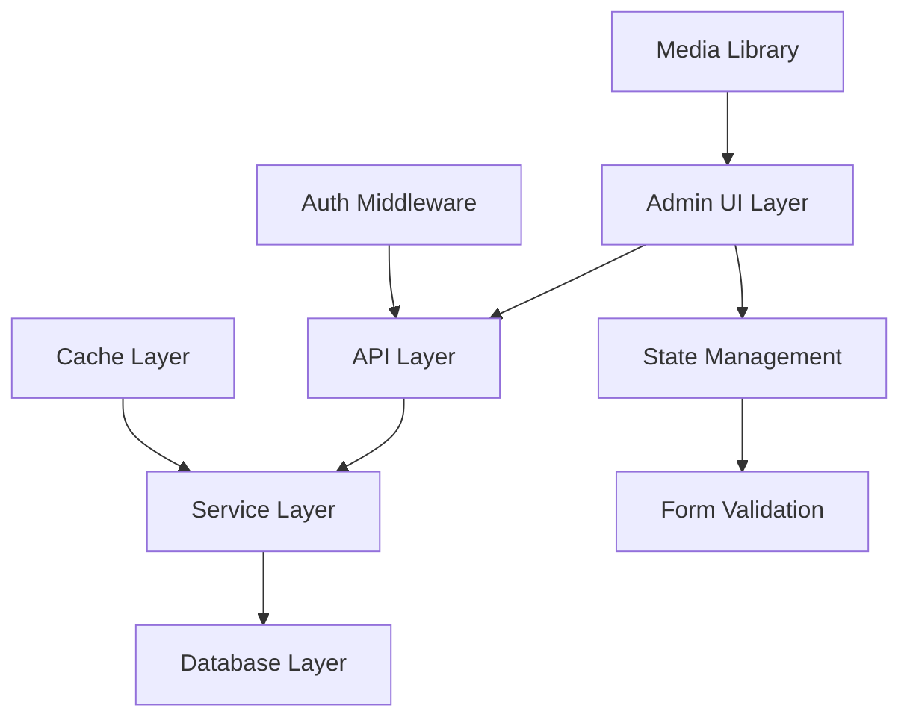

# Design Document

## Overview

The admin polls feature will extend the existing polls infrastructure to provide full CRUD functionality through the admin panel. This design leverages the current database schema, API endpoints, and UI components while adding new capabilities for poll creation, editing, and management with image support and time-based scheduling.

## Steering Document Alignment

### Technical Standards
- Follows Next.js 14+ app router patterns with server and client components
- Uses TypeScript for type safety throughout the implementation
- Leverages existing Tailwind CSS design system with dark theme
- Implements React Hook Form for form validation and state management
- Uses existing authentication and role-based access control

### Project Structure
- Components organized in `/components/admin/` for admin-specific UI
- API routes follow `/api/admin/` pattern for protected endpoints
- Database operations centralized in `/lib/db/` modules
- Types defined in `/types/` for shared interfaces
- Hooks stored in `/hooks/` for reusable logic

## Code Reuse Analysis

### Existing Components to Leverage
- **ImagePicker**: Full media library integration with preview support
- **Modal/Dialog**: Existing modal system for poll creation/edit dialogs
- **Button, Input, Badge**: Core UI components with consistent styling
- **ConfirmDialog**: Confirmation dialogs for delete operations
- **LoadingSpinner**: Loading states during API calls
- **StatsCard**: Statistics display for poll metrics

### Integration Points
- **Database Schema**: polls, poll_items, poll_votes tables already defined
- **API Endpoints**: /api/admin/polls with full CRUD operations implemented
- **Authentication**: getServerSession() and checkRole() for admin verification
- **Media Library**: /api/admin/media endpoints for image management
- **Cache Invalidation**: invalidateEntityCache() for cache management

## Architecture

The feature follows a layered architecture pattern consistent with the existing codebase:



## Components and Interfaces

### Component 1: PollDialog
- **Purpose:** Modal dialog for creating and editing polls
- **Interfaces:**
  - Props: `{ isOpen, onClose, onSave, poll?, mode: 'create' | 'edit' }`
  - Form data: `PollFormData` interface
- **Dependencies:** Modal, React Hook Form, ImagePicker, PollItemsManager
- **Reuses:** Modal component, form validation patterns from NewsForm

### Component 2: PollItemsManager
- **Purpose:** Manage poll options with add/remove/reorder functionality
- **Interfaces:**
  - Props: `{ items, onChange, minItems?, maxItems? }`
  - Item: `{ id?, title, description?, image_url?, display_order }`
- **Dependencies:** ImagePicker, DndKit for drag-and-drop
- **Reuses:** Existing PollItemsManager base, ImagePicker for option images

### Component 3: PollFormFields
- **Purpose:** Reusable form fields for poll metadata
- **Interfaces:**
  - Props: `{ control, errors, watch }`
  - Fields: title, description, dates, visibility settings
- **Dependencies:** React Hook Form, date picker, select components
- **Reuses:** Input, Select components, validation utilities

### Component 4: PollListItem
- **Purpose:** Display poll in list/grid view with actions
- **Interfaces:**
  - Props: `{ poll, onEdit, onDelete, onToggleStatus, selected, onSelect }`
  - Poll data from database schema
- **Dependencies:** Badge, Button, status indicators
- **Reuses:** PollCard component structure, action button patterns

### Component 5: PollScheduler
- **Purpose:** Date/time picker for poll scheduling
- **Interfaces:**
  - Props: `{ startDate, endDate, onChange, minDate? }`
  - Date validation and formatting
- **Dependencies:** Date picker library, validation logic
- **Reuses:** Date formatting utilities, timezone handling

## Data Models

### PollFormData
```typescript
interface PollFormData {
  title: string;
  description?: string;
  poll_type: 'weekly' | 'monthly' | 'custom';
  image_url?: string;
  start_date: string;
  end_date: string;
  is_active: boolean;
  show_on_homepage: boolean;
  show_results: 'after_voting' | 'always' | 'when_ended';
  items: PollItemFormData[];
}
```

### PollItemFormData
```typescript
interface PollItemFormData {
  id?: number;
  title: string;
  description?: string;
  image_url?: string;
  display_order: number;
  is_active: boolean;
}
```

### ExtendedPoll (extends existing Poll)
```typescript
interface ExtendedPoll extends Poll {
  status: 'draft' | 'scheduled' | 'active' | 'ended';
  statistics?: {
    total_votes: number;
    unique_voters: number;
    participation_rate: number;
  };
  items: PollItemFormData[];
}
```

## API Design

### Enhanced Endpoints

#### POST /api/admin/polls/items
- Create poll with items in single transaction
- Request: `{ poll: PollFormData, items: PollItemFormData[] }`
- Response: `{ success: boolean, data: { id: number } }`

#### PUT /api/admin/polls/[id]/items
- Update poll and items atomically
- Request: `{ poll: Partial<PollFormData>, items: PollItemFormData[] }`
- Response: `{ success: boolean }`

#### GET /api/admin/polls/[id]/preview
- Preview poll as it would appear publicly
- Response: `{ poll: ExtendedPoll, preview_mode: boolean }`

## State Management

### Poll Dialog State
```typescript
interface PollDialogState {
  isOpen: boolean;
  mode: 'create' | 'edit';
  pollId?: number;
  formData: PollFormData;
  isLoading: boolean;
  errors: Record<string, string>;
  isDirty: boolean;
}
```

### Poll List State
```typescript
interface PollListState {
  polls: ExtendedPoll[];
  loading: boolean;
  filters: PollFilters;
  pagination: PaginationState;
  selectedIds: Set<number>;
  sortBy: 'created' | 'start_date' | 'votes';
}
```

## Error Handling

### Error Scenarios

1. **Network Failure During Save**
   - **Handling:** Retry with exponential backoff, preserve form data
   - **User Impact:** Toast notification with retry option

2. **Concurrent Edit Conflict**
   - **Handling:** Detect version mismatch, offer merge/overwrite options
   - **User Impact:** Dialog showing conflicts with resolution choices

3. **Image Upload Failure**
   - **Handling:** Fallback to URL input, show upload error inline
   - **User Impact:** Error message with manual URL entry option

4. **Date Validation Error**
   - **Handling:** Prevent save, highlight invalid fields
   - **User Impact:** Inline error messages with correction hints

5. **Insufficient Permissions**
   - **Handling:** Redirect to login, preserve intended action
   - **User Impact:** Session timeout message with re-authentication

## Testing Strategy

### Unit Testing
- Form validation logic for dates and required fields
- Poll status calculation based on dates
- Option reordering and management functions
- API response parsing and error handling

### Integration Testing
- Complete poll creation flow with database persistence
- Image picker integration with media library
- Cache invalidation after CRUD operations
- Permission checks for admin-only operations

### End-to-End Testing
- Create poll ’ View in list ’ Edit ’ Delete flow
- Schedule future poll ’ Verify public visibility
- Add images to options ’ Verify display
- Vote on public side ’ View results in admin