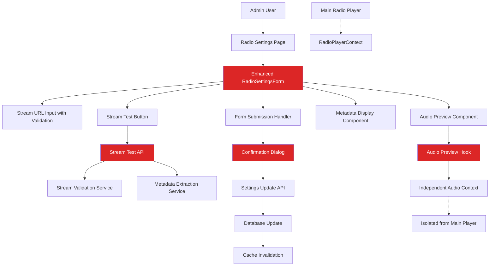

# Design Document - Admin Radio Stream Settings

## Overview

This document outlines the technical design for enhancing the existing radio settings functionality with stream URL testing, audio preview capabilities, and metadata display features. The design extends the current RadioSettingsForm component and integrates with existing admin infrastructure while maintaining the platform's principle of simplicity and reliability.

## Steering Document Alignment

### Technical Standards (tech.md)
- **Next.js 15.5.3 App Router**: Leverages existing admin page structure in `/admin/settings/radio/`
- **React 19.1.0**: Uses latest React patterns with existing hooks and component architecture
- **TypeScript**: Maintains type safety with existing RadioSettingsFormData interfaces
- **Tailwind CSS v4**: Follows established dark theme (RED/BLACK/WHITE) color scheme
- **Rate Limiting**: Extends existing rate limiting middleware for stream testing API calls
- **Authentication**: Integrates with NextAuth.js admin authentication system

### Project Structure (structure.md)
- **Components**: Extends `src/components/admin/RadioSettingsForm.tsx`
- **API Routes**: Enhances `src/app/api/admin/settings/radio/` endpoints
- **Database**: Utilizes existing `radioSettings` queries and validation functions
- **UI Components**: Leverages `src/components/ui/` Button, Input, Modal, LoadingSpinner
- **Hooks**: Creates new audio preview hook following existing `useRadioPlayer` patterns

## Code Reuse Analysis

### Existing Components to Leverage
- **RadioSettingsForm**: Core form component with URL validation, debouncing, and submission handling
- **Button Component**: Existing variants (primary, secondary) with loading states for test and preview buttons
- **Input Component**: Form input with validation support and error display
- **Card Component**: Layout wrapper for organizing sections (test results, metadata display)
- **LoadingSpinner**: Loading states for async operations (testing, preview loading)
- **Modal/ConfirmDialog**: User confirmation for critical stream URL changes

### Integration Points
- **Admin Authentication**: Existing auth middleware and role verification (admin/super_admin)
- **RadioPlayerContext**: Ensures preview audio operates independently from main player
- **Rate Limiting Middleware**: Extends existing infrastructure for stream test endpoint protection
- **Database Layer**: Uses current `getActiveSettings` and `updateSettings` functions
- **Form Validation**: Builds on existing react-hook-form configuration with URL validators

### Services to Extend
- **Stream Testing API**: Enhances `/api/admin/settings/radio/test` with metadata extraction
- **Audio Handling**: Creates isolated audio context for preview functionality
- **Error Handling**: Follows existing Turkish language error message patterns

## Architecture

The enhanced radio settings system follows a modular architecture that extends existing components while maintaining separation of concerns:



## Components and Interfaces

### Enhanced RadioSettingsForm Component
- **Purpose**: Extends existing form with new testing, preview, and metadata capabilities
- **New Props**:
  - `showPreviewControls?: boolean` - Toggle preview functionality
  - `enableMetadataDisplay?: boolean` - Control metadata feature visibility
- **Dependencies**: Existing form validation, new audio preview hook, metadata service
- **Reuses**: Current form structure, validation logic, submission handling

### StreamTestResult Component
- **Purpose**: Display test results with connection details and metadata
- **Interfaces**:
  - `TestResultData`: status, message, details (responseTime, contentType, statusCode)
  - `MetadataInfo`: title, bitrate, format, currentSong, serverInfo
- **Dependencies**: Existing Card and LoadingSpinner components
- **Reuses**: Current success/error styling patterns from existing test feedback

### AudioPreviewPlayer Component
- **Purpose**: Independent audio preview with play/pause controls
- **Interfaces**:
  - `PreviewState`: isPlaying, isLoading, currentUrl, error
  - `PreviewControls`: play(), pause(), stop(), setVolume()
- **Dependencies**: New useAudioPreview hook, existing Button component
- **Reuses**: Radio player control patterns but isolated from main player context

### MetadataDisplay Component
- **Purpose**: Show extracted stream metadata in organized format
- **Interfaces**:
  - `StreamMetadata`: streamInfo, audioFormat, currentContent, serverDetails
- **Dependencies**: Metadata extraction service, existing Card component layout
- **Reuses**: Existing data display patterns from radio settings current status section

## Data Models

### Enhanced RadioSettingsFormData
```typescript
interface RadioSettingsFormData {
  // Existing fields
  stationName: string;
  description: string;
  streamUrl: string;
  backupStreamUrl?: string;
  websiteUrl?: string;
  socialUrl?: string;

  // New fields for enhanced functionality
  testResults?: StreamTestResult;
  previewState?: AudioPreviewState;
  metadata?: StreamMetadata;
}
```

### StreamTestResult
```typescript
interface StreamTestResult {
  success: boolean;
  message: string;
  timestamp: Date;
  details: {
    statusCode?: number;
    responseTime?: number;
    contentType?: string;
    redirectUrl?: string;
  };
  metadata?: StreamMetadata;
}
```

### StreamMetadata
```typescript
interface StreamMetadata {
  streamTitle?: string;
  bitrate?: number;
  audioFormat?: string; // 'MP3' | 'AAC' | 'OGG' | 'FLAC'
  currentSong?: string;
  serverInfo?: {
    serverType?: string; // 'Shoutcast' | 'Icecast' | 'Other'
    serverVersion?: string;
    description?: string;
  };
  lastUpdated: Date;
}
```

### AudioPreviewState
```typescript
interface AudioPreviewState {
  isPlaying: boolean;
  isLoading: boolean;
  currentUrl?: string;
  volume: number;
  error?: string;
  duration?: number;
  currentTime?: number;
}
```

## API Enhancements

### Enhanced Stream Test Endpoint
**Route**: `/api/admin/settings/radio/test`
- **Method**: POST
- **Enhanced Response**: Includes metadata extraction results
- **Rate Limiting**: Maintains existing 10 tests/minute limit
- **New Features**: Metadata parsing, redirect handling, enhanced error details

### New Metadata Extraction Endpoint
**Route**: `/api/admin/settings/radio/metadata`
- **Method**: POST
- **Purpose**: Real-time metadata updates during preview sessions
- **Authentication**: Admin role required
- **Response**: Current stream metadata without full validation

### Audio Preview Support
**Route**: `/api/admin/settings/radio/preview-proxy`
- **Method**: GET
- **Purpose**: CORS proxy for preview audio streams when needed
- **Headers**: Appropriate CORS headers for audio streaming
- **Caching**: Short-term caching for metadata requests

## Error Handling

### Enhanced Error Scenarios
1. **Stream Validation Failures**
   - **Handling**: Display detailed error with retry options
   - **User Impact**: Clear Turkish error messages with troubleshooting guidance
   - **Recovery**: Preserve original URL, offer manual retry

2. **Preview Audio Failures**
   - **Handling**: Graceful fallback with error notification
   - **User Impact**: "Önizleme başlatılamadı" with technical details
   - **Recovery**: Independent from main player, doesn't affect live stream

3. **Metadata Extraction Failures**
   - **Handling**: Continue with successful validation, note metadata unavailability
   - **User Impact**: "Metadata bilgisi mevcut değil" message
   - **Recovery**: Non-blocking, doesn't prevent URL testing or saving

4. **Rate Limit Exceeded**
   - **Handling**: Display countdown timer for next available test
   - **User Impact**: "Test limiti aşıldı. X saniye sonra tekrar deneyin"
   - **Recovery**: Automatic re-enable when rate limit resets

## Testing Strategy

### Unit Testing
- **Component Testing**: RadioSettingsForm enhancements with React Testing Library
- **Hook Testing**: useAudioPreview hook with audio mocking
- **Validation Testing**: URL validation, metadata parsing, error handling
- **Service Testing**: Stream testing service, metadata extraction utility

### Integration Testing
- **API Testing**: Enhanced stream test endpoint with various stream types
- **Form Integration**: Complete form submission flow with new features
- **Authentication Testing**: Admin role verification for new endpoints
- **Rate Limiting Testing**: Verify 10 tests/minute enforcement

### End-to-End Testing
- **Admin Workflow**: Complete stream URL update process with testing and preview
- **Error Scenarios**: Network failures, invalid URLs, timeout handling
- **Cross-browser Testing**: Audio preview functionality across supported browsers
- **Mobile Responsiveness**: Admin interface usability on tablet devices

## Implementation Phases

### Phase 1: Core Infrastructure
- Enhance existing RadioSettingsForm with new state management
- Create useAudioPreview hook for independent audio handling
- Extend stream test API with metadata extraction
- Add new TypeScript interfaces and data models

### Phase 2: UI Components
- Implement StreamTestResult display component
- Create AudioPreviewPlayer with play/pause controls
- Build MetadataDisplay component with organized information layout
- Enhance form layout to accommodate new sections

### Phase 3: Integration & Polish
- Integrate all components into enhanced RadioSettingsForm
- Implement proper error handling and user feedback
- Add confirmation dialogs for critical URL changes
- Optimize performance and add loading states

### Phase 4: Testing & Validation
- Comprehensive testing of all new functionality
- Validate independence from main radio player
- Test rate limiting and error scenarios
- Verify responsiveness and accessibility

## Performance Considerations

### Audio Preview Optimization
- **Lazy Loading**: Create audio elements only when preview is requested
- **Resource Cleanup**: Proper cleanup of audio resources on component unmount
- **Memory Management**: Limit concurrent preview sessions, cleanup inactive streams

### Metadata Caching
- **Client-side Caching**: Cache metadata for recently tested URLs (5-minute TTL)
- **Request Deduplication**: Prevent duplicate metadata requests for same URL
- **Background Updates**: Refresh metadata during preview sessions without blocking UI

### Network Optimization
- **Request Batching**: Combine validation and metadata requests when possible
- **Timeout Handling**: Proper timeout management to prevent hung requests
- **Progressive Enhancement**: Core functionality works without metadata support

## Security Considerations

### Stream URL Validation
- **Input Sanitization**: Prevent injection attacks through URL validation
- **Protocol Restrictions**: Only allow HTTP/HTTPS protocols
- **Domain Validation**: Optional whitelist for allowed streaming domains

### Audio Preview Security
- **CORS Handling**: Proper CORS configuration for cross-origin audio streams
- **Resource Limits**: Prevent abuse through preview session time limits
- **Content Validation**: Basic audio content-type validation before preview

### Metadata Privacy
- **Information Disclosure**: Avoid exposing internal network details in metadata
- **Error Message Sanitization**: Generic error messages for external-facing errors
- **Rate Limiting**: Prevent metadata scraping through aggressive rate limiting