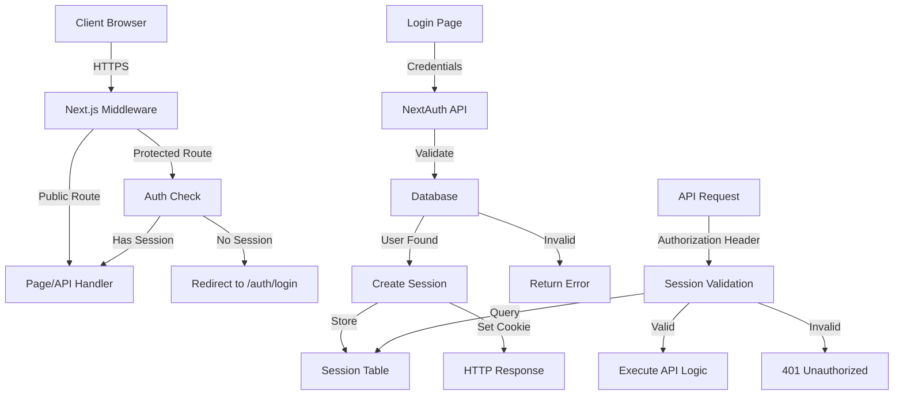
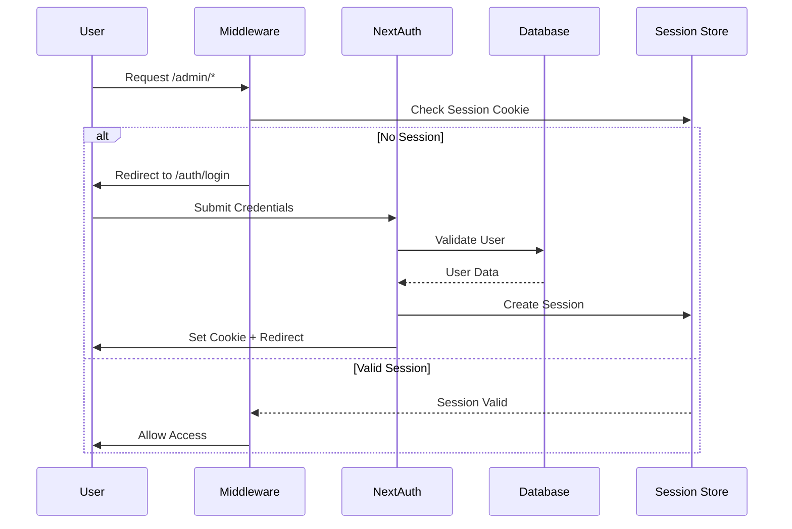
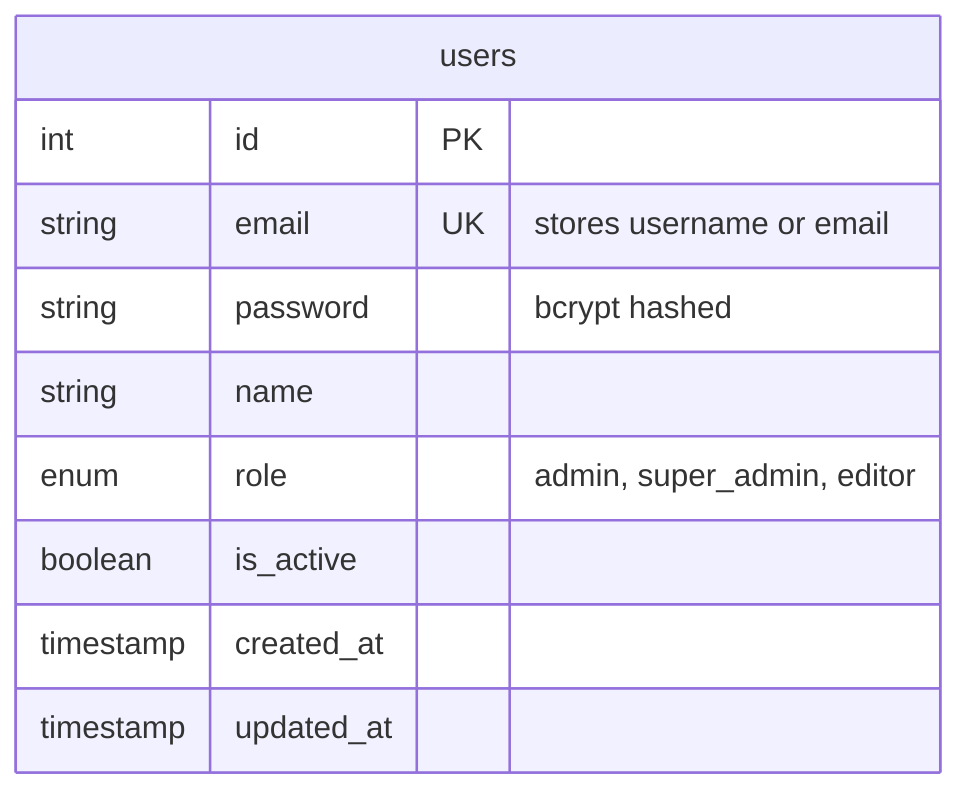

# Authentication System Design Document

> **⚠️ IMPLEMENTATION NOTE**: The actual implementation deviates from this design in several key areas. See [IMPLEMENTATION_NOTES.md](./IMPLEMENTATION_NOTES.md) for the current implementation details, including:
> - Username-based login (not email)
> - JWT strategy (not database sessions)
> - No database adapter
> - Simplified edge-compatible middleware
> - No sessions/accounts tables
> - Performance optimizations (removed DNS lookups, fonts)

## Overview

The Authentication System will provide secure, role-based access control for the Trend Ankara Radio CMS platform using NextAuth.js v5 with database sessions stored in MySQL. The system integrates with Next.js 15's App Router architecture, leveraging existing UI components and database patterns while introducing new authentication-specific modules. The design emphasizes simplicity and security, with a single unified login page and comprehensive middleware protection for all administrative routes.

## Steering Document Alignment

### Technical Standards (tech.md)
- **NextAuth.js Integration**: Implements NextAuth v5 with MySQL adapter for session storage
- **Database Design**: Extends existing `users` table with proper indexing for session queries
- **API Pattern**: Follows established `/api/*` route structure with consistent JSON responses
- **Security Implementation**: Uses bcrypt for password hashing, httpOnly cookies for sessions
- **Dark Mode Theme**: Login page follows RED/BLACK/WHITE color scheme
- **Performance**: Session validation under 50ms using indexed database queries

### Project Structure (structure.md)
- **Authentication Routes**: `/auth/login` page in root app directory
- **API Endpoints**: `/api/auth/[...nextauth]` for NextAuth handlers
- **Middleware**: `src/middleware.ts` for route protection
- **Components**: Reusable auth components in `src/components/auth/`
- **Library Functions**: Auth utilities in `src/lib/auth/`
- **Database Queries**: Auth-specific queries in `src/lib/db/auth.ts`

## Code Reuse Analysis

### Existing Components to Leverage
- **UI Components**:
  - `src/components/ui/Input.tsx` - For email/password fields with error handling
  - `src/components/ui/Button.tsx` - For login button with loading states
  - `src/components/ui/Card.tsx` - For login form container
- **Database Client**:
  - `src/lib/db/client.ts` - Existing MySQL connection pool with transaction support
- **Utilities**:
  - `src/lib/utils/logger.ts` - For authentication event logging
  - `src/lib/utils.ts` (cn function) - For className management

### Integration Points
- **Database**: Connect to existing MySQL instance using established connection pool
- **Admin Layout**: Inject session provider into `src/app/admin/layout.tsx`
- **API Routes**: Protect existing `/api/admin/*` endpoints with auth checks
- **Environment Config**: Extend existing `.env` structure with auth variables

## Architecture

The authentication system follows a layered architecture with clear separation of concerns:



### Component Interaction Diagram



### Database Schema Diagram



## Components and Interfaces

### Component 1: NextAuth Configuration (`src/lib/auth/config.ts`)
- **Purpose:** Central configuration for NextAuth with providers and callbacks
- **Interfaces:**
  - `authOptions`: NextAuth configuration object
  - Session callbacks for role enrichment
  - JWT callbacks for token customization
- **Dependencies:** NextAuth core, bcrypt, database adapter
- **Reuses:** Database client from `src/lib/db/client.ts`

### Component 2: Database Adapter (`src/lib/auth/adapter.ts`)
- **Status:** NOT IMPLEMENTED - JWT strategy doesn't require adapter
- **Reason:** NextAuth Credentials provider incompatible with database adapters when using JWT
- **Alternative:** Direct database queries in auth config for user validation only

### Component 3: Middleware (`src/middleware.ts`)
- **Purpose:** Route protection using JWT token validation
- **Interfaces:**
  - `matcher` configuration for protected routes
  - JWT token validation using `getToken`
  - Redirect handling for unauthorized access
- **Dependencies:** next-auth/jwt, Next.js middleware
- **Performance:** Edge runtime compatible, no database calls

### Component 4: Login Page Component (`src/app/auth/login/page.tsx`)
- **Purpose:** Unified authentication interface for all users
- **Interfaces:**
  - Form submission handler
  - Error display logic
  - Redirect after successful login
- **Dependencies:** NextAuth signIn, Next.js router
- **Reuses:** Input, Button, Card components from UI library

### Component 5: Auth Provider (`src/components/auth/AuthProvider.tsx`)
- **Purpose:** Client-side session provider wrapper
- **Interfaces:**
  - SessionProvider wrapper for client components
  - Session refresh logic
- **Dependencies:** NextAuth React provider
- **Reuses:** None (thin wrapper component)

### Component 6: Auth Utilities (`src/lib/auth/utils.ts`)
- **Purpose:** Helper functions for authentication operations
- **Interfaces:**
  - Password hashing/verification
  - Session helpers
  - Role checking utilities
- **Dependencies:** bcrypt, database client
- **Reuses:** Logger utilities for audit trail

### Component 7: User Management API (`src/app/api/admin/users/route.ts`)
- **Purpose:** CRUD operations for user management (Super Admin only)
- **Interfaces:**
  - GET: List users
  - POST: Create user
  - PUT: Update user
  - DELETE: Soft delete user
- **Dependencies:** NextAuth session, database client
- **Reuses:** Database transaction support, error handling patterns

## Data Models

### Extended User Model
```typescript
interface User {
  id: number;
  email: string;
  password: string; // bcrypt hashed
  name: string;
  role: 'admin' | 'super_admin' | 'editor'; // Extended ENUM (editor kept for compatibility)
  is_active: boolean;
  created_at: Date;
  updated_at: Date;
  deleted_at: Date | null;
}
```

### Session Model
```typescript
// NOT IMPLEMENTED - Using JWT tokens instead
// Sessions are stored in JWT tokens, not database
// Token payload includes: user id, email, name, role
```

### Database Migrations
```sql
-- Modify users table for super_admin role (keeping 'editor' for backward compatibility)
ALTER TABLE users MODIFY COLUMN role ENUM('admin', 'super_admin', 'editor') DEFAULT 'editor';

-- Note: Sessions and Accounts tables NOT created - using JWT strategy
-- The email field stores both username and email formats for flexibility
```

## Error Handling

### Error Scenarios

1. **Invalid Credentials**
   - **Handling:** Return generic "Invalid email or password" message
   - **User Impact:** Error message displayed on login form in Turkish
   - **Logging:** Log failed attempt with IP address for security monitoring

2. **Session Expired**
   - **Handling:** Clear invalid session, redirect to login with return URL
   - **User Impact:** Seamless redirect to login, returns to original page after auth
   - **Logging:** Log session expiration event

3. **Database Connection Failed**
   - **Handling:** Return 503 Service Unavailable for APIs, error page for UI
   - **User Impact:** "Service temporarily unavailable" message
   - **Logging:** Critical error logged, alert operations team

4. **Rate Limit Exceeded**
   - **Handling:** Return 429 Too Many Requests, block IP temporarily
   - **User Impact:** "Too many login attempts, please try again later"
   - **Logging:** Log potential brute force attempt

5. **Unauthorized Role Access**
   - **Handling:** Return 403 Forbidden, log security event
   - **User Impact:** "You don't have permission to access this resource"
   - **Logging:** Log authorization failure with user details

## Session Management Strategy

### JWT Token Management
- **Token Expiry**: 24 hours (configured in NextAuth)
- **Token Refresh**: Automatic refresh every 1 hour
- **Implementation**: JWT tokens stored in httpOnly cookies
- **No Database Cleanup**: JWT tokens expire automatically

### Session Security
- **JWT Secret**: Required environment variable (AUTH_SECRET or NEXTAUTH_SECRET)
- **Cookie Settings**: httpOnly=true, secure=true (production), sameSite='lax'
- **Token Contents**: User ID, email/username, name, role (no sensitive data)
- **Edge Compatible**: Tokens validated without database calls

## Package Dependencies

### Required NPM Packages
```json
{
  "dependencies": {
    "next-auth": "^5.0.0-beta.25",
    "bcryptjs": "^2.4.3",
    "@auth/mysql-adapter": "^1.0.0"
  }
}
```

## Middleware Configuration

### Route Protection Rules
```typescript
// src/middleware.ts
export const config = {
  matcher: [
    '/admin/:path*',        // All admin pages
    '/api/admin/:path*',    // Admin API endpoints
    '/auth/logout',         // Logout endpoint
    // Exclude public routes
    '/((?!api/mobile|api/radio|api/polls/vote|_next/static|favicon.ico).*)',
  ]
}
```

## API Response Schemas

### Login Endpoint
```typescript
// Handled by NextAuth at /api/auth/[...nextauth]
// POST /api/auth/callback/credentials
interface LoginRequest {
  username: string;  // Changed from email
  password: string;
}

// Response handled by NextAuth, returns JWT token in cookie
```

### User Management Endpoints
```typescript
// GET /api/admin/users
interface GetUsersResponse {
  success: boolean;
  data: User[];
  pagination: {
    page: number;
    limit: number;
    total: number;
  };
}

// POST /api/admin/users
interface CreateUserRequest {
  email: string;
  password: string;
  name: string;
  role: 'admin' | 'super_admin';
}

// PUT /api/admin/users/:id
interface UpdateUserRequest {
  email?: string;
  password?: string;
  name?: string;
  role?: 'admin' | 'super_admin';
  is_active?: boolean;
}
```

## Testing Strategy

### Unit Testing
- **Auth Utilities**: Test password hashing, verification, role checks
  - Test bcrypt rounds configuration
  - Test password complexity validation
  - Test role permission matrices
- **Database Adapter**: Mock database calls, test CRUD operations
  - Mock mysql2 connection pool
  - Test transaction rollback scenarios
  - Test connection failure handling
- **Middleware Logic**: Test route matching, session validation logic
  - Test protected vs public route detection
  - Test session cookie parsing
  - Test redirect URL preservation

### Integration Testing
- **Authentication Flow**: Full login/logout cycle with database
  - Test with real MySQL instance
  - Verify session creation in database
  - Test cookie setting and clearing
- **Session Management**: Creation, validation, expiration handling
  - Test session timeout after 24 hours
  - Test concurrent session limits
  - Test session cleanup job
- **Role-Based Access**: Test admin vs super_admin permissions
  - Verify user management restricted to super_admin
  - Test API endpoint authorization
  - Test UI component visibility
- **API Protection**: Verify middleware blocks unauthorized requests
  - Test 401 responses for missing sessions
  - Test 403 responses for insufficient permissions
  - Test rate limiting on login attempts

### End-to-End Testing
- **User Login Journey**: Complete flow from login to accessing admin panel
  - Test form submission with valid credentials
  - Verify redirect to originally requested page
  - Test session persistence across navigation
- **Session Persistence**: Verify sessions survive page refreshes
  - Test cookie persistence
  - Test session validation on each request
  - Test remember me functionality (if implemented)
- **Logout Flow**: Ensure complete session cleanup
  - Verify session removed from database
  - Verify cookie cleared
  - Test redirect to login page
- **Error Scenarios**: Test invalid credentials, expired sessions
  - Test wrong password error message
  - Test non-existent user handling
  - Test expired session redirect
- **Mobile Responsiveness**: Verify login page works on all devices
  - Test on iOS Safari
  - Test on Android Chrome
  - Test responsive layout breakpoints

## Performance Monitoring

### Metrics to Track
- Session validation time (target < 50ms)
- Login request processing time (target < 500ms)
- Database query performance (indexed queries)
- Failed login attempt rate (detect attacks)
- Session cleanup job duration
- Concurrent session count per user