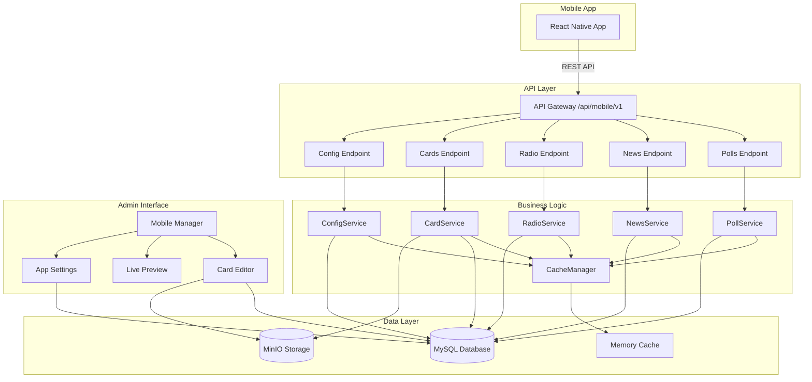

# Design Document - Mobile API & Manager

## Overview

The Mobile API & Manager feature provides a comprehensive REST API system for mobile applications and a simplified card-based content management interface. This design leverages existing polls, news, and radio systems while introducing new mobile-specific endpoints and a streamlined admin interface. The architecture emphasizes performance (sub-200ms responses), simplicity (card-based content), and flexibility (configurable app behavior).

## Steering Document Alignment

### Technical Standards (tech.md)
- **Next.js 15 App Router**: Mobile API routes follow `/api/mobile/v1/` structure
- **MySQL 8.0**: Optimized schemas with proper indexing for sub-100ms queries
- **MinIO Storage**: Automatic URL conversion from MinIO to HTTPS proxy endpoints
- **TypeScript**: Strong typing for all API contracts and data models
- **Caching Strategy**: Memory caching with ETags for conditional requests
- **Response Format**: Consistent JSON structure with success/data/error pattern

### Project Structure (structure.md)
- **API Routes**: `/src/app/api/mobile/v1/` for all mobile endpoints
- **Admin Pages**: `/src/app/admin/mobile/` for management interface
- **Components**: `/src/components/mobile/` for card components and previews
- **Types**: `/src/types/mobile.ts` extended with new interfaces
- **Database Queries**: `/src/lib/db/queries/mobile/` for mobile-specific queries
- **Utilities**: Reuse `/src/lib/utils/url-fixer.ts` for URL conversion

## Code Reuse Analysis

### Existing Components to Leverage
- **`/src/lib/utils/url-fixer.ts`**: URL conversion from MinIO to proxy URLs (used in all API responses)
- **`/src/lib/db/client.ts`**: Database connection pool and query execution
- **`/src/app/api/polls/active/route.ts`**: Poll fetching logic and vote validation
- **`/src/app/api/news/route.ts`**: News pagination and filtering patterns
- **`/src/app/api/mobile/v1/radio/route.ts`**: Caching strategy and ETag implementation
- **`/src/components/ui/Button.tsx`**: Reusable UI components for admin interface
- **`/src/app/admin/layout.tsx`**: Authentication wrapper and admin layout structure

### Integration Points
- **Polls System**: Direct integration with existing `polls`, `poll_items`, and `poll_votes` tables
- **News System**: Leverage `news` and `news_categories` tables with existing relationships
- **Radio Settings**: Extend `radio_settings` table with mobile-specific configurations
- **Authentication**: Use existing `requireAuth()` utility for admin panel protection
- **Media Storage**: Integrate with MinIO through existing media proxy pattern

## Architecture



## Components and Interfaces

### Mobile API Gateway (`/src/app/api/mobile/v1/`)
- **Purpose:** Central entry point for all mobile API requests with versioning support
- **Interfaces:** Standard Next.js route handlers with consistent response format
- **Dependencies:** Database client, cache manager, URL fixer utility
- **Reuses:** Existing API response patterns from current mobile radio endpoint

### Poll Service (`/src/services/mobile/PollService.ts`)
- **Purpose:** Handles poll data retrieval and voting logic for mobile endpoints
- **Interfaces:**
  ```typescript
  getActivePoll(settings: MobileSettings): Promise<MobilePoll | null>
  submitVote(pollId: number, itemId: number, deviceInfo: DeviceInfo): Promise<VoteResult>
  ```
- **Dependencies:** Database client, existing poll vote validation logic
- **Reuses:** Poll fetching logic from `/src/app/api/polls/active/route.ts`

### News Service (`/src/services/mobile/NewsService.ts`)
- **Purpose:** Provides paginated news with mobile-optimized formatting
- **Interfaces:**
  ```typescript
  getNewsList(page: number, limit: number, settings: MobileSettings): Promise<PaginatedNews>
  getNewsDetail(slug: string): Promise<NewsDetail>
  ```
- **Dependencies:** Database client, URL fixer for image URLs
- **Reuses:** Pagination logic from `/src/app/api/news/route.ts`

### Card Service (`/src/services/mobile/CardService.ts`)
- **Purpose:** Manages simplified card-based content for mobile display
- **Interfaces:**
  ```typescript
  getCards(type?: 'featured' | 'normal'): Promise<MobileCard[]>
  createCard(data: CardInput): Promise<MobileCard>
  updateCard(id: number, data: CardInput): Promise<MobileCard>
  reorderCards(cardIds: number[]): Promise<void>
  ```
- **Dependencies:** Database client, MinIO client for image storage
- **Reuses:** Image upload patterns from existing media manager

### Config Service (`/src/services/mobile/ConfigService.ts`)
- **Purpose:** Manages mobile app configuration and settings
- **Interfaces:**
  ```typescript
  getSettings(): Promise<MobileSettings>
  updateSettings(settings: Partial<MobileSettings>): Promise<MobileSettings>
  getPlayerLogo(): Promise<string | null>
  ```
- **Dependencies:** Database client, caching layer
- **Reuses:** Settings pattern from radio configuration

### Cache Manager (`/src/lib/cache/MobileCacheManager.ts`)
- **Purpose:** Provides memory caching with TTL and ETag support
- **Interfaces:**
  ```typescript
  get<T>(key: string): CacheEntry<T> | null
  set<T>(key: string, value: T, ttl: number): void
  generateETag(data: any): string
  invalidate(pattern: string): void
  ```
- **Dependencies:** Node.js crypto for ETag generation
- **Reuses:** Caching strategy from radio endpoint implementation

### Mobile Admin Components

#### Card Editor (`/src/components/mobile/CardEditor.tsx`)
- **Purpose:** Simple form for creating/editing mobile cards
- **Interfaces:** Props for card data, onSave, onCancel callbacks
- **Dependencies:** UI components, media picker, form validation
- **Reuses:** Form patterns from existing admin panels

#### Live Preview (`/src/components/mobile/LivePreview.tsx`)
- **Purpose:** Real-time preview of mobile app appearance
- **Interfaces:** Props for cards array, settings configuration
- **Dependencies:** Framer Motion for animations
- **Reuses:** Mobile preview scaling from content builder

#### Settings Panel (`/src/components/mobile/SettingsPanel.tsx`)
- **Purpose:** Configure mobile app behavior and limits
- **Interfaces:** Props for current settings, onChange callback
- **Dependencies:** Form components, validation utilities
- **Reuses:** Settings UI patterns from radio configuration

## Data Models

### Mobile Cards Table (`mobile_cards`)
```sql
CREATE TABLE mobile_cards (
  id INT AUTO_INCREMENT PRIMARY KEY,
  title VARCHAR(255) NOT NULL,
  description TEXT,
  image_url VARCHAR(500),
  redirect_url VARCHAR(500),
  is_featured BOOLEAN DEFAULT FALSE,
  display_order INT DEFAULT 0,
  is_active BOOLEAN DEFAULT TRUE,
  created_at TIMESTAMP DEFAULT CURRENT_TIMESTAMP,
  updated_at TIMESTAMP DEFAULT CURRENT_TIMESTAMP ON UPDATE CURRENT_TIMESTAMP,
  created_by INT,
  INDEX idx_featured_order (is_featured, display_order),
  INDEX idx_active (is_active),
  FOREIGN KEY (created_by) REFERENCES users(id)
);
```

### Mobile Settings Table (`mobile_settings`)
```sql
CREATE TABLE mobile_settings (
  id INT AUTO_INCREMENT PRIMARY KEY,
  setting_key VARCHAR(100) UNIQUE NOT NULL,
  setting_value JSON NOT NULL,
  description VARCHAR(500),
  updated_at TIMESTAMP DEFAULT CURRENT_TIMESTAMP ON UPDATE CURRENT_TIMESTAMP,
  updated_by INT,
  INDEX idx_setting_key (setting_key),
  FOREIGN KEY (updated_by) REFERENCES users(id)
);
```

### TypeScript Interfaces
```typescript
// Extend existing mobile.ts types
interface MobileCard {
  id: number;
  title: string;
  description?: string;
  imageUrl?: string;
  redirectUrl?: string;
  isFeatured: boolean;
  displayOrder: number;
  isActive: boolean;
}

interface MobileSettings {
  showOnlyLastActivePoll: boolean;
  maxNewsCount: number;
  enablePolls: boolean;
  enableNews: boolean;
  playerLogoUrl?: string;
  cardDisplayMode: 'grid' | 'list';
}

interface MobileApiResponse<T> {
  success: boolean;
  data: T;
  error?: string;
  pagination?: {
    page: number;
    limit: number;
    total: number;
    hasNext: boolean;
  };
  cache?: {
    etag: string;
    maxAge: number;
  };
}
```

## Error Handling

### Error Scenarios

1. **Database Connection Failure**
   - **Handling:** Return cached data if available, otherwise 503 Service Unavailable
   - **User Impact:** Mobile app shows cached content with offline indicator
   - **Logging:** Error logged with stack trace for debugging

2. **Invalid Vote Submission**
   - **Handling:** Return 400 Bad Request with specific error message
   - **User Impact:** Mobile app displays localized error message
   - **Prevention:** Client-side validation before submission

3. **Missing Configuration**
   - **Handling:** Use default settings as fallback
   - **User Impact:** App functions with default behavior
   - **Alert:** Admin notified of missing configuration

4. **Image Upload Failure**
   - **Handling:** Save card without image, allow retry
   - **User Impact:** Card displays with placeholder image
   - **Recovery:** Background retry mechanism for failed uploads

5. **Rate Limit Exceeded**
   - **Handling:** Return 429 Too Many Requests with retry-after header
   - **User Impact:** Mobile app implements exponential backoff
   - **Monitoring:** Track abuse patterns for security review

## Performance Optimizations

### Database Optimization
- Composite indexes on `(is_featured, display_order)` for card queries
- Covering index on polls for active poll query
- Query result caching for frequently accessed data
- Connection pooling with 10 connections minimum

### API Response Optimization
- Gzip compression for all JSON responses
- ETag headers for conditional requests
- Memory caching with 5-minute TTL for static content
- Pagination with default limit of 20 items
- Field selection to reduce payload size

### Image Optimization
- Automatic thumbnail generation (150x150, 300x300, 600x600)
- WebP format support with JPEG fallback
- Lazy loading hints in API responses
- CDN-ready URL structure

## Testing Strategy

### Unit Testing
- Service layer methods with mocked database
- Cache manager TTL and eviction logic
- URL fixer utility with various input formats
- Validation utilities for card and settings data

### Integration Testing
- API endpoint response format validation
- Database transaction rollback scenarios
- MinIO upload and retrieval workflows
- Settings cascade effect on API responses

### End-to-End Testing
- Mobile app card creation and display flow
- Poll voting with device validation
- News pagination and detail navigation
- Settings changes affecting API behavior

## Migration Plan

### Database Migrations
```sql
-- Migration 001: Create mobile_cards table
CREATE TABLE IF NOT EXISTS mobile_cards (...);

-- Migration 002: Create mobile_settings table
CREATE TABLE IF NOT EXISTS mobile_settings (...);

-- Migration 003: Insert default settings
INSERT INTO mobile_settings (setting_key, setting_value) VALUES
  ('polls_config', '{"showOnlyLastActivePoll": false}'),
  ('news_config', '{"maxNewsCount": 50}'),
  ('app_config', '{"enablePolls": true, "enableNews": true}'),
  ('player_config', '{"logoUrl": null}');

-- Migration 004: Add indexes for performance
CREATE INDEX idx_mobile_cards_featured ON mobile_cards(is_featured, display_order);
```

### Data Migration
- No existing data migration required (new tables)
- Default settings populated on first deployment
- Existing polls and news automatically available

## Security Considerations

### API Security
- Rate limiting: 100 requests/minute per IP
- Request origin validation for CORS
- Input sanitization for all user inputs
- SQL injection prevention through parameterized queries
- XSS prevention in rich text content

### Admin Security
- Authentication required for all admin routes
- Role-based access control (ADMIN, EDITOR)
- CSRF protection for state-changing operations
- Audit logging for all admin actions
- Session timeout after 30 minutes of inactivity

### Data Security
- No sensitive data in API responses
- Image URLs use proxy pattern to hide storage details
- Configuration values validated before storage
- Soft deletes for data recovery capability