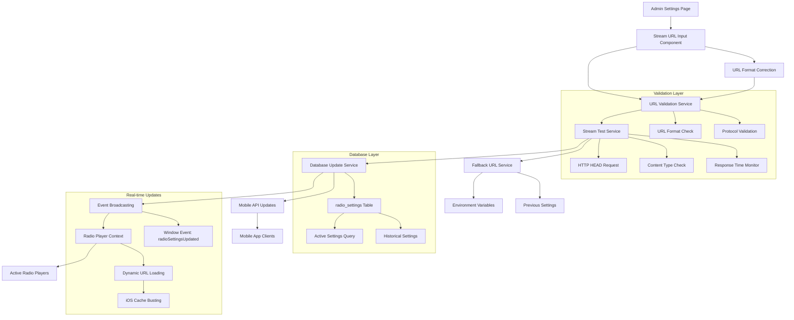

# Design Document - Configurable Radio Streaming URL

## Overview

This design implements a configurable radio streaming URL feature that enables administrators to dynamically update the radio stream URL through the admin settings interface. The system provides real-time URL validation, stream connectivity testing, automatic URL format correction, and seamless integration with the existing radio player system. The implementation leverages existing infrastructure including the `radio_settings` database table, `RadioPlayerContext`, and ReUI component system to deliver a robust and user-friendly administrative interface.

The feature replaces the current hardcoded stream URL system with a database-driven configuration that supports both web and mobile platforms, includes comprehensive error handling and fallback mechanisms, and provides real-time updates to active radio players without service interruption.

## Steering Document Alignment

### Technical Standards (tech.md)

The design strictly follows established technical patterns:
- **Next.js 15**: Uses App Router, Server Components, and async route parameters
- **ReUI Components**: Leverages feature flag system for Button, Input, Card, Alert components
- **MySQL 8.0**: Utilizes existing `radio_settings` table with proper indexing
- **Mobile API Architecture**: Implements RESTful `/api/mobile/v1/radio` endpoint with JSON responses
- **TypeScript**: Implements strict typing with proper interface definitions
- **Error Handling**: Uses standardized DatabaseError patterns and response formats

### Project Structure (structure.md)

Implementation follows established directory organization:
- **Admin Components**: Extends `/src/app/admin/settings/page.tsx`
- **API Routes**: Updates `/src/app/api/mobile/v1/radio/route.ts`
- **Database Queries**: Leverages `/src/lib/db/queries/radioSettings.ts`
- **Context Integration**: Extends `/src/components/radio/RadioPlayerContext.tsx`
- **Utilities**: Uses `/src/lib/utils/streamMetadata.ts` for validation

## Code Reuse Analysis

### Existing Components to Leverage

- **RadioPlayerContext.reloadConfiguration()**: Method already exists for real-time configuration updates, will be triggered when admin saves new URL
- **streamMetadata.testStreamConnection()**: Existing function provides stream connectivity testing with timeout and error handling
- **radioSettings.updateSettings()**: Full CRUD operations available for database persistence
- **radioSettings.testStreamConnectionWithFallback()**: Implements fallback logic for failed connections
- **radioSettings.getActiveSettings()**: Retrieves current active configuration from database
- **ReUI Button/Input/Card/Alert**: Available via feature flag system for consistent UI components

### Integration Points

- **Existing radio_settings Table**: Database schema already supports stream_url field with proper indexing and constraints
- **RadioPlayerContext Event System**: Current implementation listens for 'radioSettingsUpdated' events for real-time updates
- **Mobile API Structure**: `/api/mobile/v1/radio/route.ts` exists and needs population with configuration data
- **Stream Validation Utilities**: `parseStreamHeaders()`, `detectServerType()`, and `validateStreamUrl()` functions provide comprehensive validation
- **Admin Settings Page**: Current page structure supports adding new radio configuration section

## Architecture

The architecture extends existing systems with minimal disruption while providing comprehensive radio stream management:



## Components and Interfaces

### Component 1: StreamUrlConfigForm
- **Purpose:** Admin interface for stream URL configuration with real-time validation and testing
- **Interfaces:**
  - `onSave(url: string): Promise<void>` - Saves validated URL to database
  - `onTest(url: string): Promise<StreamTestResult>` - Tests stream connectivity
  - `onFormatCorrect(url: string): string` - Auto-corrects common URL format issues
- **Dependencies:** ReUI Input, Button, Alert components; streamMetadata utilities; radioSettings queries
- **Reuses:** Existing Card layout from admin settings page; existing validation patterns from radioSettings.ts

### Component 2: StreamTestIndicator
- **Purpose:** Visual feedback component showing stream connectivity status and metadata
- **Interfaces:**
  - `testResult: StreamTestResult` - Display test results with status, timing, metadata
  - `isLoading: boolean` - Show loading state during testing
- **Dependencies:** ReUI Alert, Badge components; streamMetadata types
- **Reuses:** Existing loading spinner patterns; existing alert styling

### Component 3: StreamUrlValidator
- **Purpose:** Service class for URL validation and format correction
- **Interfaces:**
  - `validateUrl(url: string): ValidationResult` - Comprehensive URL validation
  - `correctUrlFormat(url: string): string` - Auto-correct common URL issues
  - `testStreamConnectivity(url: string): Promise<StreamTestResult>` - Test stream accessibility
- **Dependencies:** Existing streamMetadata utilities; radioSettings validation functions
- **Reuses:** `validateStreamUrl()`, `testStreamConnection()`, and `parseStreamHeaders()` from existing codebase

### Component 4: RadioConfigurationAPI
- **Purpose:** Mobile API endpoint providing current radio configuration
- **Interfaces:**
  - `GET /api/mobile/v1/radio` - Returns current stream configuration
  - Response format: `{ success: boolean, data: { stream_url: string, metadata_url: string, station_name: string }, error?: string }`
- **Dependencies:** radioSettings.getActiveSettings(); mobile API response patterns
- **Reuses:** Existing mobile API structure and error handling patterns

## Data Models

### StreamConfigurationData
```typescript
interface StreamConfigurationData {
  id: number;
  stream_url: string;
  metadata_url: string | null;
  station_name: string;
  station_description: string | null;
  is_active: boolean;
  updated_by: number | null;
  created_at: Date;
  updated_at: Date;
}
```

### StreamTestResult
```typescript
interface StreamTestResult {
  isValid: boolean;
  statusCode?: number;
  error?: string;
  responseTime?: number;
  contentType?: string;
  metadata?: {
    serverInfo?: {
      software: ServerType;
      version?: string;
      description?: string;
    };
    streamTitle?: string;
    bitrate?: number;
    audioFormat?: AudioFormat;
  };
}
```

### URLValidationResult
```typescript
interface URLValidationResult {
  isValid: boolean;
  error?: string;
  correctedUrl?: string;
  suggestions?: string[];
}
```

### MobileRadioConfig
```typescript
interface MobileRadioConfig {
  stream_url: string;
  metadata_url: string | null;
  station_name: string;
  connection_status: 'active' | 'testing' | 'failed';
  last_tested: string;
}
```

## Error Handling

### Error Scenarios

1. **Stream URL Validation Failure:**
   - **Handling:** Display specific validation errors (invalid format, unsupported protocol, length exceeded)
   - **User Impact:** Form shows validation error with correction suggestions; save button disabled until valid URL provided

2. **Stream Connectivity Test Timeout:**
   - **Handling:** Display "Connection timeout (10 seconds exceeded)" message; offer retry option
   - **User Impact:** User sees clear timeout message and can retry test or save URL anyway with warning

3. **Stream Test Non-Audio Content Type:**
   - **Handling:** Display "Stream URL returned unexpected content type: [type]" warning
   - **User Impact:** User receives warning but can choose to save URL if they believe it's correct

4. **Database Update Failure:**
   - **Handling:** Catch DatabaseError; display user-friendly message while logging technical details
   - **User Impact:** "Settings could not be saved. Please try again." message; previous settings maintained

5. **Real-time Player Update Failure:**
   - **Handling:** Log error; attempt fallback to previous URL; display connection status in player
   - **User Impact:** Radio player shows "reconnecting" status; falls back to working URL if new URL fails

6. **Mobile API Unavailable:**
   - **Handling:** Return fallback configuration from environment variables
   - **User Impact:** Mobile app receives last known good configuration; degrades gracefully

## Testing Strategy

### Unit Testing

**Stream URL Validation:**
- Test URL format validation with various valid/invalid URLs
- Test auto-correction logic for common URL format issues (.com/stream → .com/, index.html removal)
- Test protocol validation (HTTP/HTTPS only)
- Test length validation (500 character limit)

**Stream Connectivity Testing:**
- Mock HTTP responses for testing timeout scenarios
- Test content-type validation for audio streams
- Test error handling for network failures
- Test response time measurement accuracy

**Database Operations:**
- Test radio settings CRUD operations with valid/invalid data
- Test atomic updates with proper transaction handling
- Test fallback URL retrieval logic
- Test active settings queries with multiple records

### Integration Testing

**Admin Interface to Database Flow:**
- Test complete form submission from validation through database persistence
- Test error propagation from database failures to UI feedback
- Test concurrent update scenarios from multiple admin sessions

**Real-time Player Updates:**
- Test event broadcasting when settings are updated
- Test RadioPlayerContext.reloadConfiguration() integration
- Test seamless stream transitions during playback
- Test iOS cache-busting parameter generation

**Mobile API Integration:**
- Test mobile endpoint returns current active settings
- Test API response format matches mobile app expectations
- Test fallback behavior when no active settings exist

### End-to-End Testing

**Complete Admin Configuration Workflow:**
1. Admin accesses settings page and sees current stream URL
2. Admin modifies URL and receives real-time validation feedback
3. Admin tests new URL and sees connectivity results with metadata
4. Admin saves valid URL and receives confirmation
5. Active radio players automatically reconnect to new stream
6. Mobile API immediately reflects new configuration

**Error Recovery Scenarios:**
1. Test invalid URL entry shows appropriate validation errors
2. Test stream test failure displays helpful error messages
3. Test database save failure maintains previous working configuration
4. Test network timeout scenarios during stream testing
5. Test fallback mechanisms when primary stream fails

**Cross-Platform Consistency:**
1. Test configuration changes reflect consistently across web and mobile
2. Test iOS-specific cache-busting in radio player updates
3. Test mobile API provides identical configuration to web interface