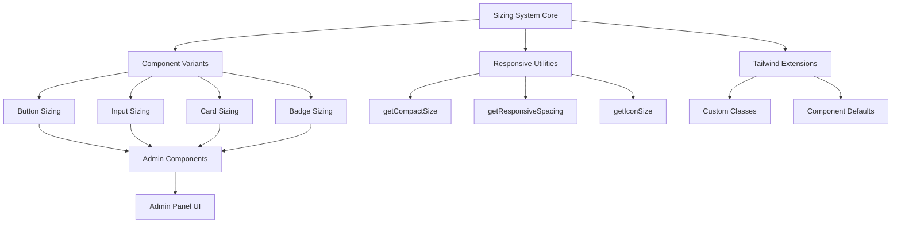

# Design Document: UI Sizing Fix

## Overview

This design establishes a comprehensive, consistent sizing system for all admin panel UI components. The implementation will create a unified design language based on compact sizing patterns, ensuring professional appearance and improved content density while maintaining mobile responsiveness and accessibility standards.

## Steering Document Alignment

### Technical Standards (tech.md)
- **Tailwind CSS v4**: Utilizes Tailwind's utility classes for all styling changes
- **Dark Mode Always**: Maintains the dark theme with RED/BLACK/WHITE color scheme
- **Mobile-First Approach**: Uses responsive modifiers (sm:, md:) for progressive enhancement
- **Performance Focus**: Pure CSS solution without JavaScript calculations for responsiveness

### Project Structure (structure.md)
- **Component Organization**: Updates will follow existing `/src/components/ui/` and `/src/components/admin/` structure
- **Utility Functions**: Extends existing `/src/lib/utils/responsive.ts` for sizing utilities
- **Type Definitions**: Enhances `/src/types/responsive.ts` with new sizing constants
- **Tailwind Config**: Updates `/tailwind.config.ts` with standardized component classes

## Code Reuse Analysis

### Existing Components to Leverage
- **Button Component** (`/src/components/ui/Button.tsx`): Already has size variants, needs adjustment to compact sizing
- **Input Component** (`/src/components/ui/Input.tsx`): Has responsive padding, needs reduction
- **Card Component** (`/src/components/ui/Card.tsx`): Has padding structure, needs optimization
- **Badge Component** (`/src/components/ui/Badge.tsx`): Has size system, needs compact variants
- **AdminSidebar** (`/src/components/admin/AdminSidebar.tsx`): Navigation structure exists, needs sizing fixes

### Existing Utilities to Extend
- **cn() utility** (`/src/lib/utils.ts`): Use for merging Tailwind classes
- **Responsive utilities** (`/src/lib/utils/responsive.ts`): Extend with compact sizing helpers
- **Type system** (`/src/types/responsive.ts`): Already has TOUCH_TARGET and sizing constants

### Integration Points
- **Tailwind Config**: Extend with custom component classes for reusability
- **Global CSS**: May need adjustments in `/src/app/globals.css` for base styles
- **Admin Layout**: Updates to `/src/app/admin/layout.tsx` for container spacing

## Architecture



## Components and Interfaces

### Component 1: Compact Sizing System
- **Purpose:** Define and apply consistent compact sizing across all components
- **Interfaces:**
  - `CompactSize` type: 'xs' | 'sm' | 'md'
  - `getCompactClasses()`: Returns Tailwind classes for compact sizing
- **Dependencies:** Tailwind CSS utilities, cn() utility
- **Reuses:** Existing size variant patterns from Button and Badge components

### Component 2: Enhanced Button Component
- **Purpose:** Update Button component with compact sizing as default
- **Interfaces:**
  ```typescript
  interface ButtonProps {
    size?: 'small' | 'medium' | 'large' | 'compact'; // Add compact option
    variant?: 'primary' | 'secondary' | 'danger' | 'ghost';
    // Backward compatibility mapping:
    // 'small' -> 'px-3 py-1 text-xs' (becomes compact default)
    // 'medium' -> 'px-4 py-2 text-sm' (legacy sizing)
    // 'compact' -> 'px-3 py-1 text-xs' (explicit compact)
  }
  ```
- **Size Mapping Strategy:**
  ```typescript
  const sizeClasses = {
    compact: 'px-3 py-1 text-xs min-h-[32px] md:min-h-[28px]',
    small: 'px-3 py-1 text-xs min-h-[32px] md:min-h-[28px]', // Map to compact
    medium: 'px-4 py-2 text-sm min-h-[40px] md:min-h-[36px]',
    large: 'px-5 py-2.5 text-base min-h-[48px] md:min-h-[44px]'
  };
  // Mobile adjustments via responsive modifiers
  ```
- **Ghost Button Specific Handling (Req 8.2):**
  ```typescript
  ghost: 'bg-transparent hover:bg-dark-surface-primary/50 text-dark-text-secondary hover:text-dark-text-primary'
  ```
- **Dependencies:** cn() utility, Tailwind classes
- **Reuses:** Existing Button component structure and variant system

### Component 3: Optimized Input Component
- **Purpose:** Reduce padding and height while maintaining touch targets
- **Interfaces:**
  - Updated default padding classes
  - Responsive padding modifiers
- **Dependencies:** Tailwind responsive utilities
- **Reuses:** Current Input component with forwardRef pattern

### Component 4: Compact Card Component
- **Purpose:** Reduce internal spacing without losing visual hierarchy
- **Interfaces:**
  - New `compact` prop for reduced padding
  - Updated default padding values
- **Dependencies:** cn() utility for class merging
- **Reuses:** Existing Card component with title/footer structure

### Component 5: Admin Sidebar Updates
- **Purpose:** Apply compact sizing to navigation buttons
- **Interfaces:**
  - Updated button and icon sizing
  - Consistent spacing between items
- **Dependencies:** Updated Button component
- **Reuses:** Current navigation structure and mobile toggle

### Component 6: Responsive Spacing Utilities
- **Purpose:** Provide consistent spacing helpers for compact layouts
- **Interfaces:**
  - `getCompactSpacing()`: Returns responsive spacing classes
  - `getCompactPadding()`: Returns responsive padding classes
- **Dependencies:** Responsive breakpoint utilities
- **Reuses:** Existing responsive utility patterns

## Data Models

### Compact Sizing Configuration
```typescript
interface CompactSizeConfig {
  // Base sizing for different component types
  button: {
    desktop: 'px-3 py-1 text-xs';
    mobile: 'px-3.5 py-1.5 text-sm';
  };
  input: {
    desktop: 'px-3 py-1.5';
    mobile: 'px-3.5 py-2';
  };
  card: {
    desktop: 'p-3';
    mobile: 'p-4';
    header: 'px-3 py-2';
  };
  badge: {
    standard: 'text-xs px-2 py-0.5';
    interactive: 'text-xs px-2.5 py-1';
  };
  spacing: {
    gap: 'gap-2';
    sectionGap: 'space-y-3';
    internalGap: 'space-y-2';
  };
}
```

### Icon Size Standards
```typescript
interface IconSizeConfig {
  standard: 'w-4 h-4';        // Desktop default
  mobile: 'w-5 h-5';          // Mobile standalone
  minimum: 'min-w-[16px] min-h-[16px]'; // Prevent shrinking
  withText: 'mr-1.5';         // Spacing when with text
  badge: 'w-3 h-3';           // Icons within badges (Req 6.3)
}
```

### Textarea Configuration
```typescript
interface TextareaConfig {
  minHeight: 'min-h-[60px]';  // Starting height (Req 2.3)
  maxHeight: 'max-h-[200px]'; // Maximum before scroll
  resize: 'resize-y';         // Allow vertical resize only
  padding: {
    desktop: 'px-3 py-1.5';
    mobile: 'px-3.5 py-2';
  };
}
```

### Element Grouping Strategy
```typescript
interface GroupingStrategy {
  // Logical grouping rules (Req 5.2)
  groupingRules: [
    { type: 'action-buttons', maxItems: 3 },
    { type: 'form-inputs', maxItems: 2 },
    { type: 'badges', maxItems: 5 },
    { type: 'nav-items', maxItems: 4 }
  ];
  wrapBehavior: 'group-then-scroll'; // Group first, then horizontal scroll
  scrollIndicators: true;            // Show fade indicators
}
```

### Mobile Table Configuration
```typescript
interface MobileTableConfig {
  strategy: 'card';                  // Card view for mobile (Req 5.4)
  cardTemplate: {
    layout: 'vertical';              // Stack fields vertically
    padding: 'p-3';                  // Compact card padding
    labelStyle: 'text-xs text-dark-text-secondary';
    valueStyle: 'text-sm text-dark-text-primary';
  };
  breakpoint: 'md';                  // Switch at md breakpoint
}
```

### Responsive Overflow Configuration
```typescript
interface OverflowConfig {
  strategy: 'scroll' | 'wrap' | 'group';
  scrollFade: boolean;        // Show fade indicators
  groupSize: number;          // Items per group
  mobileStrategy: 'card' | 'scroll'; // Mobile-specific handling
}
```

## Implementation Strategy

### Phase 1: Core Utilities
1. Create compact sizing utilities in `/src/lib/utils/compact.ts`
2. Add sizing constants to `/src/types/responsive.ts`
3. Extend Tailwind config with component classes

### Phase 2: Base Components
1. Update Button component with compact sizing
2. Optimize Input component padding
3. Reduce Card component spacing
4. Add compact Badge variants

### Phase 3: Admin Components
1. Update AdminSidebar with compact buttons
2. Fix all admin form components
3. Optimize admin table and list views
4. Update stats and dashboard cards

### Phase 4: Responsive Handling
1. Implement flex group wrapping logic
2. Add horizontal scroll containers
3. Create mobile-specific card views
4. Test and adjust touch targets

## Error Handling

### Error Scenarios

1. **Touch Target Too Small**
   - **Detection:** Calculate actual element dimensions on render
   - **Handling:**
     - Add invisible padding via `::after` pseudo-element
     - Extend clickable area to minimum 44x44px
     - Log warning in development mode
   - **User Impact:** No visual change, improved touch accuracy
   - **Recovery:** Automatic, no user action required

2. **Content Overflow**
   - **Detection:** Compare scrollWidth to clientWidth
   - **Handling:**
     - Apply `overflow-x-auto` with `scrollbar-thin`
     - Add fade gradients via `::before` and `::after`
     - Show scroll hint on first overflow
   - **User Impact:** Scrollable content with visual cues
   - **Recovery:** User can scroll to see hidden content

3. **Icon Shrinking**
   - **Detection:** Check computed styles against minimum size
   - **Handling:**
     - Force minimum dimensions with `!important` in development
     - Apply `flex-shrink-0` to prevent flex shrinking
     - Use `min-w-[16px] min-h-[16px]` constraints
   - **User Impact:** Icons maintain consistent size
   - **Recovery:** Automatic via CSS constraints

4. **Text Truncation**
   - **Detection:** Compare scrollWidth to clientWidth for text elements
   - **Handling:**
     - Apply `truncate` class for ellipsis
     - Add `title` attribute with full text
     - Optional: Show tooltip on hover/focus
   - **User Impact:** Full text available on interaction
   - **Recovery:** User can hover/focus to see full text

5. **Textarea Auto-Growth Failure** (Req 2.3)
   - **Detection:** Content height exceeds container height
   - **Handling:**
     - Calculate content height via scrollHeight
     - Dynamically adjust rows attribute
     - Cap at max-height with scroll
   - **User Impact:** Textarea grows with content up to limit
   - **Recovery:** Scroll appears after max height reached

6. **Ghost Button Invisibility** (Req 8.2)
   - **Detection:** Insufficient contrast ratio detected
   - **Handling:**
     - Apply minimum `bg-dark-surface-secondary/30` background
     - Add `hover:bg-dark-surface-primary/50` for hover state
     - Ensure border or shadow for edge detection
   - **User Impact:** All buttons clearly visible
   - **Recovery:** Automatic style application

## Testing Strategy

### Unit Testing
- **Utility Functions**: Test all new compact sizing utilities
  - `getCompactClasses()` returns correct Tailwind classes for each size
  - `getCompactSpacing()` handles responsive breakpoints correctly
  - Icon size constraints are applied properly
- **Component Props**: Test size variant transformations
  - Button component accepts and applies compact sizing
  - Input component maintains touch targets with reduced padding
  - Badge component handles both standard and interactive sizes
- **Requirements Coverage**:
  - Req 1.1-1.5: Button sizing variations
  - Req 2.1-2.5: Input field padding and labels
  - Req 6.1-6.5: Badge sizing variants

### Integration Testing
- **Component Composition**: Test components working together
  - Forms with compact inputs and buttons maintain alignment
  - Cards with reduced padding contain components properly
  - Sidebar navigation with compact buttons functions correctly
- **Responsive Behavior**: Test breakpoint transitions
  - Desktop to mobile size adjustments work smoothly
  - Touch targets expand appropriately on mobile devices
  - Overflow handling switches between strategies correctly
- **Requirements Coverage**:
  - Req 3.1-3.5: Card and container spacing integration
  - Req 4.1-4.5: Sidebar navigation functionality
  - Req 5.1-5.5: Flex wrapping and overflow behavior

### End-to-End Testing
- **User Workflows**: Test complete admin workflows
  - Create and edit content with compact forms
  - Navigate admin panel with updated sidebar
  - Manage media with optimized spacing
- **Mobile Experience**: Test on actual devices
  - Touch interactions work with compact elements
  - Scrolling and overflow handling is smooth
  - No layout shifts during interaction
- **Accessibility Compliance**:
  - Screen reader compatibility with compact elements
  - Keyboard navigation through all interactive elements
  - Focus indicators remain visible at all sizes
- **Requirements Coverage**:
  - Req 7.1-7.5: Icon consistency across workflows
  - Req 8.1-8.5: Button visibility in all contexts
  - All NFRs: Performance, accessibility, consistency

## Migration Path

### Gradual Rollout
1. **Phase 1 - Add Compact Option**:
   - Add `compact` as new size option alongside existing sizes
   - Map existing 'small' to compact sizing for consistency
   - No breaking changes, fully backward compatible

2. **Phase 2 - Update Admin Components**:
   - Update AdminSidebar to use size="compact"
   - Update all admin forms to use compact inputs
   - Update cards and containers with compact padding
   - Verify each section before proceeding

3. **Phase 3 - Set Compact as Default**:
   - Change default size prop to 'compact' in base components
   - Add console warnings for deprecated size values
   - Update documentation with new defaults

4. **Phase 4 - Cleanup**:
   - Remove old size calculations from components
   - Consolidate duplicate sizing logic
   - Remove deprecated size mappings

### Backward Compatibility
- **Size Prop Mapping**:
  ```typescript
  // Compatibility layer in Button component
  const mapLegacySize = (size: string) => {
    if (size === 'small') return 'compact';
    return size;
  };
  ```
- **Deprecation Warnings**:
  ```typescript
  if (process.env.NODE_ENV === 'development' && size === 'giant') {
    console.warn('Button size "giant" is deprecated. Use "large" instead.');
  }
  ```
- **Codemod Script**: Provide automated migration via regex replacements:
  ```bash
  # Update size="small" to size="compact"
  find . -name "*.tsx" -exec sed -i 's/size="small"/size="compact"/g' {} +
  ```

### Requirements Mapping

| Requirement ID | Design Component | Implementation |
|---------------|------------------|----------------|
| Req 1.1-1.2 | Enhanced Button Component | Compact size classes with mobile variants |
| Req 1.3 | All components | Border classes with dark-border-secondary |
| Req 1.4 | Ghost button variant | Background and hover states |
| Req 1.5 | Icon size config | Min dimensions and flex-shrink-0 |
| Req 2.1-2.2 | Optimized Input Component | Reduced padding with responsive modifiers |
| Req 2.3 | Textarea Configuration | Auto-growth with min/max heights |
| Req 2.4-2.5 | Form styling | Label and description text sizing |
| Req 3.1-3.5 | Compact Card Component | Reduced padding with section spacing |
| Req 4.1-4.5 | Admin Sidebar Updates | Compact navigation buttons |
| Req 5.1-5.3 | Grouping Strategy | Logical grouping before overflow |
| Req 5.4 | Mobile Table Config | Card view transformation |
| Req 5.5 | Button groups | Maintain minimum sizes |
| Req 6.1-6.5 | Badge sizing | Compact and interactive variants |
| Req 7.1-7.5 | Icon consistency | Size constraints and spacing |
| Req 8.1-8.5 | Button visibility | Background and border enhancements |

## Success Criteria

- ✅ All admin buttons use `px-3 py-1 text-xs` base sizing
- ✅ Mobile touch targets maintain 44px minimum height
- ✅ Content density increases by ~25% on desktop
- ✅ No horizontal scrollbars on mobile (except data tables)
- ✅ Icons maintain consistent `w-4 h-4` sizing
- ✅ CSS bundle remains under 50KB for admin styles
- ✅ All components pass WCAG accessibility standards